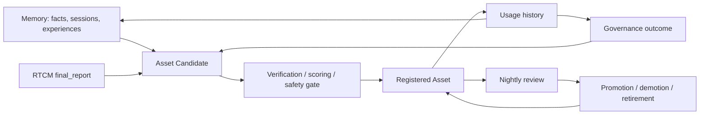

# R240-MA Memory × Asset Relation Map

## Cross-System Answers

1. Can memory be promoted to asset?
   Yes, but only after reuse value, verification, quality score, and scope gates. Raw memory is not automatically an asset.

2. Do assets have dedicated memory?
   Designed yes. Current code has partial support through DeerFlow asset memory manager and asset usage metadata, but no single unified asset memory store is proven.

3. Do prompt assets come from memory sedimentation?
   Designed yes. Prompt asset code exists in the prompt engine and Harness prompt manager, but full runtime promotion evidence is partial.

4. Can RTCM final_report become an asset?
   It should first be treated as a runtime/governance artifact and asset candidate. It should become an asset only if reusable, verified, scored, and registered.

5. Does Nightly Review decide memory-to-asset promotion?
   Designed yes. Code contains nightly distillation and review engines. Runtime evidence exists for reports, but full closed-loop promotion is not proven.

6. Can governance outcome directly become an asset?
   It can become an asset candidate. Direct promotion without validation would violate the asset definition.

7. Is asset usage history written to memory?
   Designed yes. Current registries store usage metadata and some memory-manager code exists, but universal memory writeback is not proven.

8. Is asset verification history written to governance?
   Partially yes. DPBS calls governance for asset promotion and records outcomes.

9. Does asset retirement require memory cleanup?
   Conceptually yes. Current code does not prove consistent cleanup or demotion of related memories.

10. Is there a common ID / ContextLink / governance_trace?
    Not yet unified. Current artifacts use separate identifiers such as asset IDs, task signatures, governance outcomes, RTCM session IDs, and thread IDs.

## Relationship Model

## Audit Judgment

Memory and Asset are intentionally coupled, but the current implementation is not one unified closed loop. The correct next foundation step is to define shared provenance and lifecycle contracts before optimizing either system.
