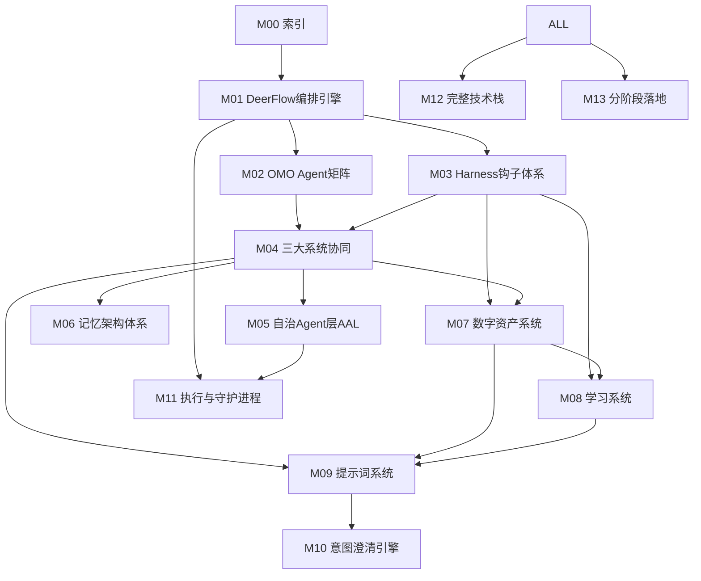

# OpenClaw 自治操作系统 — 模块化蓝图索引

> **版本：V3.0 接管式升级版（原 V2.0 精简版）**
> **来源：从 8563 行 V1 完整存档中提炼·保留全部技术细节与能力构建规则**
> **模块总数：13 个高密度技术模块 + 本索引**
> **⚠️ 架构总纲请查阅**: [`M00_System_Overview.md`](M00_System_Overview.md)（含系统宪法、接管映射全景、DeerFlow总管家定位）

---

## 模块依赖关系图



---

## 模块清单

| 编号 | 文件名 | 标题 | 核心内容 |
|---|---|---|---|
| M00 | `00_Module_Index.md` | 模块索引（本文） | 依赖关系·模块清单·系统七层护城河·阅读指南 |
| M01 | `01_Orchestration_Engine.md` | DeerFlow 2.0编排引擎 | 六大角色·SuperAgent·LangGraph·SharedContext·状态机·安全分级 |
| M02 | `02_OMO_Agent_Matrix.md` | OMO Agent矩阵 | 11个专属Agent·竞争上岗·视觉栈·CLI-Anything·工具调度三步 |
| M03 | `03_Harness_Hooks_System.md` | Harness钩子体系 | PreToolUse/PostToolUse·18个拦截点·安全白灰黑名单·经验包捕获 |
| M04 | `04_Three_Systems_Coordination.md` | 三大系统协同 | 搜索/任务/工作流·SharedContext·四种协同模式·Coordinator调度 |
| M05 | `05_Autonomous_Agent_Layer.md` | 自治Agent层AAL | 24/7运行·Ralph Loop·Antfarm·HEARTBEAT·自主任务生成·Optimizer |
| M06 | `06_Memory_Architecture.md` | 记忆架构体系 | 短期记忆·长期记忆·语义记忆·图数据库·向量检索·会话隔离 |
| M07 | `07_Digital_Asset_System.md` | 数字资产体系 | 九类资产·四层价值·生命周期状态机·五维评分·晋升淘汰·检索·可移植 |
| M08 | `08_Learning_System.md` | 学习系统与资产智能体 | 经验包·六阶段复盘·资产智能体·Optimizer·快速淘汰·周度深化·进化操作 |
| M09 | `09_Prompt_Engineering_System.md` | 提示词系统 | 五层架构·P1-P6优先级·DSPy+GEPA·搜索能力·全系统渗透·资产固化 |
| M10 | `10_Intent_Clarification_Engine.md` | 意图澄清引擎 | 七步串联·IntentProfile·清晰度评分·追问策略·超时猜测·四模式注入 |
| M11 | `11_Execution_And_Daemons.md` | 执行层与守护进程 | 四大执行器·视觉决策树·Dapr持久化·Daemon·Cron·11项修正项 |
| M12 | `12_Tech_Stack_And_Config.md` | 完整技术栈与配置 | 12层技术栈·18个阈值参数·目录结构·可移植方案·API Keys |
| M13 | `13_Phased_Implementation.md` | 分阶段落地计划 | Phase 0-4·验收标准·系统宪法·24条决策·三审核员·风险矩阵 |

---

## 系统七层护城河

```
1. 感知→行动→记忆 完整闭环
   眼耳嘴 + Claude Code手脚 + 三层记忆

2. Agent是操作者 不是被操作对象
   AgentFlow节点面板给Agent自主编排

3. 工具无限扩展
   CLI-Anything将任何软件Agent化·节点库持续增长

4. 即时+批量双轨进化
   Optimizer即时优化 + 夜间深度复盘·越用越聪明

5. 24/7不间断
   HEARTBEAT心跳 + Ralph Loop + Dapr持久化·永不停机

6. ByteDance技术栈
   DeerFlow 2.0 + UI-TARS + Midscene.js·字节最新内部工具

7. 飞书原生
   消息入口 = Agent神经中枢·信息流全程闭环
```

---

## 阅读指南

```
快速了解系统全貌:
 M00(本文) → M01(编排核心) → M13(落地计划)

深入技术细节:
 M01 → M02 → M03 → M04 → M05（按依赖链条阅读）

理解资产与学习:
 M07 → M08 → M09 → M10（资产体系到意图澄清闭环）

准备落地实施:
 M12(技术栈) → M13(分阶段) → M11(执行与守护)
```

---

## 核心设计原则

```
1. 去中心化: Swarm思想P2P动态交接·非集中Pipeline
2. 自主进化: 双轨学习(即时+夜间)·资产四级流转·提示词自动编译
3. 安全第一: gVisor沙盒·JIT零信任凭证·三审核员·系统宪法
4. 用户主权: 核心资产由用户决断·操作审计永久保存·飞书所有关键决策通知
5. 极简运维: 每天看晨报2分钟·偶尔回复几个字·资产库由系统自动维持
```
