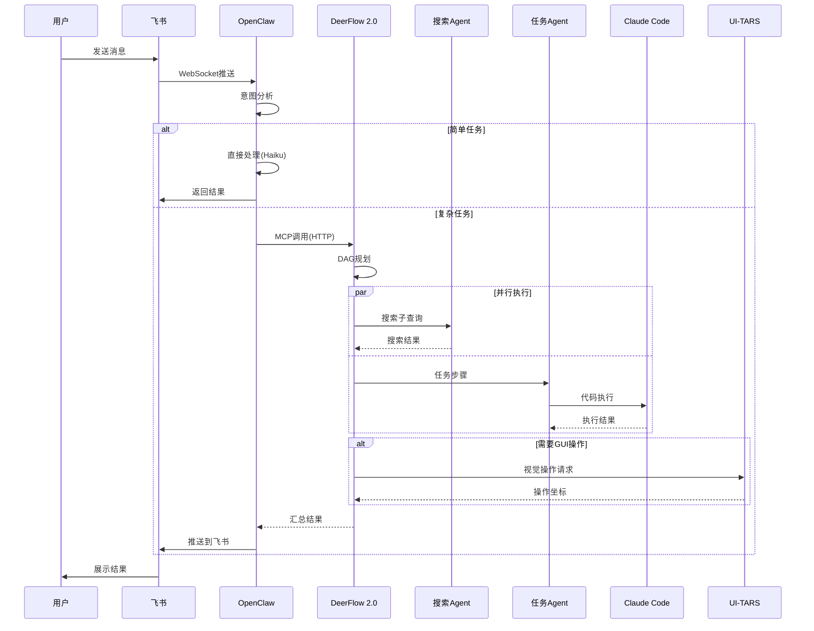
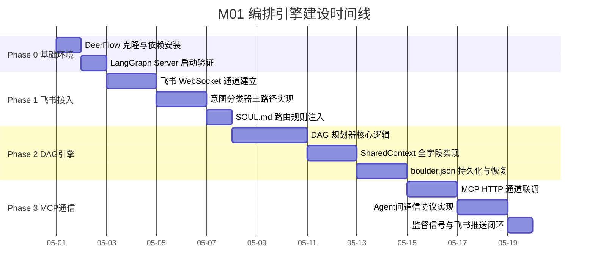
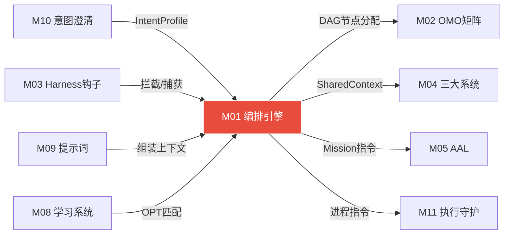

# 模块 01: 编排引擎与路由

> **本文档定义 DeerFlow 2.0 编排核心的完整架构、飞书WebSocket接入、意图分类器、DAG引擎、SharedContext 与四种协同模式。**
> **架构定位 (V3.0 接管式升级)**: DeerFlow 2.0 作为 OpenClaw 的**内嵌编排引擎**，是 M01 的实现层。其全部技术能力（LangGraph/DAG/子Agent派生/沙盒执行/并行运行）100% 保留，仅从属关系变更为 OpenClaw 管辖。
> 跨模块引用：M00（系统总论）·M02（OMO特工矩阵）·M04（三大系统协同）·M10（意图澄清引擎）

---

## 1. 编排引擎定位

### 1.1 统一系统架构 (V3.0 接管式升级)

> **架构变更声明**: 原 Brain-Terminal 分离模型已升级为统一模型。DeerFlow 的全部技术能力不变，仅从属关系调整为 OpenClaw 内嵌编排引擎。原文保留于下方供参考。

| 角色 | 组件 | 职责 | V3.0 定位 |
|---|---|---|---|
| **系统主体** | OpenClaw | 统一操作系统·管辖全部模块和数据 | 🔴 系统主体 |
| **编排引擎** | DeerFlow 2.0 | 编排·推理·规划·资源调度·子Agent派生·记忆·沙盒 | 内嵌编排层 |
| **手脚** | Claude Code | 代码执行·文件操作·Shell命令·持久会话 | 执行层 |
| **眼睛** | UI-TARS-2 | 屏幕截图理解·GUI坐标定位·视觉操作 | 感知层 |

### 1.2 DeerFlow 2.0 核心能力

DeerFlow 2.0 是一个 SuperAgent Harness：
- **内置文件系统**：每个 Agent 拥有独立工作空间
- **内置记忆**：长期记忆在会话间构建持久化用户偏好和工作流档案
- **内置技能**：Skills 目录按需加载·支持自动生成
- **沙盒感知执行**：gVisor 隔离·不可逆操作拦截
- **子Agent派生**：主 Agent 动态派生子 Agent，每个有独立上下文、工具和终止条件
- **并行运行**：多个子 Agent 并行执行，汇报结构化结果
- **开源·模型无关**：为自托管设计·可接入任何 LLM 提供商

### 1.3 核心技术栈

```
DeerFlow 2.0
├── LangGraph        — 状态机驱动·DAG执行引擎
├── LangChain        — 工具调用·链式推理
├── FastAPI          — REST API 暴露
│   ├── LangGraph Server (端口 2024)
│   └── Gateway API (端口 8001)
├── Temporal.io      — 持久化工作流·exactly-once处理·崩溃恢复
└── Claude Code      — 代码执行子进程·持久化会话
```

---

## 2. 飞书 WebSocket 接入

### 2.1 接入架构

```
用户 ←→ 飞书App ←→ WebSocket长连接 ←→ OpenClaw Gateway ←→ DeerFlow 2.0
                                          ↓
                                    意图路由器
                                    ↓        ↓
                              直接回答    复杂处理
                                          ↓
                                    DeerFlow编排
                                    ↓        ↓
                              搜索Agent  任务Agent
```

### 2.2 关键设计决策

| 决策 | 选择 | 原因 |
|---|---|---|
| 连接方式 | WebSocket 长连接 | 无需公网IP·无需内网穿透·零成本·低延迟 |
| 飞书直连 DeerFlow | **禁用** | DeerFlow conf.yaml 中 `feishu.enabled: false`，由 OpenClaw 统一管理 |
| 消息格式 | 富文本卡片 | 支持结构化输出·引用折叠·代码块·进度条 |
| 进度播报 | 每2分钟 | 长任务每2分钟向飞书推送进度·里程碑完成即推送 |

### 2.3 conf.yaml 飞书关闭配置

```yaml
channels:
  feishu:
    enabled: false   # 由 OpenClaw 统一管理
    # app_id 和 app_secret 在 OpenClaw 侧配置
```

### 2.4 OpenClaw 侧飞书配置

```json
{
  "channels": {
    "feishu": {
      "enabled": true,
      "websocket": true,
      "app_id": "${FEISHU_APP_ID}",
      "app_secret": "${FEISHU_APP_SECRET}",
      "event_encrypt_key": "${FEISHU_ENCRYPT_KEY}",
      "verification_token": "${FEISHU_VERIFICATION_TOKEN}"
    }
  }
}
```

---

## 3. 意图分类器

### 3.1 三条路由路径

```
用户消息进入
 ↓
意图分析器
 ↓
┌─────────────────────────────────────────┐
│ 路径A: 直接回答                          │
│ 判断标准:                                │
│   · 单步·无需工具·无需实时信息·无需文件   │
│   · 30字以内可完整回答                    │
│ LLM路由: Claude Haiku                    │
│ 响应目标: <3秒                           │
├─────────────────────────────────────────┤
│ 路径B: 追问补全                          │
│ 触发条件:                                │
│   · 意图不明确·缺关键参数·多义词歧义     │
│   · 目标范围模糊                         │
│ 策略: 最多提1个核心问题·不连续追问       │
│ 收到答复后重新路由                        │
├─────────────────────────────────────────┤
│ 路径C: 进入DeerFlow编排                  │
│ 触发条件（任一满足）:                     │
│   · 多步骤·需搜索·需工具·需文件操作      │
│   · 需代码执行·预估>30秒                 │
│ 分配: 搜索模式 或 任务模式               │
└─────────────────────────────────────────┘
```

### 3.2 意图分类维度

| 维度 | 分析内容 | 影响路由 |
|---|---|---|
| **复杂度** | 单步 vs 多步·需不需要拆分 | 直答 vs 编排 |
| **信息需求** | 需不需要外部信息·实时性要求 | 是否触发搜索 |
| **执行需求** | 需不需要文件/代码/工具操作 | 是否触发任务 |
| **时间预估** | <3s / 3-30s / >30s | 模型路由+是否并行 |
| **安全级别** | 是否涉及敏感操作 | 是否需要人工确认 |

### 3.3 学习系统驱动的智能路由

```
LS读取:
 · 用户偏好资产 — 历史交互习惯·偏好深度·偏好格式
 · OPT模板匹配 — 一句话匹配已有工作流模板
 · 意图分类模式 — 从历史经验包学习的模式

效果:
 · 用户说"帮我做X" → 命中OPT模板 → 直接调用整条优化后的工作流
 · 用户说模糊指令 → 匹配历史相似意图 → 预填参数减少追问
 · 用户高频使用某模式 → 自动识别进入对应Agent
```

### 3.4 SOUL.md 路由规则

```markdown
## 任务路由规则

收到请求后判断复杂度：

**简单任务**（单步、明确、无需工具）
→ OpenClaw 直接处理

**复杂任务**（多步骤 / 需要搜索+执行 / 超过5分钟）
→ 调用 DeerFlow：
  exec deerflow-task '{
    "task": "{{用户指令}}",
    "config": {
      "subagent_enabled": true,
      "thinking_enabled": true
    }
  }'

**需要操作界面的任务**
→ DeerFlow 内部调用 UI-TARS API
```

---

## 4. DAG 任务引擎

### 4.1 DAG 规划流程

```
任务指令进入
 ↓
Lead Agent (DeerFlow 2.0)
 ↓
步骤:
 1. 理解最终目标
 2. 识别依赖关系（串行/并行）
 3. 分配子Agent（按工作类型分类路由）
 4. 制定验收标准
 ↓
输出: 有向无环图（DAG）
 · 每节点含: 目标/工具/预期输出/超时限制
```

### 4.2 DAG 节点结构

```json
{
  "dag": {
    "id": "task-uuid",
    "created_at": "2026-04-10T10:00:00Z",
    "goal": "用户原始指令",
    "nodes": [
      {
        "id": "node-1",
        "type": "search",
        "tool": "searxng",
        "goal": "子任务目标",
        "depends_on": [],
        "timeout_min": 10,
        "expected_output": "结构化搜索结果",
        "status": "pending",
        "assignee": {
          "category": "research",
          "model": null
        }
      },
      {
        "id": "node-2",
        "type": "code",
        "tool": "claude-code",
        "goal": "代码执行任务",
        "depends_on": ["node-1"],
        "timeout_min": 15,
        "expected_output": "可运行代码+测试结果",
        "status": "pending",
        "assignee": {
          "category": "code-execution",
          "model": null
        }
      }
    ],
    "edges": [
      {"from": "node-1", "to": "node-2"}
    ]
  }
}
```

### 4.3 分类驱动的模型路由（借鉴OMO）

Agent 声明"工作类型"（category），Harness 在运行时决定使用哪个模型，Agent 不感知模型细节。

| 工作类别(category) | 默认模型 | 特点 |
|---|---|---|
| `research` | Claude Sonnet | 综合推理·搜索综合 |
| `code-execution` | Claude Code (本地) | 代码生成·文件操作 |
| `quick-lookup` | Claude Haiku | 速度优先·低成本 |
| `deep-analysis` | Claude Opus | 深度推理·长报告 |
| `visual-engineering` | UI-TARS API | GUI操作·截图理解 |
| `document-retrieval` | 轻量模型/GLM | 文档检索·最便宜 |
| `privacy-sensitive` | 本地 Ollama | 不出本机 |

> [!NOTE]
> 模型升级时只需修改 category→model 映射配置，不需要修改各 Agent 的代码。

### 4.4 boulder.json 任务状态持久化（借鉴OMO）

```json
// ~/.deerflow/tasks/current-boulder.json
{
  "task_id": "task-uuid",
  "goal": "用户原始指令",
  "created_at": "2026-04-10T10:00:00Z",
  "status": "in_progress",
  "progress": 0.45,
  "dag_snapshot": {
    "total_nodes": 5,
    "completed": 2,
    "in_progress": 1,
    "pending": 2
  },
  "nodes_status": [
    {"id": "node-1", "status": "completed", "output_ref": "..."},
    {"id": "node-2", "status": "completed", "output_ref": "..."},
    {"id": "node-3", "status": "in_progress", "progress": 0.6},
    {"id": "node-4", "status": "pending"},
    {"id": "node-5", "status": "pending"}
  ],
  "git_snapshots": ["abc123", "def456"],
  "last_checkpoint": "2026-04-10T10:15:00Z"
}
```

**关键用途**：
- 任务中断后重启可从上次位置继续（不重新规划整个 DAG）
- 监督Agent读取它恢复执行
- 飞书进度播报读取它展示 checkbox 进度

---

## 5. OpenClaw ↔ DeerFlow MCP 接入

### 5.1 接入方式

```bash
# 方式A: CLI 添加
openclaw mcp add --transport http deerflow http://localhost:8001

# 方式B: 直接编辑 openclaw.json
{
  "plugins": {
    "deerflow": {
      "enabled": true,
      "config": {
        "baseUrl": "http://localhost:8001",
        "type": "http"
      }
    }
  }
}
```

### 5.2 DeerFlow 启动

```bash
# 克隆并安装
git clone https://github.com/bytedance/deer-flow
cd deer-flow
pip install -r requirements.txt
cp conf.yaml.example conf.yaml

# 启动 LangGraph Server (端口 2024)
langgraph dev

# 启动 Gateway API (端口 8001)
python -m app.gateway
```

### 5.3 完整数据流



---

## 6. SharedContext 核心定义

每次编排流程创建一个 SharedContext 实例，贯穿搜索→任务→工作流的全生命周期。

```json
{
  "shared_context": {
    "id": "ctx-uuid",
    "created_at": "ISO8601",
    "user_intent": {
      "raw": "用户原始输入",
      "parsed": {
        "type": "search|task|workflow|combined",
        "entities": [],
        "constraints": {},
        "clarity_score": 0.92
      }
    },
    "mode": "search|task|workflow",
    "search_state": {
      "current_round": 1,
      "max_rounds": 3,
      "queries": [],
      "results_cache": {},
      "cross_validation": {}
    },
    "task_state": {
      "dag": {},
      "current_node": "node-id",
      "completed_nodes": [],
      "tool_calls": [],
      "git_snapshots": []
    },
    "workflow_state": {
      "template_id": "wf-uuid",
      "current_step": 0,
      "variables": {}
    },
    "models_used": [],
    "tokens_consumed": {
      "input": 0,
      "output": 0,
      "total_cost_usd": 0
    },
    "experience_package": null
  }
}
```

---

## 7. Agent 间通信协议

### 7.1 搜索Agent → 任务Agent

```json
{
  "type": "search_result",
  "results": [
    {
      "title": "标题",
      "url": "https://...",
      "content": "正文摘要",
      "date": "2026-04-10",
      "confidence": 0.92
    }
  ],
  "summary": "结果综合摘要",
  "missing_info": ["未找到的信息项"],
  "search_rounds_used": 2
}
```

### 7.2 任务Agent → 搜索Agent

```json
{
  "type": "search_request",
  "task_context": "当前任务上下文",
  "specific_need": "具体需要搜索的内容",
  "urgency": "high|normal|low",
  "max_rounds": 3
}
```

> [!NOTE]
> `urgency: "high"` 时跳过第一轮摸索，直接用 Tavily/Exa 精准搜索。

### 7.3 监督Agent → 所有Agent

| 信号 | 含义 | 权限 |
|---|---|---|
| `PAUSE` | 暂停执行 | 最高优先级·可中断任何Agent |
| `ROLLBACK` | 回滚到最近快照 | 恢复 git snapshot 对应状态 |
| `ABORT` | 终止任务+汇报 | 终止全部子Agent·生成报告 |
| `ESCALATE` | 升级模型 | Haiku→Sonnet→Opus |

### 7.4 所有Agent → 用户（飞书）

通过 OpenClaw Gateway 推送：
- **进度推送**：长任务每2分钟播报
- **里程碑推送**：关键节点完成即推送
- **等待确认**：不可逆操作前发消息询问
- **最终报告**：任务完成后发送结构化结果

---

## 8. 核心配置文件职责分工

| 文件 | 职责 | 修改权限 |
|---|---|---|
| **OpenClaw SOUL.md** | 身份定义·意图路由规则·DeerFlow调用触发条件·用户偏好·输出格式 | 只读区 + 可追加区（进化层更新） |
| **DeerFlow conf.yaml** | 模型路由·工具接入·飞书关闭·沙盒配置·记忆后端·学习系统配置 | auto_tunable 标记字段可自动调整 |
| **Claude Code CLAUDE.md** | 工作目录权限·允许的系统命令白名单·安全边界·交互协议 | 用户手动修改 |
| **Skills 目录** | 搜索Skill·UI-TARS Skill·研究Skill·自动打包新Skill | 进化层持续增长 |

---

## 附录 A: 建设蓝图 (Construction Roadmap)

### 阶段划分

| 阶段 | 目标 | 关键交付物 | 验收标准 | 预估工期 |
|:---:|---|---|---|:---:|
| **Phase 0** | 基础环境搭建 | DeerFlow 2.0 本地部署运行、LangGraph Server 启动、Gateway API 可达 | `curl localhost:8001/health` 返回 200；`langgraph dev` 启动无报错 | 2 天 |
| **Phase 1** | 飞书接入与意图路由 | OpenClaw ↔ 飞书 WebSocket 长连接通道、三条路由路径判定逻辑、直答/追问/编排分流 | 飞书发消息 → OpenClaw 正确分流 → 简单问题 <3s 直答、复杂问题进入 DeerFlow | 5 天 |
| **Phase 2** | DAG 引擎与 SharedContext | DAG 规划器输出合法有向无环图、SharedContext 贯穿全流程、boulder.json 持久化 | 输入多步任务 → 自动拆解 DAG → 并行/串行调度子 Agent → 中断恢复不丢状态 | 7 天 |
| **Phase 3** | MCP 接入与 Agent 通信 | OpenClaw ↔ DeerFlow MCP HTTP 通道、Agent 间四种消息格式互通、监督信号生效 | PAUSE/ROLLBACK/ABORT/ESCALATE 四种信号均可触发对应行为 | 5 天 |

### 里程碑时间线



---

## 附录 B: 模块结构脑图 (Architecture Mind Map)

```mermaid
graph TD
    M01["M01 编排引擎与路由"]

    M01 --> ENTRY["入口层"]
    ENTRY --> FS["飞书 WebSocket"]
    ENTRY --> API["Gateway API :8001"]

    M01 --> INTENT["意图分类器"]
    INTENT --> PA["路径A: 直接回答 (Haiku)"]
    INTENT --> PB["路径B: 追问补全"]
    INTENT --> PC["路径C: DeerFlow编排"]

    M01 --> DAG["DAG 任务引擎"]
    DAG --> PLAN["规划器 (Lead Agent)"]
    DAG --> NODE["节点执行器"]
    DAG --> SCHED["并行/串行调度"]

    M01 --> SC["SharedContext"]
    SC --> UI["user_intent"]
    SC --> SS["search_state"]
    SC --> TS["task_state"]
    SC --> WS["workflow_state"]
    SC --> TK["tokens_consumed"]

    M01 --> COMM["Agent通信协议"]
    COMM --> S2T["搜索→任务"]
    COMM --> T2S["任务→搜索"]
    COMM --> SUP["监督信号 PAUSE/ROLLBACK/ABORT/ESCALATE"]
    COMM --> USR["→用户 (飞书推送)"]

    M01 --> PERSIST["持久化"]
    PERSIST --> BOULDER["boulder.json"]
    PERSIST --> LGS["LangGraph Server :2024"]
    PERSIST --> TEMP["Temporal.io (可选)"]

    M01 --> ROUTE["模型路由"]
    ROUTE --> R1["research → Sonnet"]
    ROUTE --> R2["code-execution → Claude Code"]
    ROUTE --> R3["quick-lookup → Haiku"]
    ROUTE --> R4["deep-analysis → Opus"]
    ROUTE --> R5["visual → UI-TARS"]
    ROUTE --> R6["privacy → Ollama"]

    style M01 fill:#E74C3C,stroke:#FFF,color:#FFF
    style INTENT fill:#3498DB,stroke:#FFF,color:#FFF
    style DAG fill:#27AE60,stroke:#FFF,color:#FFF
    style SC fill:#F39C12,stroke:#FFF,color:#FFF
    style COMM fill:#9B59B6,stroke:#FFF,color:#FFF
```



---

## 附录 C: 跨模块关系图 (Cross-Module Dependencies)

### 数据流向表

| 方向 | 对端模块 | 交换内容 | 触发条件 |
|:---:|---|---|---|
| ← 输入 | **M10 意图澄清引擎** | 经澄清后的 IntentProfile（含 goal、deliverable、constraints） | 用户消息触发路径B追问后回传 |
| → 输出 | **M02 OMO Agent矩阵** | DAG 节点分配指令（category + goal + timeout） | 路径C进入DeerFlow后，规划器按类别分派 |
| → 输出 | **M04 三大系统协同** | SharedContext 实例（含 search_state / task_state） | DAG 节点涉及搜索或任务系统时传递 |
| ← 输入 | **M03 Harness钩子** | PreToolUse 安全拦截结果、PostToolUse 经验捕获数据 | 每次工具调用前后触发 |
| → 输出 | **M05 AAL自治层** | Mission/Phase 级别的任务指令、boulder.json 完整快照 | AAL 自主立项时通过编排引擎下发 |
| ← 输入 | **M09 提示词系统** | 经 P1-P6 优先级组装的上下文（含安全约束+用户偏好+Few-shot） | 每次 LLM 调用前注入 |
| → 输出 | **M11 执行与守护** | 进程启动指令、HEARTBEAT 心跳注册 | 系统启动/任务启动时 |
| ← 输入 | **M08 学习系统** | OPT 模板匹配结果、历史经验包命中的快速路径 | 意图识别阶段检索资产库 |

### 关系拓扑图



---

## 附录 D: GitHub 项目与相关文献 (References)

### 核心开源项目

| 项目 | GitHub 链接 | 在本模块中的角色 |
|---|---|---|
| **DeerFlow 2.0** | https://github.com/bytedance/deer-flow | 编排引擎核心框架，SuperAgent Harness，提供子Agent派生、并行调度、沙盒感知执行 |
| **LangGraph** | https://github.com/langchain-ai/langgraph | 状态机驱动的 DAG 执行引擎，支持循环图、检查点持久化、Human-in-the-loop 中断 |
| **LangChain** | https://github.com/langchain-ai/langchain | 工具调用框架、链式推理、LLM 抽象层 |
| **Temporal.io** | https://github.com/temporalio/temporal | 持久化工作流引擎，exactly-once 语义，崩溃恢复，长时间运行任务状态管理 |
| **UI-TARS** | https://github.com/bytedance/UI-TARS | 字节跳动原生 GUI Agent，截图理解+坐标定位，视觉操作自动化 |
| **UI-TARS Desktop** | https://github.com/bytedance/UI-TARS-desktop | UI-TARS 桌面应用封装，提供本地/远程计算机操控能力 |
| **OpenAI Swarm** | https://github.com/openai/swarm | 多 Agent 编排思想参考，Handoff 动态交接模式的设计灵感来源 |
| **FastAPI** | https://github.com/fastapi/fastapi | Gateway API 和 LangGraph Server 的 REST 框架 |
| **SearXNG** | https://github.com/searxng/searxng | 自托管元搜索引擎，隐私优先，搜索系统的本地搜索后端 |
| **Tavily** | https://github.com/tavily-ai/tavily-python | AI Agent 专用搜索 API，实时信息获取，减少幻觉 |
| **gVisor** | https://github.com/google/gvisor | Google 容器沙盒运行时，提供安全隔离的代码执行环境 |

### 技术文献与论文

| 标题 | 链接 | 核心贡献 |
|---|---|---|
| *UI-TARS: Pioneering Automated GUI Interaction with Native Agents* | https://arxiv.org/abs/2501.12326 | 端到端视觉语言模型驱动的 GUI Agent，感知-推理-行动统一建模 |
| *LangGraph: Multi-Agent Workflows* | https://blog.langchain.dev/langgraph-multi-agent-workflows/ | LangGraph 多 Agent 工作流模式详解，循环图+状态持久化 |
| *Orchestrating Agents: Routines and Handoffs* | https://cookbook.openai.com/examples/orchestrating_agents | OpenAI 官方 Agent 编排手册，Swarm 的 Routines+Handoffs 模式 |
| *DeerFlow: Deep Exploration and Efficient Research Flow* | https://github.com/bytedance/deer-flow/blob/main/README.md | DeerFlow 架构设计文档，六大角色定义与 SuperAgent 模式 |

---

## 附录 E: 方法论参考 (Methodology Sources)

| 方法论 | 来源网址 | 在本模块中的应用点 |
|---|---|---|
| **Swarm P2P 交接思想** | https://openai.com/index/swarm/ | Agent 间去中心化的动态交接（Handoff），非集中式 Pipeline |
| **有限状态机 (FSM) 驱动编排** | https://langchain-ai.github.io/langgraph/ | LangGraph 将 Agent 工作流建模为有向循环图，状态驱动节点跳转 |
| **DAG 任务调度** | https://docs.temporal.io/concepts/what-is-a-workflow | 有向无环图规划：拆解目标→识别依赖→并行/串行调度→checkpoint 恢复 |
| **Brain-Terminal 分离架构** | https://github.com/bytedance/deer-flow/blob/main/README.md | DeerFlow=大脑（规划推理）、OpenClaw=终端（消息通道）、Claude Code=手脚（执行） |
| **Category-based Model Routing** | https://github.com/bytedance/deer-flow | Agent 只声明工作类型(category)，Harness 在运行时动态绑定最优模型 |
| **Human-in-the-Loop 模式** | https://langchain-ai.github.io/langgraph/concepts/human_in_the_loop/ | 支持 Agent 在不可逆操作前暂停等待人工确认 |
| **SharedContext 跨系统状态共享** | https://docs.langchain.com/docs/concepts/ | 单一 SharedContext 贯穿搜索→任务→工作流生命周期，消除重复传参 |
| **Durable Execution 持久化执行** | https://docs.temporal.io/concepts/what-is-durable-execution | 任务执行过程自动持久化，崩溃后从最近 checkpoint 恢复而非重头开始 |

---

## 校验清单

- [x] Brain-Terminal 分离架构完整描述
- [x] V3.0 统一系统架构升级（DeerFlow 定位为内嵌编排引擎）
- [x] DeerFlow 2.0 核心能力列表
- [x] 飞书 WebSocket 接入配置（双侧）
- [x] 三条意图路由路径（判断标准+LLM路由+响应目标）
- [x] DAG 任务引擎完整（节点结构 JSON + 规划流程）
- [x] 分类驱动模型路由矩阵（7个 category）
- [x] boulder.json 任务状态持久化 schema
- [x] MCP 接入方式（CLI + JSON 双方式）
- [x] DeerFlow 启动命令
- [x] SharedContext 完整 JSON schema
- [x] Agent 间通信协议（四种消息格式）
- [x] 监督Agent 信号定义表
- [x] 数据流 Mermaid 时序图
- [x] 配置文件职责分工表
- [x] 接管清单（V3.0）

---

## 接管清单 (Takeover Manifest)

> **V3.0 接管式升级 — 2026-04-11 新增**

### 接管类型

🔴 **纯新增** — OpenClaw 原生没有编排引擎，DeerFlow 作为新能力注入。

### 注入方式

DeerFlow 不是独立系统，而是作为 OpenClaw 的编排引擎**插件**注入：

```
OpenClaw 消息管线（注入前）:
  飞书消息 → OpenClaw Agent → 直接调用工具 → 返回结果

OpenClaw 消息管线（注入后）:
  飞书消息 → OpenClaw → M10意图澄清 → M01编排引擎(DeerFlow) → DAG拆解
  → M02 Agent矩阵 → 工具执行 → M03钩子 → M08学习 → 返回结果
```

### DeerFlow 保留的全部技术能力

| 能力 | 技术实现 | 状态 |
|---|---|:---:|
| 状态机驱动 | LangGraph | ✅ 100%保留 |
| DAG执行 | LangChain | ✅ 100%保留 |
| REST API | FastAPI | ✅ 100%保留 |
| 持久化工作流 | Temporal.io | ✅ 100%保留 |
| 代码执行 | Claude Code | ✅ 100%保留 |
| 子Agent派生 | 独立上下文+工具+终止条件 | ✅ 100%保留 |
| 并行运行 | 多子Agent并行 | ✅ 100%保留 |
| 沙盒隔离 | gVisor | ✅ 100%保留 |

### 唯一改变：从属关系

```
旧: DeerFlow(大脑) ←管辖→ OpenClaw(终端)
新: OpenClaw(系统主体) ←包含→ DeerFlow(内嵌编排引擎)
```
