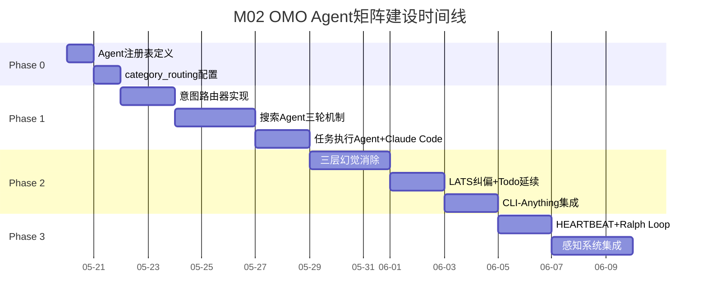
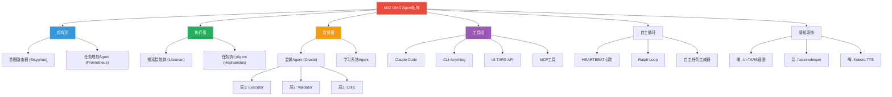
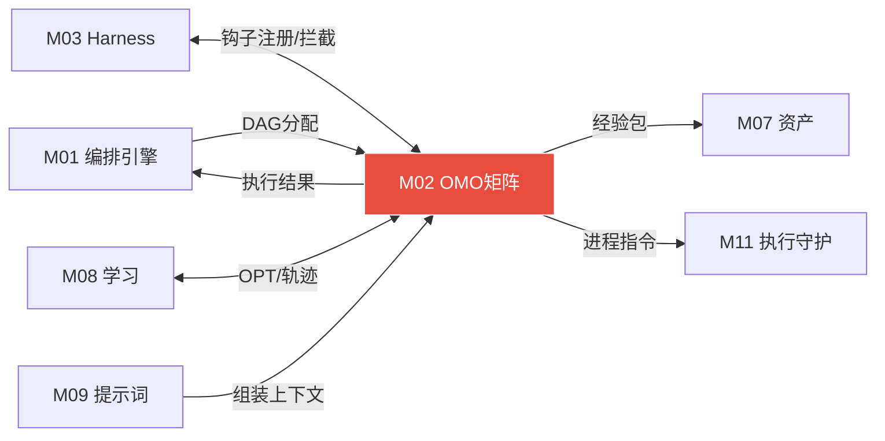

# 模块 02: OMO 特工矩阵

> **本文档定义 OpenClaw 系统的完整Agent角色体系、四组分工模型、分类驱动路由、Swarm Handoff机制、钩子注册、Todo强制延续、LATS纠偏与Supervisor联动。**
> 跨模块引用：M01（编排引擎）·M03（驾驭工程与钩子系统）·M08（学习系统）

---

## 1. Agent 角色体系概览

### 1.1 四组分工模型（借鉴 OMO 4组设计）

| 组别 | Agent角色 | 对应OMO角色 | 推荐模型 | 核心职责 |
|---|---|---|---|---|
| **指挥组** | 意图路由器 | Sisyphus | Claude Sonnet | 意图识别·任务分类·LS资产检索·路由决策 |
| | 任务规划Agent | Prometheus | Claude Sonnet | DAG分解·子任务规划·检查点设定 |
| **执行组** | 搜索智能体 | Librarian/Explore | Claude Haiku | 三轮搜索·多源验证·引用输出·context7 |
| | 任务执行Agent | Hephaestus | Claude Sonnet/CC | 工具调度·Claude Code驱动·CLI-Anything |
| **监督组** | 监督Agent | Oracle | Claude Sonnet | 三层幻觉消除·置信度熔断·快照回滚 |
| | 学习系统Agent | （新设计） | Claude Haiku | 钩子监听·经验包生成·复盘分析 |
| **工具组** | 工具执行层 | Sisyphus-Junior | 本地/Claude Code | Claude Code·CLI-Anything·UI-TARS·bash |

### 1.2 Agent 注册表结构

```json
{
  "agent_registry": {
    "agents": [
      {
        "id": "main",
        "name": "大主管",
        "group": "command",
        "category": "strategic",
        "model": "minimax-m2.7",
        "capabilities": ["total_coordination", "ceo_management", "strategic_planning"],
        "hooks": ["UserPromptSubmit", "EmergencyStop"],
        "max_concurrent": 1,
        "priority": 1000
      },
      {
        "id": "ceo",
        "name": "CEO",
        "group": "command",
        "category": "executive",
        "model": "minimax-m2.7",
        "capabilities": ["business_management", "reporting_to_main", "agent_collaboration"],
        "hooks": ["PostTaskComplete"],
        "max_concurrent": 1,
        "priority": 900
      },
      {
        "id": "intent-router",
        "name": "意图路由器",
        "group": "command",
        "category": "research",
        "model": null,
        "capabilities": ["intent_parse", "opt_match", "asset_search"],
        "hooks": ["UserPromptSubmit"],
        "max_concurrent": 1,
        "priority": 100,
        "health_check_interval_ms": 30000
      },
      {
        "id": "task-planner",
        "name": "任务规划Agent",
        "group": "command",
        "category": "deep",
        "model": null,
        "capabilities": ["dag_decompose", "checkpoint_set", "dependency_resolve"],
        "hooks": ["PreToolUse"],
        "max_concurrent": 1,
        "priority": 90
      },
      {
        "id": "search-agent",
        "name": "搜索智能体",
        "group": "execution",
        "category": "search",
        "model": null,
        "capabilities": ["multi_round_search", "cross_validation", "source_evaluation"],
        "hooks": ["PreToolUse", "PostToolUse"],
        "max_concurrent": 5,
        "priority": 80
      },
      {
        "id": "task-executor",
        "name": "任务执行Agent",
        "group": "execution",
        "category": "code-execution",
        "model": null,
        "capabilities": ["tool_dispatch", "code_execute", "cli_anything", "file_operate"],
        "hooks": ["PreToolUse", "PostToolUse", "Stop"],
        "max_concurrent": 3,
        "priority": 70
      },
      {
        "id": "supervisor",
        "name": "监督Agent",
        "group": "supervision",
        "category": "analysis",
        "model": null,
        "capabilities": ["confidence_eval", "hallucination_detect", "circuit_break", "rollback"],
        "hooks": ["PostToolUse", "Stop"],
        "max_concurrent": 1,
        "priority": 100,
        "signals": ["PAUSE", "ROLLBACK", "ABORT", "ESCALATE"]
      },
      {
        "id": "learning-agent",
        "name": "学习系统Agent",
        "group": "supervision",
        "category": "quick",
        "model": null,
        "capabilities": ["experience_capture", "asset_search", "nightly_review"],
        "hooks": ["PostToolUse", "UserPromptSubmit", "SessionEnd"],
        "max_concurrent": 1,
        "priority": 60
      },
      {
        "id": "tool-executor",
        "name": "工具执行层",
        "group": "tool",
        "category": "code-execution",
        "model": null,
        "capabilities": ["claude_code", "cli_anything", "ui_tars", "bash", "mcp"],
        "hooks": ["PreToolUse", "PostToolUse"],
        "max_concurrent": 5,
        "priority": 50
      }
    ]
  }
}
```

---

## 2. 分类驱动的模型路由

### 2.1 核心设计理念

**Agent 声明"工作类型"而不是"使用哪个模型"**，Harness 在运行时决定模型。

- Agent 不感知模型细节
- 模型升级时只需修改 `category_routing` 一处配置
- 每个 Provider 和 Model 都有并发上限控制

### 2.2 路由配置（conf.yaml）

```yaml
category_routing:
  # 工作类别 → 模型映射
  search:    claude-haiku-4               # 快速搜索·低成本
  research:  claude-sonnet-4-5            # 深度研究·综合推理
  code-execution: claude-code-local       # 代码执行·文件操作
  visual-engineering: ui-tars-siliconflow # 界面操作·截图理解
  quick:     claude-haiku-4               # 简单任务·速度优先
  deep:      claude-sonnet-4-5            # 复杂推理·长报告
  analysis:  claude-sonnet-4-5            # 数据分析·报告生成
  document-retrieval: glm-4-flash         # 文档检索·最便宜
  sensitive: ollama-local                 # 隐私数据·不出本机

# 模型并发上限
model_concurrency:
  claude-sonnet-4-5: 3
  claude-haiku-4: 10
  claude-code-local: 2
  ui-tars-siliconflow: 2
  ollama-local: 1
```

### 2.3 两种委派方式（借鉴 OMO）

| 方式 | 说明 | 使用场景 |
|---|---|---|
| **task()** 分类委派 | 选择工作类别，Harness 自动选模型 | 常规任务·推荐使用 |
| **call_agent()** 直接调用 | 指定 Agent ID，绕过分类路由 | 特殊场景·需要指定Agent |

```python
# 方式A: 分类委派（推荐）
result = await task(
    category="research",          # 声明工作类别
    goal="搜索最新的AI框架比较",
    context=shared_context,
    background=True                # 后台并行执行
)

# 方式B: 直接调用
result = await call_agent(
    agent_id="search-agent",      # 指定Agent
    goal="搜索最新的AI框架比较",
    context=shared_context
)
```

---

## 3. 各 Agent 详细职责

### 3.1 意图路由器（指挥组 · Lead）

**角色定位**：Sisyphus 主编排者

```
用户消息进入
 ↓
LS读取:
 · 用户偏好资产 — 交互习惯·偏好深度·偏好格式
 · OPT模板匹配 — 一句话匹配已有工作流模板（命中→直接调用）
 · 意图分类模式 — 从历史经验包学习的分类规律
 ↓
意图分析:
 · 复杂度判断（单步 vs 多步）
 · 信息需求（是否需外部信息）
 · 执行需求（是否需工具/代码操作）
 · 时间预估（<3s / 3-30s / >30s）
 · 安全级别（是否涉及敏感操作）
 ↓
三条路由:
 · 路径A: 直接回答 → Haiku (<3s)
 · 路径B: 追问补全 → 最多1个核心问题
 · 路径C: DeerFlow编排 → 搜索模式 或 任务模式
 ↓
LS写入: 路由决策记录（供复盘优化分类准确率）
```

### 3.2 任务规划Agent（指挥组）

**角色定位**：Prometheus 规划者

```
接收指挥组路由的复杂任务
 ↓
任务拆解 (DAG):
 1. 理解最终目标
 2. 识别依赖关系（串行/并行）
 3. 为每个节点声明工作类别(category)
 4. 制定验收标准
 5. 设定超时限制（每节点默认10分钟）
 ↓
输出: DAG (有向无环图)
 · 每节点: 目标/工具/预期输出/超时/category
 · 写入 boulder.json 持久化
 ↓
LS读取: 工作流模板资产 → 命中则直接加载DAG跳过规划
LS写入: 任务规划记录 → 供复盘优化规划质量
```

### 3.3 搜索智能体（执行组）

**角色定位**：Librarian + Explore（快速搜索 + 文档检索）

**核心能力**：
- 意图深挖与查询拆解（简单1条 / 复杂2-5条并行）
- 三轮搜索机制（主查询 → 精炼 → 提炼）
- 多源交叉验证（≥2个独立来源）
- 信源路由（SearXNG / Tavily / Exa / GitHub / context7）
- 结构化引用输出

```json
// 搜索Agent输出格式
{
  "results": [
    {
      "title": "标题",
      "url": "https://...",
      "content": "正文摘要",
      "date": "2026-04-10",
      "confidence": 0.92,
      "source_type": "official_doc"
    }
  ],
  "summary": "结果综合摘要",
  "missing_info": ["未找到的信息项"],
  "search_rounds_used": 2,
  "engines_used": ["tavily", "exa"],
  "cross_validation": {
    "sources_count": 3,
    "conflicts": 0,
    "confidence": 0.95
  }
}
```

### 3.4 任务执行Agent（执行组）

**角色定位**：Hephaestus 自主深度执行者

**工具调度完整决策**：

```
步骤需要工具
 ↓ 第一步: 本地扫描
工具箱扫描:
 · 已安装CLI工具
 · 可调用API（已配key）
 · 本地脚本库
 · 已安装桌面软件
 · OpenClaw Skills
 · DeerFlow Skills
 ↓ 扫描结果分支
┌──────────────────────────────────────────┐
│ 有CLI/API → 直接调用（优先级最高·稳定）  │
│   通过Claude Code执行·记录日志            │
├──────────────────────────────────────────┤
│ 有GUI软件·无接口                         │
│   使用次数 < 3 → UI-TARS视觉操作         │
│   使用次数 ≥ 3 → 搜索该软件API           │
│     无API → 继续UI-TARS                  │
│     使用CLI-Anything自动生成CLI（终极）    │
├──────────────────────────────────────────┤
│ 本地无此工具                              │
│   → cli-hub-meta-skill 自主发现           │
│   → 查CLI-Hub注册表 → pip install        │
│   → SKILL.md自动写入 → 注册到工具箱       │
│   → 若CLI-Hub无 → 搜索层搜索安装方式      │
│   → 直接无选项 → CLI-Anything自动生成     │
├──────────────────────────────────────────┤
│ 以上均失败 → UI-TARS兜底                  │
│   视觉点击 → 记录使用次数                 │
│   达到阈值(≥3) → 自动触发CLI生成流程      │
└──────────────────────────────────────────┘
 ↓
安全审查（每次必过） → 执行 → 验证结果
```

### 3.5 监督Agent（监督组 · Supervisor）

**角色定位**：Oracle 架构/调试顾问·质量守门人

#### 实时监控触发条件

**自动熔断（立即暂停）**：
- 置信度 < 设定阈值（默认 0.70）
- 连续 3 次工具执行失败
- 任务方向偏离原始目标 > 40%
- 检测到敏感操作（删除/外传/支付）
- 子任务超时（默认 10 分钟/子任务）
- Token 消耗超预算警戒线

**人工检查点（等待确认）**：
- 不可逆操作：删除文件/发送消息/提交代码
- 高风险工具：系统命令/网络请求/外部API写操作
- 金额相关操作（任何涉及支付的步骤）
- 首次使用新外部服务
- 任务完成前的最终输出确认（可配置）

#### 三层幻觉消除（Executor → Validator → Critic）

```
层1 · Executor（执行层）
 │ 执行任务步骤 → 生成初步输出
 │ 每步附带置信度自评分(0-1)
 │ 评估维度: 信息来源可靠性 · 逻辑推理链完整性 · 与已知事实一致性
 │
 ↓ 置信度 < 0.80 → 触发Validator
 │
层2 · Validator（验证层）
 │ 独立验证: 重新检索关键事实 · 比对多来源 · 检查逻辑一致性
 │ 检验: 数字/日期/名称准确性
 │ 输出: 验证通过/失败 + 具体问题定位
 │ 验证失败 → 打回Executor重新生成（最多3次）
 │
 ↓ 3次重生成仍失败 → 触发Critic
 │
层3 · Critic（批评层）
 │ 深度审查: 分析失败模式 · 判断根因
 │ 决策分支:
 │  a) 信息不足 → 调用搜索层补充 → 重新执行
 │  b) 能力边界 → 升级模型 (Haiku→Sonnet→Opus)
 │  c) 任务本身有问题 → 返回用户·请求澄清·给出已完成部分
```

#### 输出核实与交付标准

| 核实项 | 标准 | 不通过处理 |
|---|---|---|
| 事实准确性 | 关键事实有来源支撑·数字精确·时间正确 | Validator重新检索·修正后重输出 |
| 任务完整性 | 原始任务所有要求均已覆盖 | 补充缺失部分或说明原因 |
| 格式规范性 | 符合用户指定格式·引用完整·结构清晰 | 格式化处理 |
| 操作可逆性 | 不可逆操作已人工确认 | 阻断·等待确认 |
| Token成本 | 记录本次任务总消耗·累计统计 | 超预算发送提醒 |

### 3.6 学习系统Agent（监督组）

**角色定位**：全系统观察者 · 零侵入数据采集

- 挂载在 **PostToolUse** 钩子上：每次工具调用后异步记录
- 挂载在 **UserPromptSubmit**：用户输入时预检索资产库
- 挂载在 **SessionEnd**：会话结束时完成经验包写入
- **异步写入**，不阻塞主执行流程

### 3.7 工具执行层（工具组 · Sisyphus-Junior）

动态创建的专业执行者，模型从所在分类继承，支持后台并行运行。

| 执行器 | 核心能力 | 调用方式 |
|---|---|---|
| **Claude Code** | 代码生成·文件读写·bash终端·持久会话 | 本地CLI进程 |
| **CLI-Anything** | 任意软件CLI化·7阶段自动生成·pip发布 | Claude Code调用 |
| **UI-TARS API** | 截图→理解→操作坐标→执行 | 硅基流动API |
| **MCP工具** | 外部MCP服务器能力 | MCP协议调用 |
| **bash** | 系统命令·脚本执行 | Claude Code子进程 |

---

## 4. Swarm Handoff 机制

### 4.1 Agent 间任务交接

```
Agent A 执行中
 ↓ 检测到需要另一个专业能力
Handoff Protocol:
 1. Agent A 打包当前上下文(SharedContext)
 2. 声明需要的工作类别(category)
 3. Harness 根据 category_routing 选择 Agent B
 4. Agent B 接收上下文 → 执行 → 返回结果
 5. Agent A 继续后续步骤
```

### 4.2 Handoff 场景矩阵

| 触发Agent | 目标Agent | 触发条件 | 传递内容 |
|---|---|---|---|
| 任务执行Agent | 搜索智能体 | 工具缺失·执行报错·需要文档 | task_context + specific_need + urgency |
| 搜索智能体 | 任务执行Agent | 搜索完成需执行操作 | search_results + action_plan |
| 任务执行Agent | 监督Agent | 置信度低·敏感操作 | execution_state + risk_assessment |
| 监督Agent | 任务执行Agent | 验证通过·继续执行 | validation_result + next_step |
| 任务规划Agent | 搜索智能体 | 规划需要领域知识 | planning_context + info_need |
| 任务执行Agent | 工具执行层 | 需要具体工具能力 | tool_name + params + context |

### 4.3 并行执行与汇聚

```python
# 并行执行多个子Agent
async def execute_parallel_nodes(nodes, shared_context):
    tasks = []
    for node in nodes:
        if node.depends_on_all_completed():
            task = asyncio.create_task(
                dispatch_to_agent(
                    category=node.category,
                    goal=node.goal,
                    context=shared_context
                )
            )
            tasks.append(task)
    
    # 等待所有并行任务完成
    results = await asyncio.gather(*tasks, return_exceptions=True)
    
    # 汇聚结果到 SharedContext
    for result in results:
        shared_context.merge_result(result)
    
    return shared_context
```

---

## 5. Todo 强制延续机制（Continuation Enforcer）

### 5.1 核心设计

**问题**：Agent 不是被外力打断，而是主动"躺平"停下来。
**解决**：DAG 节点 status ≠ completed 时，Agent 收到 stop 信号会被拦截并强制继续。

### 5.2 实现方式

```
Agent 执行中
 ↓ Agent 发出 stop 信号
Stop 钩子拦截:
 ↓
检查 boulder.json:
 · 未完成节点数 > 0 ?
 · 所有必须节点都已 completed ?
 ↓
┌──────────────────────────────────┐
│ 仍有未完成节点 →                  │
│   拦截 stop → 强制继续            │
│   注入提示: "任务尚未完成，       │
│   还有N个步骤需要执行"            │
│   更新 boulder.json 进度          │
├──────────────────────────────────┤
│ 所有节点已完成 →                   │
│   允许 stop → 生成最终报告        │
│   写入经验包 → 清理 boulder.json  │
├──────────────────────────────────┤
│ 例外情况（允许停止）:              │
│   · 监督层置信度熔断               │
│   · 人工检查点等待                 │
│   · 用户主动取消                   │
│   · Token预算耗尽                  │
└──────────────────────────────────┘
```

### 5.3 上下文重置策略（借鉴 Ralph Loop）

当上下文过长时的硬重置机制：
1. 压缩关键信息到 `AGENTS.md`（每轮自动更新）
2. 保存 `boulder.json` 当前进度
3. 创建全新 Agent 实例（干净上下文）
4. 新实例读取 `AGENTS.md` + `boulder.json` 继续执行
5. 防止上下文漂移·保持执行精度

---

## 6. LATS 纠偏机制

### 6.1 Language Agent Tree Search

当执行路径偏离目标时的纠偏流程：

```
当前执行路径
 ↓ 监督Agent检测到偏离 > 40%
LATS 启动:
 1. 暂停当前路径
 2. 回溯到最近的正确节点（git snapshot）
 3. 生成2-3个替代执行路径
 4. 每条路径评估:
    · 目标对齐度（与原始意图的相似度）
    · 可行性（所需工具是否可用）
    · 成本预估（token + 时间）
 5. 选择最优路径继续执行
 6. 记录偏离模式 → LS写入失败模式库
```

### 6.2 偏离检测维度

| 维度 | 检测方式 | 阈值 |
|---|---|---|
| 目标对齐度 | 当前输出与原始目标的语义相似度 | < 0.60 触发纠偏 |
| 步骤偏离 | DAG 实际执行路径与计划路径的偏差 | > 40% 触发 |
| 成本偏离 | 实际 token 消耗与预估的比值 | > 2.0x 触发警告 |
| 时间偏离 | 实际耗时与预估超时的比值 | > 1.5x 触发警告 |

---

## 7. 自主循环引擎

### 7.1 双引擎协同

| 引擎 | 触发方式 | 工作模式 | 类比 |
|---|---|---|---|
| **HEARTBEAT** | 定时触发（每5-30分钟） | 检查环境·处理待办·监控异常·触发定时 | 心脏跳动·保持"活着" |
| **Ralph Loop** | 任务驱动触发 | 执行→评估→迭代→完成·不达目标不停 | 专注员工·接活干完 |

### 7.2 HEARTBEAT.md 心跳配置

```markdown
## 环境扫描（每30分钟）
- [ ] 检查新收到的飞书消息（未处理任务）
- [ ] 扫描监控列表（股票/新闻/仓库更新）
- [ ] 检查当前任务队列（有待执行任务则启动）
- [ ] 评估自我状态（资源/进度/下一步）

## 自主决策规则
- 有待处理任务 → 立即进入Ralph Loop执行
- 无外部任务 + 有学习目标 → 执行自主进化任务
- 发现异常 → 推送飞书通知
- 深夜时段(02:00) → 触发夜间复盘

isolatedSession: true  ## 每次心跳干净上下文
```

### 7.3 自主任务生成器（Self-Task Generator）

```
触发时机:
 1. 当前任务队列为空 → "我现在应该做什么"
 2. Ralph Loop完成后 → "基于刚才的结果，下一步是什么"
 3. HEARTBEAT扫描发现变化 → "这个变化需要我做什么"
 4. 夜间复盘后 → "明天我应该主动改进什么"

四类自主任务:
 · 进化任务 — 根据盲区/弱点/低效模式，主动改进自身
 · 监控任务 — 检查用户关心的变化（股价/新闻/仓库/天气）
 · 维护任务 — 清理过期资产·更新工具·检查系统健康
 · 探索任务 — 用户曾提到但未深入的话题·主动搜索整理

任务队列 (~/.deerflow/tasks/queue.json):
 {
   "pending": [],
   "in_progress": [],
   "completed": [],
   "self_generated": []
 }
 优先级: 用户任务 > 监控触发 > 自主进化任务
```

### 7.4 自主运行安全机制

| 保护机制 | 触发条件 | 动作 |
|---|---|---|
| Token日预算 | 超过每日上限 | 暂停·等待次日 |
| 连续失败 | 3次同类任务失败无解 | 推飞书请求人工介入 |
| 危险操作 | 删除/格式化/发送 | 必须人工确认 |
| 用户命令 | 用户说"停止" | 立即停止所有循环 |
| 深夜模式 | 00:00-06:00 | 只执行低消耗任务（复盘/维护） |
| 看门狗 | 主循环崩溃 | HEARTBEAT自动重启 |
| 崩溃恢复 | 系统重启 | 读取boulder.json从上次位置继续 |

---

## 8. 感知系统集成

### 8.1 眼睛（视觉感知）

| 层级 | 工具 | 触发方式 | 用途 |
|---|---|---|---|
| 屏幕监控（被动） | Python mss + UI-TARS API | HEARTBEAT定时截图 | 检测任务状态·监控异常 |
| 主动操作（按需） | UI-TARS API（硅基流动） | 任务需要GUI操作时 | 截图→理解→点击→验证 |
| 摄像头（可选） | Vision-Agents | Phase 4扩展 | 实时视频流分析·物理环境感知 |

### 8.2 耳朵（语音/音频感知）

| 层级 | 工具 | 用途 |
|---|---|---|
| 实时语音输入 | faster-whisper + sounddevice | 麦克风监听→文字，唤醒词检测 |
| 环境音分析 | Python librosa | 检测异常声音·报警音·通知音 |
| 文件/视频音频 | Whisper + FFmpeg | 会议记录·视频内容转文字 |

### 8.3 嘴巴（语音/文字输出）

| 层级 | 工具 | 用途 |
|---|---|---|
| TTS | Kokoro（本地）/ ElevenLabs（云端） | 主动语音播报·进度通知·警报 |
| 消息推送 | 飞书Bot API（已有） | 文字通知·报告推送·确认请求 |
| 结构化报告 | Markdown / JSON / 图表 | 任务总结·复盘日报·能力报告 |

### 8.4 感知数据流向

```
屏幕变化 → 监督层感知任务状态 → 判断是否需要干预
语音输入 → 意图路由器 → 同文字指令一样处理
异常声音/画面 → HEARTBEAT触发告警 → 飞书推送
所有感知数据 → PostToolUse钩子 → 学习系统记录 → 经验包
```

---

## 附录 A: 建设蓝图 (Construction Roadmap)

### 阶段划分

| 阶段 | 目标 | 关键交付物 | 验收标准 | 预估工期 |
|:---:|---|---|---|:---:|
| **Phase 0** | Agent 注册表与骨架 | `openclaw.json` a2a__ 系列定义、MAIN & CEO 层级确立 | 注册表可加载、指挥链明确 | 2 天 |
| **Phase 1** | 独立化迁移 (E-Base) | 物理路径脱敏、凭据自愈、E 盘环境隔离 | verify_e_drive_startup 通场通过 | 7 天 |
| **Phase 2** | 指挥组 + 执行组部署 | a2a__main & a2a__ceo 联通、业务 Agent 集群上线 | 闭环测试 pilot_mission.py 成功 | 7 天 |
| **Phase 3** | 感知系统 + 自主循环 | HEARTBEAT 定时心跳、Ralph Loop 任务驱动、UI-TARS 视觉操作、语音输入输出 | 系统无人值守 30 分钟完成 3 项自主任务 | 5 天 |

### 里程碑时间线



---

## 附录 B: 模块结构脑图 (Architecture Mind Map)



---

## 附录 C: 跨模块关系图 (Cross-Module Dependencies)

### 数据流向表

| 方向 | 对端模块 | 交换内容 | 触发条件 |
|:---:|---|---|---|
| ← 输入 | **M01 编排引擎** | DAG 节点分配指令（category + goal + timeout） | 编排引擎路径C分流后下发 |
| → 输出 | **M01 编排引擎** | Agent 执行结果、Handoff 请求 | Agent 完成或需要切换时 |
| ← 输入 | **M03 Harness钩子** | PreToolUse 安全拦截、PostToolUse 经验捕获 | 每次工具调用前后 |
| → 输出 | **M03 Harness钩子** | 钩子注册声明（hooks 字段） | Agent 注册时声明 |
| → 输出 | **M07 数字资产** | 经验包捕获数据、搜索结果记录 | PostToolUse 异步写入 |
| ← 输入 | **M08 学习系统** | OPT 模板命中、历史经验包 | 意图路由阶段检索 |
| → 输出 | **M08 学习系统** | 执行轨迹、失败模式、路由决策记录 | SessionEnd 时批量写入 |
| ← 输入 | **M09 提示词系统** | P1-P6 组装后的完整提示词 | 每次 LLM 调用前 |
| → 输出 | **M11 执行与守护** | Claude Code 进程启动/停止指令 | 任务执行Agent调度时 |

### 关系拓扑图



---

## 附录 D: GitHub 项目与相关文献 (References)

### 核心开源项目

| 项目 | GitHub 链接 | 在本模块中的角色 |
|---|---|---|
| **DeerFlow 2.0** | https://github.com/bytedance/deer-flow | SuperAgent Harness 框架，Agent 派生、并行执行、category 路由 |
| **OpenAI Swarm** | https://github.com/openai/swarm | Handoff 动态交接机制的设计参考，Agent间P2P交接模式 |
| **LangGraph** | https://github.com/langchain-ai/langgraph | DAG 状态机执行引擎，驱动 Agent 工作流循环 |
| **UI-TARS** | https://github.com/bytedance/UI-TARS | 视觉感知执行器，截图理解→坐标定位→GUI自动操作 |
| **UI-TARS Desktop** | https://github.com/bytedance/UI-TARS-desktop | UI-TARS 桌面客户端封装 |
| **Midscene.js** | https://github.com/web-infra-dev/midscene | AI 驱动的浏览器自动化框架，自然语言操作 Web 界面 |
| **faster-whisper** | https://github.com/SYSTRAN/faster-whisper | 高性能语音识别，CTranslate2 加速，耳朵感知层 |
| **SearXNG** | https://github.com/searxng/searxng | 搜索Agent的元搜索引擎后端 |
| **Tavily Python** | https://github.com/tavily-ai/tavily-python | 搜索Agent的AI专用搜索API |
| **gVisor** | https://github.com/google/gvisor | 工具执行层的安全沙盒运行时 |
| **LATS 参考实现** | https://github.com/lapisrocks/LanguageAgentTreeSearch | LATS纠偏机制的论文参考代码 |

### 技术文献与论文

| 标题 | 链接 | 核心贡献 |
|---|---|---|
| *Language Agent Tree Search Unifies Reasoning Acting and Planning* | https://arxiv.org/abs/2310.04406 | LATS纠偏机制的理论基础，MCTS+LLM统一推理行动规划 |
| *UI-TARS: Pioneering Automated GUI Interaction with Native Agents* | https://arxiv.org/abs/2501.12326 | 端到端GUI Agent，感知-推理-行动统一建模 |
| *Orchestrating Agents: Routines and Handoffs* | https://cookbook.openai.com/examples/orchestrating_agents | Swarm Handoff设计模式详解 |
| *ReAct: Synergizing Reasoning and Acting in Language Models* | https://arxiv.org/abs/2210.03629 | 推理+行动交替的Agent基础范式 |

---

## 附录 E: 方法论参考 (Methodology Sources)

| 方法论 | 来源网址 | 在本模块中的应用点 |
|---|---|---|
| **OMO 四组分工模型** | https://github.com/bytedance/deer-flow | 指挥/执行/监督/工具四组Agent角色划分的原型 |
| **Swarm Handoff 交接** | https://openai.com/index/swarm/ | Agent间去中心化动态任务交接，不经过中央调度器 |
| **LATS 树搜索纠偏** | https://arxiv.org/abs/2310.04406 | 执行路径偏离时回溯到正确节点并生成替代路径 |
| **ReAct 推理-行动范式** | https://arxiv.org/abs/2210.03629 | Agent 交替进行推理(Thought)和行动(Action)的基础循环 |
| **三层幻觉消除** | https://langchain-ai.github.io/langgraph/concepts/human_in_the_loop/ | Executor→Validator→Critic 三层递进验证，确保输出可靠 |
| **Ralph Loop 自主循环** | https://github.com/bytedance/deer-flow | 任务驱动的持续执行循环，不达目标不停止 |
| **CLI-Anything 自动化** | https://github.com/bytedance/deer-flow | 将任意GUI软件通过AI自动生成CLI接口的七阶段流程 |
| **Category-based Routing** | https://github.com/bytedance/deer-flow | Agent声明工作类型，Harness运行时绑定最优模型 |

---

## 校验清单

- [x] 四组Agent分工模型完整定义
- [x] Agent注册表JSON schema（7个Agent）
- [x] 分类驱动模型路由（9个category + 并发上限）
- [x] 两种委派方式（task() + call_agent()）
- [x] 各Agent详细职责（7个Agent逐一描述）
- [x] 工具调度完整决策树（4条路径）
- [x] 三层幻觉消除流程
- [x] Swarm Handoff机制（6种场景）
- [x] Todo强制延续机制（含例外情况）
- [x] 上下文重置策略（Ralph Loop）
- [x] LATS纠偏机制（4维度检测）
- [x] 自主循环双引擎（HEARTBEAT + Ralph Loop）
- [x] 自主任务生成器（4类任务）
- [x] 自主运行安全机制（7个保护点）
- [x] 感知系统三模态（眼/耳/嘴）

---

## 接管清单 (Takeover Manifest)

> **V3.0 接管式升级 — 2026-04-11 新增**

### 接管目标

- **文件**: `openclaw.json` → `agents.list` (19个Agent)
- **获取方式**: 保留原Agent矩阵，在其基础上添加OMO四类分级路由

### 保留项

- 19个Agent的完整配置（id/model/tools/workspace）保持不变
- 飞书工具集成（35个feishu工具）保持不变
- Agent层级组织（User -> 大主管 -> CEO -> 部长 -> 专员）保持一致性
- 命名体系：全面使用原版 ID（`main`, `ceo`, `doudian` 等）作为底层统一标识符
- 模型驱动：MiniMax 作为第一优先级驱动核心指挥链

### M02 增强能力

| 新增能力 | 原生没有 |
|---|---|
| OMO四类分级（Operator/Manager/Orchestrator/Observer） | 原生Agent平铺无分级 |
| 竞争上岗机制 | 原生固定分配 |
| Swarm Handoff动态交接 | 原生顺序调用 |
| 视觉栈（UI-TARS/Midscene.js） | 原生无视觉能力 |
