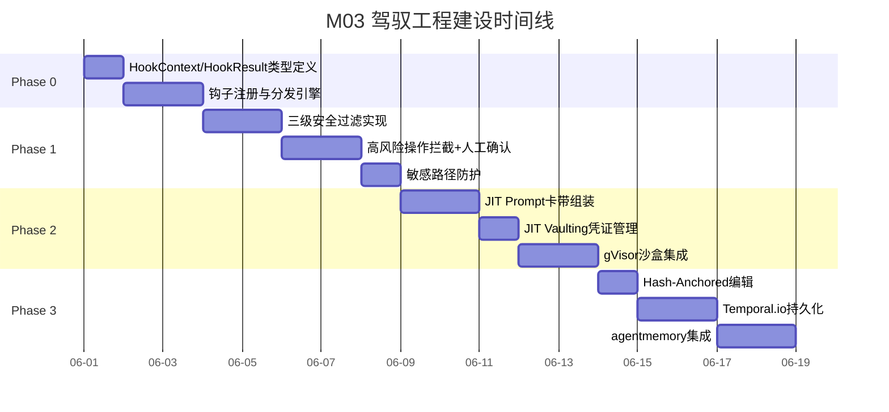
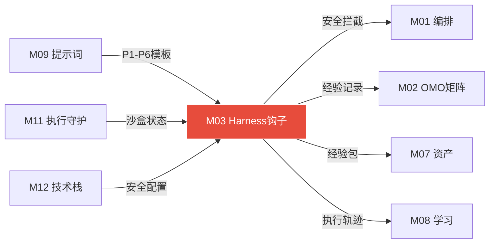

# 模块 03: 驾驭工程与钩子系统

> **本文档定义 PreToolUse/PostToolUse 生命周期钩子体系、JIT Prompt 卡带注入、Hash-Anchored 编辑、gVisor 沙盒隔离、零信任 JIT Vaulting 凭证管理、三级安全过滤系统。**
> **接管目标 (V3.0)**: 接管 OpenClaw 原生 `core/self-hardening.js` (666行)，将其 8 条静态规则+崩溃分析升级为完整的 Pre/PostToolUse 生命周期钩子体系。
> 跨模块引用：M00（系统总论）·M02（OMO特工矩阵）·M08（学习系统）·M11（执行环境）·M12（技术栈）

---

## 1. 驾驭工程总论

### 1.1 Harness 定位

**Harness**（驾驭框架）是包裹在 Agent 外层的控制壳：

```
用户请求
 ↓
┌──────────────── Harness Shell ────────────────┐
│  权限系统 → 钩子层 → 安全过滤 → 凭证JIT注入   │
│     ↓                                          │
│  ┌────────── Agent Core ──────────┐            │
│  │  引擎循环: query→stream→tool   │            │
│  │  工具: 43个内置 + MCP扩展      │            │
│  │  Skills: 按需加载.md文件       │            │
│  └────────────────────────────────┘            │
│     ↓                                          │
│  钩子层(Post) → 学习系统 → 结果投递            │
└────────────────────────────────────────────────┘
```

### 1.2 核心设计原则

| 原则 | 说明 |
|---|---|
| **零侵入** | 钩子挂载在执行流旁侧，不修改任何核心执行逻辑 |
| **可组合** | 每个能力（权限/钩子/安全/记忆）是独立可组合层 |
| **Agent无感** | Agent 只管执行，安全/学习/监控全部由 Harness 透明处理 |
| **Provider可替换** | 文件系统/Shell/沙盒通过可替换 Provider 实现（本地/Docker/云端） |

---

## 2. 生命周期钩子体系

### 2.1 六种钩子类型（借鉴 OpenHarness + OMO 融合设计）

| 钩子类型 | 触发时机 | 学习系统动作 | 监督层动作 |
|---|---|---|---|
| **PreToolUse** | 每次工具调用前 | 记录：工具名·参数·调用上下文·timestamp | 白名单检查·高风险拦截·人工确认触发 |
| **PostToolUse** | 每次工具调用后 | 记录：执行结果·耗时·token·成功/失败 | 结果置信度评分·幻觉检测·失败计数 |
| **UserPromptSubmit** | 用户每次发消息 | 记录意图特征·触发LS资产预检索 | 意图安全扫描 |
| **Stop** | Agent尝试停止 | 检查经验包是否完整 | Todo强制延续检查·阻断未完成停止 |
| **SessionCreate** | 新会话开始 | 加载用户偏好·历史资产索引预热 | 加载熔断阈值配置 |
| **SessionEnd** | 任务完成 | 触发经验包完整性检查·写入JSONL | 最终输出核实通过后放行 |

### 2.2 OMO 48钩子映射（5层）

| OMO钩子层 | 含义 | 映射到OpenClaw | 典型钩子 |
|---|---|---|---|
| **Session** | 会话生命周期 | SessionCreate/SessionEnd | 会话创建·上下文管理·资源清理 |
| **Tool-Guard** | 工具调用前拦截 | PreToolUse | 权限检查·安全过滤·日志记录 |
| **Transform** | 输出变换 | PostToolUse | 结果格式化·置信度注入·脱敏 |
| **Continuation** | 强制继续 | Stop | Todo Continuation Enforcer |
| **Skill** | 技能触发 | UserPromptSubmit | OPT模板识别·Skill按需加载 |

### 2.3 钩子注册与执行

```python
# 钩子注册示例
class LearningSystemHook:
    """学习系统数据采集钩子 — 挂载在 PostToolUse"""
    
    hook_type = "PostToolUse"
    priority = 50          # 低优先级·不拦截执行
    blocking = False       # 异步执行·不阻塞主流程
    
    async def execute(self, context: HookContext) -> HookResult:
        """每次工具调用后自动触发"""
        record = {
            "tool_name": context.tool_name,
            "params": context.params,
            "result": context.result,
            "duration_ms": context.duration_ms,
            "tokens_used": context.tokens_used,
            "success": context.success,
            "confidence_score": context.confidence,
            "timestamp": datetime.now().isoformat()
        }
        
        # 异步写入当日JSONL（不阻塞主流程）
        await self.experience_writer.append(record)
        
        # 触发 agentmemory 语义压缩（异步）
        await self.agent_memory.process(record)
        
        return HookResult(allow=True)  # 永远放行


class SecurityGuardHook:
    """安全守卫钩子 — 挂载在 PreToolUse"""
    
    hook_type = "PreToolUse"
    priority = 100         # 最高优先级
    blocking = True        # 同步执行·可拦截
    
    async def execute(self, context: HookContext) -> HookResult:
        """每次工具调用前拦截检查"""
        tool = context.tool_name
        
        # 检查黑名单
        if tool in self.blacklist:
            return HookResult(
                allow=False, 
                reason=f"工具 {tool} 已被拉黑，拒绝执行"
            )
        
        # 检查灰名单 → 沙盒隔离
        if tool in self.greylist:
            context.sandbox_required = True
            context.sandbox_type = "gvisor"
        
        # 高风险操作 → 人工确认
        if self.is_high_risk(context):
            await self.request_human_confirmation(context)
        
        return HookResult(allow=True)
```

### 2.4 钩子执行顺序

```
用户消息 → UserPromptSubmit钩子[LS资产预检索·安全扫描]
    ↓
意图路由 → SessionCreate钩子[加载偏好·预热缓存]
    ↓
工具调用前 → PreToolUse钩子[安全检查·白名单验证·JIT凭证注入]
    ↓
工具执行 → [Agent Core执行]
    ↓
工具调用后 → PostToolUse钩子[结果记录·置信度评分·LS写入·agentmemory]
    ↓
Agent尝试停止 → Stop钩子[Todo Continuation检查·经验包完整性]
    ↓
会话结束 → SessionEnd钩子[经验包最终写入·资源清理·报告生成]
```

---

## 3. JIT Prompt 卡带注入

### 3.1 核心理念

**Prompt 不是静态模板，而是按需组装的动态卡带**。

每次任务执行前，系统根据当前上下文动态组装最优 Prompt：

```
Prompt 卡带组装流程:
 │
 ├─ 基础卡带: SOUL.md（系统人格·行为规范）
 │     → 只读·永远加载
 │
 ├─ 身份卡带: AGENTS.md（Agent角色定义）
 │     → Ralph Loop每轮自动更新
 │
 ├─ 技能卡带: 相关SKILL.md（按需加载）
 │     → DeerFlow 2.0按需渐进式加载
 │     → 意图匹配后只加载相关技能
 │     → 节省85%+技能描述token
 │
 ├─ 经验卡带: 资产库匹配结果
 │     → LS读取·相似度≥0.85直接注入
 │     → 包含：最优路径·工具配置·关键词模式
 │
 ├─ 用户卡带: 用户偏好资产
 │     → 历史偏好·格式要求·领域知识
 │
 └─ 工具卡带: 当前可用工具列表
       → 白名单工具描述·MCP服务器能力
       → 过滤掉黑名单工具·减少幻觉
```

### 3.2 卡带加载策略

| 卡带 | 加载时机 | 大小控制 | 缓存策略 |
|---|---|---|---|
| SOUL.md | SessionCreate | ≤2000 token | 会话级缓存 |
| AGENTS.md | 每轮迭代 | ≤1000 token | 实时刷新 |
| SKILL.md | 意图匹配后 | 按需·每个≤500 token | 会话级缓存 |
| 经验资产 | UserPromptSubmit | ≤1500 token | 5分钟TTL |
| 用户偏好 | SessionCreate | ≤500 token | 日级缓存 |
| 工具列表 | 每次工具调用前 | 自适应 | 会话级缓存 |

### 3.3 DSPy 编译优化

核心原则：**提示词不手工调优，通过 DSPy 参数化编译**。

```python
# DSPy Prompt 编译流程
class PromptOptimizer:
    """基于DSPy的提示词自动优化"""
    
    compile_conditions = {
        "min_calls": 100,     # 最少调用100次
        "max_calls": 500,     # 最多调用500次后必须编译
        "min_quality": 0.7    # 最低质量分要求
    }
    
    solidify_conditions = {
        "consecutive_count": 5,      # 连续5次 ≥ 0.85
        "min_score": 0.85           # 固化质量阈值
    }
    
    async def check_and_compile(self, prompt_id: str):
        stats = await self.get_prompt_stats(prompt_id)
        
        if stats.call_count >= self.compile_conditions["min_calls"]:
            # 触发DSPy编译：基于历史调用数据优化参数
            optimized = await dspy.compile(
                module=self.get_module(prompt_id),
                trainset=stats.training_data,
                metric=self.quality_metric
            )
            # 验证优化效果
            if optimized.score > stats.current_score + 0.05:
                await self.deploy_optimized(prompt_id, optimized)
```

### 3.4 GEPA 反思进化

**GEPA**（Generative Evolution of Prompt Architectures）——提示词的反思式进化：

```
当前提示词 P_current
 ↓ 积累足够调用数据
GEPA 分析:
 1. 收集最近N次调用的质量分
 2. 识别低质量输出的共同模式
 3. 生成3个变异版本 (P_v1, P_v2, P_v3)
 4. A/B测试（每个版本试5次）
 5. 选择最优变异版本
 ↓
替换条件: 
 · 新版本质量分 > 当前分 + 0.05 (gepa_replacement_threshold)
 · 连续5次质量 ≥ 0.85 (prompt_solidify_count)
 ↓
替换成功 → 写入提示词资产库 → 全局生效
替换失败 → 保留当前版本 → 下次再尝试
```

---

## 4. Hash-Anchored 编辑（代码修改零误差）

### 4.1 设计来源

借鉴 OMO 的 `hashline_edit` 工具：每次修改代码前先校验目标行的内容哈希，确保是预期内容再写入。

### 4.2 工作流程

```
Claude Code 需要修改文件
 ↓
Step 1: 读取目标行内容
 → 计算 SHA-256 哈希
 → 记录: {file, line_range, content_hash}
 ↓
Step 2: 验证哈希
 → 修改前重新读取目标行
 → 计算当前哈希
 → 比对: current_hash == expected_hash?
 ↓
┌──────────────────────────────────┐
│ 匹配 → 执行修改 → 记录日志      │
├──────────────────────────────────┤
│ 不匹配 → 拒绝修改               │
│ 原因: 行号偏移/并发修改/文件变化 │
│ 处理: 重新定位目标行 → 重试      │
└──────────────────────────────────┘
```

### 4.3 核心收益

| 场景 | 无Hash-Anchor | 有Hash-Anchor |
|---|---|---|
| 行号偏移 | 修改错误行·引入bug | 自动检测·拒绝执行 |
| 并发修改 | 覆盖他人修改 | 检测冲突·等待 |
| 文件变化 | 盲改·不可追溯 | 每次验证·零误差 |

---

## 5. gVisor 沙盒隔离

### 5.1 为什么需要 gVisor

| 隔离方案 | 安全级别 | 性能开销 | 选择 |
|---|---|---|---|
| 无隔离 | 低 | 零 | ❌ 不可接受 |
| Docker 默认(runc) | 中 | 低 | ❌ 共享内核·存在逃逸风险 |
| **gVisor (runsc)** | **高** | **中低** | **✅ 用户态内核·syscall拦截** |
| MicroVM (Firecracker) | 最高 | 高 | ❌ 过重·启动慢 |

### 5.2 gVisor 架构

```
Agent 工具调用
 ↓
PreToolUse 钩子: 安全检查
 ↓ 灰名单工具 → 要求沙盒
┌─────────────── gVisor Container ──────────────┐
│  ┌─────── Sentry (用户态内核) ──────┐         │
│  │  拦截所有 syscall                  │         │
│  │  · 文件读写 → 限制在工作目录       │         │
│  │  · 网络请求 → 限制在白名单端口     │         │
│  │  · 进程创建 → 限制递归深度         │         │
│  └────────────────────────────────────┘         │
│  ┌─────── 工具执行 ──────┐                     │
│  │  CLI-Anything / bash  │                     │
│  │  执行用户工具调用     │                     │
│  └───────────────────────┘                     │
└────────────────────────────────────────────────┘
 ↓
PostToolUse 钩子: 结果验证
 · 输出是否包含异常内容
 · 文件系统变更审计
 · 网络流量审计
```

### 5.3 Docker daemon.json 配置

```json
{
  "runtimes": {
    "runsc": {
      "path": "/usr/local/bin/runsc",
      "runtimeArgs": [
        "--network=sandbox",
        "--platform=systrap"
      ]
    }
  },
  "default-runtime": "runsc"
}
```

### 5.4 DeerFlow 沙盒配置

```yaml
# conf.yaml
sandbox:
  type: local           # Windows 先用 local
  workspace: "C:/Users/win/.deerflow/workspace"
  runtime: runsc         # gVisor 沙盒
  
  # 沙盒策略
  policy:
    filesystem:
      writable_dirs:
        - "${workspace}"
        - "/tmp"
      readonly_dirs:
        - "/usr"
        - "/etc"
    network:
      allowed_ports: [80, 443, 8888, 6333]
      blocked_domains: []
    process:
      max_depth: 5
      max_concurrent: 10
```

---

## 6. 零信任 JIT Vaulting 凭证管理

### 6.1 核心原则

**按需注入·用完回收·不在环境变量中暴露**

```
Agent 需要调用 Tavily API
 ↓
PreToolUse 钩子:
 1. 识别工具需要的凭证类型 (TAVILY_API_KEY)
 2. 从安全金库请求临时凭证
 3. 注入到工具调用上下文
 4. 设置TTL（默认60秒）
 ↓
工具执行（使用临时凭证）
 ↓
PostToolUse 钩子:
 1. 从上下文中清除凭证
 2. 通知金库回收临时令牌
 3. 记录凭证使用日志（不记录凭证值本身）
```

### 6.2 凭证生命周期

| 阶段 | 动作 | 安全措施 |
|---|---|---|
| 存储 | `.env` 加密存储 或 系统密钥管理 | 不以明文存放在代码或日志中 |
| 注入 | PreToolUse 钩子按需注入到执行上下文 | TTL 默认60秒·单次使用 |
| 使用 | 工具执行过程中使用 | 仅在沙盒内可见 |
| 回收 | PostToolUse 钩子清除 | 从内存中擦除·日志中脱敏 |
| 审计 | 记录使用事件（不含凭证值） | 审计日志持久化 |

### 6.3 实现配置

```json
{
  "vault": {
    "type": "local_env",
    "credentials": {
      "ANTHROPIC_API_KEY": {"source": ".env", "ttl_seconds": 60},
      "TAVILY_API_KEY": {"source": ".env", "ttl_seconds": 60},
      "SILICONFLOW_API_KEY": {"source": ".env", "ttl_seconds": 60},
      "FEISHU_APP_SECRET": {"source": ".env", "ttl_seconds": 30}
    },
    "audit_log": "./assets/audit-log/credential-access.jsonl"
  }
}
```

---

## 7. 三级安全过滤系统

### 7.1 完整过滤架构

```
工具调用请求
 ↓
PreToolUse 钩子
 ↓
┌─── 第一级: 工具分级过滤 ───┐
│ 白名单 → 直通（已验证安全） │
│ 灰名单 → 进入沙盒验证      │
│ 黑名单 → 拒绝执行           │
└────────────────────────────┘
 ↓
┌─── 第二级: 操作风险评估 ───┐
│ 低风险 → 自动执行            │
│   (读取/查询/搜索)           │
│ 中风险 → 沙盒隔离执行        │
│   (写入/安装/网络请求)       │
│ 高风险 → 人工确认            │
│   (删除/发送/支付/系统命令)  │
└────────────────────────────┘
 ↓
┌─── 第三级: 输出安全审查 ───┐
│ PostToolUse 钩子:            │
│ · 输出内容是否包含敏感信息   │
│ · 文件变更是否在预期范围     │
│ · 网络请求是否合规           │
│ · 是否触发异常行为           │
└────────────────────────────┘
```

### 7.2 工具分级详细规则

| 级别 | 名称 | 判断标准 | 执行方式 | 升降级规则 |
|---|---|---|---|---|
| **白名单** | 已验证工具 | 连续5次无异常 或 手动标记 | 直接执行·记录日志 | 出现异常 → 立即降黑 |
| **灰名单** | 新工具/未知来源 | 首次使用·自动安装·进化层生成 | 沙盒隔离执行·输出校验 | 5次无异常 → 升白 |
| **黑名单** | 已知恶意/高危 | 安全扫描不通过 或 曾触发异常 | 拒绝执行·告警·审计 | 需人工手动解除 |

### 7.3 高风险操作检查表

| 操作类型 | 具体操作 | 处理方式 |
|---|---|---|
| **文件删除** | `rm`, `del`, `shred` | 人工确认 + git snapshot |
| **系统命令** | `reboot`, `shutdown`, `format` | 绝对禁止 |
| **网络写入** | POST/PUT/DELETE 到外部API | 人工确认 |
| **消息发送** | 飞书消息/邮件发送 | 人工确认（除自动进度播报外） |
| **支付操作** | 任何涉及金额的操作 | 绝对确认 |
| **代码提交** | `git push` 到远程仓库 | 人工确认 |
| **软件安装** | `pip install`, `npm install` | 沙盒验证 + 灰名单 |
| **环境变量** | 修改系统环境变量 | 人工确认 |

### 7.4 敏感路径保护

```json
{
  "protected_paths": {
    "read_only": [
      "~/.openclaw/SOUL.md",
      "~/.deerflow/conf.yaml",
      "~/.ssh/",
      "~/.gnupg/"
    ],
    "no_access": [
      "~/.env",
      "~/.credentials/",
      "C:/Users/win/AppData/Local/Google/Chrome/User Data/"
    ],
    "monitored": [
      "~/projects/",
      "~/.deerflow/workspace/"
    ]
  }
}
```

---

## 8. 可靠执行保障

### 8.1 Temporal.io 持久化工作流

```
DeerFlow 任务执行
 ↓
Temporal Worker 接收任务
 ↓
┌─── 持久化保障 ───────────────┐
│ · 每个步骤的状态自动持久化    │
│ · 崩溃后自动从精确中断点恢复  │
│ · exactly-once 语义·不重复    │
│ · 内置重试策略·指数退避       │
│ · 可追溯的完整执行历史        │
└──────────────────────────────┘
```

### 8.2 多层恢复机制

| 恢复层级 | 触发条件 | 恢复策略 | 数据来源 |
|---|---|---|---|
| **L1 自动重试** | 工具调用超时/网络错误 | 指数退避重试（1s, 2s, 4s）·最多3次 | 当前上下文 |
| **L2 节点回滚** | 节点执行失败·验证不通过 | 回到 git snapshot → 替换执行路径 | boulder.json + git |
| **L3 进程恢复** | 系统崩溃/重启 | 读取 boulder.json → 从最近节点继续 | boulder.json |
| **L4 完整回滚** | 任务整体失败 | 回滚所有 git snapshot → 报告失败 | git history |

### 8.3 openclaw-skill-claude-code

Job 管理系统：异步持久化任务，防止超时中断。

```
长任务提交
 ↓
创建 Job 记录:
 {
   "job_id": "job-uuid",
   "status": "running",
   "started_at": "ISO8601",
   "timeout_min": 60,
   "checkpoint_interval_min": 5,
   "last_checkpoint": null
 }
 ↓
每5分钟自动 checkpoint:
 · 保存当前执行状态
 · 写入 boulder.json
 · git commit
 ↓
超时检测:
 · 接近超时 → 保存状态 → 创建延续 Job
 · 硬超时 → 保存状态 → 推飞书通知 → 等待恢复
```

---

## 9. agentmemory 集成

### 9.1 PostToolUse 升级流程

```
PostToolUse 钩子触发
 ↓
SHA-256 去重（5分钟窗口）
 → 重复调用直接跳过
 ↓
隐私脱敏
 → 移除 API Key / 密码 / <private> 标签
 ↓
观察存储（原始事件流）
 ↓
LLM 语义压缩
 → 提取：类型 / 事实 / 叙述 / 概念 / 涉及文件
 ↓
Zod 格式验证
 → 失败自动重试一次
 ↓
质量打分 (0-100)
 ↓
生成向量嵌入 (BGE-M3)
 ↓
写入对应记忆层:
 · 质量 ≥ 80 → 热记忆（即时可检索）
 · 质量 60-79 → 温记忆（会话级检索）
 · 质量 < 60 → 归档（等待复盘清理）
```

### 9.2 电路断路器

```
agentmemory 调用 LLM 时:
 ↓
连续3次 LLM 调用失败?
 → 触发断路器 → 暂停语义压缩
 → 降级：直接存储原始事件（不压缩）
 → 30秒后半开状态 → 尝试一次
 → 成功 → 恢复正常
 → 失败 → 继续断路
```

---

## 附录 A: 建设蓝图 (Construction Roadmap)

### 阶段划分

| 阶段 | 目标 | 关键交付物 | 验收标准 | 预估工期 |
|:---:|---|---|---|:---:|
| **Phase 0** | 钩子执行框架 | HookContext / HookResult 基础类型、六种钩子注册/分发机制 | 注册一个 PostToolUse Mock 钩子 → 工具调用后自动触发并写入日志 | 3 天 |
| **Phase 1** | 安全层搭建 | 三级安全过滤、白/灰/黑名单管理、高风险操作拦截、敏感路径保护 | 黑名单工具调用 → 被拦截；灰名单 → 进入沙盒；高风险 → 人工确认弹窗 | 5 天 |
| **Phase 2** | JIT 注入与沙盒 | JIT Prompt 卡带组装、JIT Vaulting 凭证管理、gVisor 沙盒集成 | 工具调用前凭证按需注入 → 60s TTL 后自动回收；gVisor 容器沙盒隔离运行 | 5 天 |
| **Phase 3** | 编辑保障与持久化 | Hash-Anchored 编辑、Temporal.io 持久化、agentmemory 集成 | 修改代码前哈希校验通过率 100%；崩溃后从 checkpoint 恢复不丢进度 | 5 天 |

### 里程碑时间线



---

## 附录 B: 模块结构脑图 (Architecture Mind Map)

```mermaid
graph TD
    M03["M03 驾驭工程与钩子系统"]

    M03 --> HOOKS["生命周期钩子"]
    HOOKS --> PRE["PreToolUse 安全拦截"]
    HOOKS --> POST["PostToolUse 经验捕获"]
    HOOKS --> UPS["UserPromptSubmit 意图扫描"]
    HOOKS --> STOP["Stop Todo延续"]
    HOOKS --> SC["SessionCreate 偏好加载"]
    HOOKS --> SE["SessionEnd 经验包写入"]

    M03 --> JIT["JIT 注入层"]
    JIT --> PROMPT["Prompt卡带组装"]
    JIT --> VAULT["JIT Vaulting 凭证"]
    PROMPT --> SOUL["SOUL.md 基础卡带"]
    PROMPT --> SKILL["SKILL.md 技能卡带"]
    PROMPT --> EXP["经验资产卡带"]

    M03 --> SEC["三级安全过滤"]
    SEC --> WH["白名单 (直通)"]
    SEC --> GR["灰名单 (沙盒)"]
    SEC --> BL["黑名单 (拒绝)"]

    M03 --> SAND["gVisor 沙盒"]
    SAND --> SENTRY["Sentry 用户态内核"]
    SAND --> FS["文件系统隔离"]
    SAND --> NET["网络白名单"]

    M03 --> EDIT["Hash-Anchored 编辑"]
    M03 --> DURABLE["持久化保障"]
    DURABLE --> TEMP["Temporal.io"]
    DURABLE --> AMEM["agentmemory 语义压缩"]

    style M03 fill:#E74C3C,stroke:#FFF,color:#FFF
    style HOOKS fill:#3498DB,stroke:#FFF,color:#FFF
    style SEC fill:#F39C12,stroke:#FFF,color:#FFF
    style SAND fill:#27AE60,stroke:#FFF,color:#FFF
```



---

## 附录 C: 跨模块关系图 (Cross-Module Dependencies)

### 数据流向表

| 方向 | 对端模块 | 交换内容 | 触发条件 |
|:---:|---|---|---|
| → 输出 | **M01 编排引擎** | PreToolUse 安全拦截结果（allow/deny） | 每次工具调用前 |
| → 输出 | **M02 OMO矩阵** | PostToolUse 经验记录、安全上下文 | 每次工具调用后 |
| → 输出 | **M07 数字资产** | 经验包原始数据（JSONL 格式） | PostToolUse + SessionEnd |
| → 输出 | **M08 学习系统** | 执行轨迹、工具使用统计、agentmemory 压缩结果 | 异步持续写入 |
| ← 输入 | **M09 提示词系统** | P1-P6 优先级模板、DSPy 编译后的优化提示词 | JIT Prompt 卡带组装时 |
| ← 输入 | **M11 执行与守护** | gVisor 沙盒运行时状态、Claude Code 进程状态 | PreToolUse 查询沙盒就绪状态 |
| ← 输入 | **M12 技术栈** | 全局安全阈值配置、凭证存储路径 | SessionCreate 加载时 |

### 关系拓扑图



---

## 附录 D: GitHub 项目与相关文献 (References)

### 核心开源项目

| 项目 | GitHub 链接 | 在本模块中的角色 |
|---|---|---|
| **DeerFlow 2.0** | https://github.com/bytedance/deer-flow | Harness Shell 的宿主框架，钩子挂载点的运行环境 |
| **gVisor** | https://github.com/google/gvisor | 用户态容器沙盒运行时，syscall级安全隔离 |
| **Temporal.io** | https://github.com/temporalio/temporal | 持久化工作流引擎，exactly-once 语义保障执行可靠性 |
| **DSPy** | https://github.com/stanfordnlp/dspy | 提示词参数化编译框架，JIT Prompt 卡带的自动优化引擎 |
| **LangChain** | https://github.com/langchain-ai/langchain | 工具调用链的基础设施，钩子嵌入点 |
| **agentmemory** | https://github.com/autonomousresearchgroup/agentmemory | 语义记忆压缩引擎，PostToolUse 数据的结构化存储 |

### 技术文献与论文

| 标题 | 链接 | 核心贡献 |
|---|---|---|
| *gVisor: Container-Optimized OS Sandbox* | https://gvisor.dev/docs/ | 用户态内核 Sentry 架构，syscall 拦截与安全策略 |
| *DSPy: Compiling Declarative Language Model Calls* | https://arxiv.org/abs/2310.03714 | 提示词参数化编译的理论基础 |
| *Zero Trust Architecture (NIST SP 800-207)* | https://csrc.nist.gov/publications/detail/sp/800-207/final | 零信任安全架构标准，JIT Vaulting 的设计依据 |

---

## 附录 E: 方法论参考 (Methodology Sources)

| 方法论 | 来源网址 | 在本模块中的应用点 |
|---|---|---|
| **OpenHarness 钩子设计** | https://github.com/bytedance/deer-flow | 六种生命周期钩子的设计原型（Pre/Post/Session/Stop） |
| **零信任架构 (Zero Trust)** | https://csrc.nist.gov/publications/detail/sp/800-207/final | JIT Vaulting 按需凭证注入，用完回收，不信任任何常驻环境变量 |
| **gVisor 用户态隔离** | https://gvisor.dev/docs/architecture_guide/ | 灰名单工具在用户态内核中执行，syscall 级别安全过滤 |
| **Hash-Anchored Editing** | https://github.com/bytedance/deer-flow | 代码修改前 SHA-256 校验目标行内容，防止行号偏移误改 |
| **DSPy 编译式优化** | https://dspy.ai/ | 提示词不手工调优，通过 DSPy 采集历史数据后参数化编译 |
| **GEPA 反思进化** | https://github.com/stanfordnlp/dspy | 提示词变异测试：生成3个变体→A/B测试→选最优→固化 |
| **电路断路器模式** | https://docs.microsoft.com/en-us/azure/architecture/patterns/circuit-breaker | agentmemory LLM 调用连续失败时降级为原始存储，30s 半开重试 |

---

## 校验清单

- [x] Harness 架构总论（零侵入·可组合·Agent无感·Provider可替换）
- [x] 六种生命周期钩子完整定义（含触发时机·学习系统·监督层联动）
- [x] OMO 48钩子5层映射表
- [x] 钩子注册代码示例（SecurityGuard + LearningSystem）
- [x] 钩子执行顺序完整流程图
- [x] JIT Prompt 卡带注入（6种卡带·加载策略·大小控制）
- [x] DSPy 编译优化（条件·流程·固化规则）
- [x] GEPA 反思进化（变异·测试·替换阈值）
- [x] Hash-Anchored 编辑（SHA-256验证·零误差）
- [x] gVisor 沙盒隔离（架构·配置·策略）
- [x] 零信任 JIT Vaulting（注入·使用·回收·审计）
- [x] 三级安全过滤系统（工具分级·操作风险·输出审查）
- [x] 高风险操作检查表（8类操作）
- [x] 敏感路径保护配置
- [x] Temporal.io 持久化工作流
- [x] 四层恢复机制
- [x] 接管清单（V3.0 接管 self-hardening.js）

---

## 接管清单 (Takeover Manifest)

> **V3.0 接管式升级 — 2026-04-11 新增**

### 接管目标

- **文件**: `.openclaw/core/self-hardening.js` (666行)
- **类名**: `SelfHardeningSystem`
- **实例**: `global.selfHardening`
- **获取方式**: 备份原文件 → 增强版逐步替换 → 验证通过后切换

### 保留项（升级继承）

| 原生功能 | 源码位置 | M03 升级后 |
|---|---|---|
| 8条静态检查规则（输入验证/错误处理/类型安全...） | `RULES[]` | → 纳入 M03 动态规则库（可学习新规则） |
| 崩溃分析器5种模式 | `analyzeCrash()` | → 升级为完整崩溃分析+根因定位+自动恢复 |
| 代码自修复（addNullChecks/addErrorHandling） | `fixCode()` | → 纳入 M03 策略图谱 → 自动选择最优修复路径 |
| setInterval 每5min自检 | `monitor()` | → 被 M03 PreToolUse/PostToolUse 实时钩子取代 |

### 替换项（备份后替换）

| 原生功能 | 为什么替换 | M03 替代方案 |
|---|---|---|
| `setInterval` 定时自检 | 粗粒度、非实时 | PreToolUse/PostToolUse 每次工具调用实时触发 |
| 简单正则匹配 | 只耐栀5种模式 | 完整崩溃分析+根因定位+自动恢复 |
| 代码包装修复 | 固定策略、不可学习 | 策略图谱+学习新修复策略 |

### M03 增强能力（超出原生的新增）

| 新增能力 | 原生没有 |
|---|---|
| 18个拦截点完整生命周期 | 原生只有 setInterval 定时检查 |
| JIT Prompt 卡带注入 | 原生无提示词动态加载 |
| Hash-Anchored 零误差编辑 | 原生无 |
| gVisor 沙盒隔离 | 原生无 |
| 零信任 JIT Vaulting 凭证 | 原生无 |
| 三级安全过滤（白/灰/黑名单） | 原生只有简单规则 |
| DSPy 编译优化 | 原生无 |
| GEPA 反思进化 | 原生无 |
| 经验包捕获 | 原生无 |
