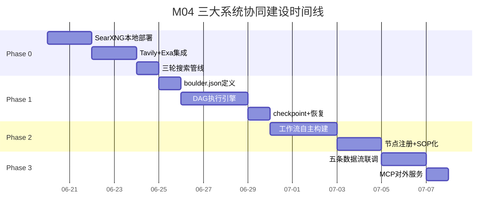
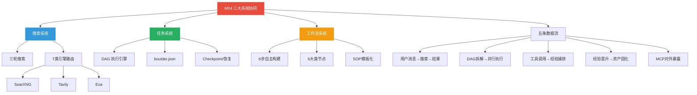
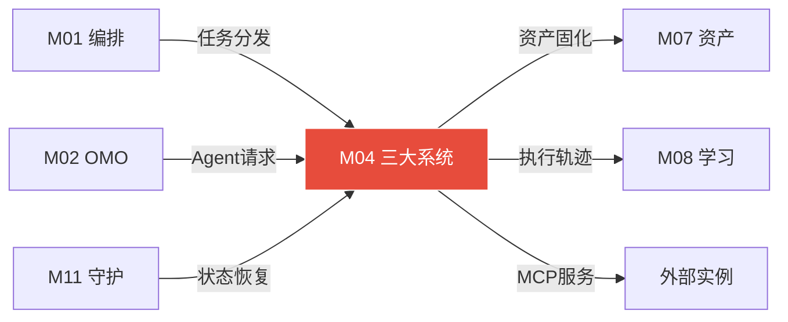

# 模块 04: 三大系统协同

> **本文档定义搜索系统·任务系统·工作流系统在 DeerFlow 2.0 框架内的完整建设方案、三系统数据流互联、五条核心执行路径、资产检索与晋升闭环。**
> 跨模块引用：M01（编排引擎）·M02（OMO特工矩阵）·M06（AgentFlow工作流）·M08（学习系统）·M13（三层记忆）

---

## 1. 三大系统在 DeerFlow 内的定位

### 1.1 系统分工总览

```
DeerFlow 2.0 SuperAgent Harness
 ╠══ 搜索系统 — 信息获取·多引擎路由·交叉验证·结构化输出
 ╠══ 任务系统 — DAG分解·工具调度·监督熔断·Sandbox验证·Optimizer优化
 ╚══ 工作流系统 — 节点注册表·Agent自主编排·SOP节点库·工作流进化
```

### 1.2 三系统关系

| 系统 | 职责 | 与其他系统的关系 |
|---|---|---|
| **搜索系统** | 为决策提供信息 | 任务系统需要信息时调用搜索 · 工作流中的搜索节点 |
| **任务系统** | 将目标分解为可执行步骤 | 调度搜索系统和工作流系统 · 核心受 DeerFlow Lead Agent 编排 |
| **工作流系统** | 固化最优执行路径 | 搜索和任务的重复路径固化为SOP · 提供确定性执行能力 |

---

## 2. 搜索系统完整建设

### 2.1 建设方式

DeerFlow Skills + MCP 服务器组合：

```
搜索Skill文件（~/.deerflow/skills/search/SKILL.md）:
 · 定义三轮搜索逻辑·引擎路由规则·验证策略

MCP接入:
 · context7（官方文档·实时准确）
 · grep_app（GitHub代码搜索）
 · InfoQuest（ByteDance内置）

外部引擎:
 · SearXNG（Docker自托管·通用）
 · Tavily API（AI优化搜索）
 · Exa API（语义搜索·学术深度）

学习集成:
 · 每次搜索完成 → PostToolUse钩子 → 写搜索经验包
 · 复盘优化引擎路由权重

对外接口:
 · search MCP工具 → 任意OpenClaw调用
 · 统一返回结构化结果+引用
```

### 2.2 三轮搜索机制

```
用户查询
 ↓
第一轮: 主查询
 · 意图深挖：简单→1条查询 / 复杂→2-5条并行
 · 引擎路由：按信息类型选择最优引擎
 · 输出：初步结果集 + 置信度评估
 ↓ 置信度 < 0.80 或 信息不完整
第二轮: 精炼查询
 · 基于第一轮结果调整关键词
 · 切换备用引擎（第一轮失败的引擎跳过）
 · 增加限定条件（时间范围/来源类型）
 ↓ 仍不完整
第三轮: 提炼查询
 · 深度目标：填补具体gap
 · 尝试所有未用引擎
 · 交叉验证：≥2个独立来源确认
 ↓
输出: 结构化搜索结果
 {
   results, summary, missing_info,
   search_rounds_used, engines_used,
   cross_validation: {sources_count, conflicts, confidence}
 }
```

### 2.3 引擎路由规则

| 信息类型 | 主引擎 | 备引擎 | 内容提取 |
|---|---|---|---|
| 通用网页 | SearXNG（自托管） | Brave Search API | Jina Reader |
| AI/技术文档 | Tavily API | Exa Search | Jina Reader |
| 官方文档（实时） | context7 MCP | 官网直抓 | MCP直接返回 |
| 学术/深度 | Exa Search | arXiv API | PDF解析 |
| 代码/仓库 | GitHub Search API | grep_app MCP | 直接API返回 |
| ByteDance内部 | InfoQuest（DeerFlow内置） | — | 内置处理 |
| 本地文件 | OpenClaw Memory向量索引 | ripgrep全文 | BGE-M3 embedding |

### 2.4 SearXNG 本地部署

```yaml
# docker-compose.yml 追加
  searxng:
    image: searxng/searxng:latest
    container_name: openclaw-searxng
    ports:
      - "8080:8080"
    volumes:
      - ./searxng-data:/etc/searxng
    environment:
      - SEARXNG_BASE_URL=http://localhost:8080/
    restart: unless-stopped
```

---

## 3. 任务系统完整建设

### 3.1 建设方式

DeerFlow Lead Agent + Dapr DurableAgent 封装：

```
任务Skill文件（~/.deerflow/skills/task/SKILL.md）:
 · DAG分解规则 · 工具调度顺序 · 监督熔断规则

Dapr封装:
 · 每个任务步骤包装为 DurableAgent Activity
 · exactly-once 语义 · 崩溃自动恢复

安全集成:
 · PreToolUse钩子：白/灰/黑名单过滤
 · PostToolUse钩子：结果记录 · 经验包写入
 · Stop钩子：Todo强制延续

对外接口:
 · execute_task MCP工具 → 任意OpenClaw调用
 · 接收目标描述 → 返回执行结果 + 经验包
```

### 3.2 任务执行完整流程

```
목标接收（来自意图路由器）
 ↓
Step 1: 资产预检索
 · 查 asset-index.json（相似度阈值 0.85）
 · 命中 → 加载最优路径（跳过规划）
 · 0.70-0.85 → 参考但不直接复用
 · < 0.70 → 全新规划
 ↓
Step 2: DAG 规划
 · 分解目标为子任务节点
 · 为每节点声明 category（用于模型路由）
 · 标注依赖关系（串行/并行）
 · 设定每节点超时（默认10分钟）
 · 写入 boulder.json 持久化
 ↓
Step 3: 逐节点执行
 · 按拓扑排序逐一执行
 · 无依赖节点可并行
 · 每节点: PreToolUse → 执行 → PostToolUse
 ↓
Step 4: 监督层介入
 · 置信度 < 0.70 → 熔断 → 三层幻觉消除
 · 连续3次失败 → 切换备用路径
 · 敏感操作 → 人工确认
 ↓
Step 5: Sandbox 验证
 · 代码任务 → Docker沙盒跑pytest
 · HTTP任务 → 健康检查
 · 文件任务 → 存在性/格式/大小验证
 ↓
Step 6: Optimizer 即时优化
 · 元推理: "本次用N步，最少需要几步？"
 · 节省 ≥ 20% → 写入工作流资产
 ↓
Step 7: 经验包写入
 · 当日 JSONL 记录
 · agentmemory 语义压缩
 · boulder.json 更新完成状态
```

### 3.3 boulder.json 结构

```json
{
  "task_id": "task-uuid",
  "goal": "用户原始目标",
  "status": "in_progress",
  "created_at": "ISO8601",
  "dag": {
    "nodes": [
      {
        "id": "n1",
        "name": "搜索相关框架",
        "category": "search",
        "status": "completed",
        "depends_on": [],
        "timeout_min": 5,
        "result_summary": "找到3个框架...",
        "tokens_used": 1500
      },
      {
        "id": "n2",
        "name": "对比分析",
        "category": "research",
        "status": "in_progress",
        "depends_on": ["n1"],
        "timeout_min": 10
      }
    ],
    "edges": [["n1", "n2"]]
  },
  "total_tokens": 5200,
  "checkpoints": ["git-sha-1", "git-sha-2"]
}
```

---

## 4. 工作流系统完整建设 (AgentFlow)

> **AgentFlow = Agent的操作系统界面**
> 与直接给人用的 Coze/n8n 相反，AgentFlow 中工作流由 Agent 自主分析、构建、执行和优化。面板是 Agent 外化意识的可视化。

### 4.1 核心哲学：Coze 的对立面

| 维度 | Coze / n8n（给人用） | AgentFlow（给Agent用） |
|---|---|---|
| 操作者 | 人：拖拽节点·填写配置 | Agent：分析目标·自动选节点·自主配置 |
| 工作流来源 | 人工设计·手动维护 | Agent动态生成·按需组装·执行后优化 |
| 节点触发 | 人点击运行/触发器触发 | HEARTBEAT·任务目标驱动·感知层事件 |
| 人的角色 | 主设计师·主操作员 | 审计者·边界设定者·偶尔干预者 |

### 4.2 DeerFlow + n8n 双轨与四层运行架构

**双轨架构**：
- **智能轨**：DeerFlow 2.0 (LangGraph) 负责智能决策、任务编排和多Agent协调。
- **确定轨**：自托管 n8n 负责确定性工作流执行、400+ API 集成和人审可视化。

**四层运行架构**：
1. **Layer 0 感知层**：常驻 HEARTBEAT、多模态监控，按优先级分类事件。
2. **Layer 1 编排层**：AgentFlow + DeerFlow 负责检索/构建工作流并做安全审查。
3. **Layer 2 执行层**：Ralph Loop 持续执行，AntFarm 小队推进，遇到具体节点触发执行。
4. **Layer 3 学习层**：全程监听状态生成经验包，夜间沉淀 SOP 节点。

### 4.3 节点基础设施

AgentFlow Builder Agent + node_registry.json + DeerFlow LangGraph：

```
节点目录（~/.deerflow/agentflow/node_registry.json）:
 · 所有可装配节点的标准化定义

工作流存储:
 · ~/.deerflow/workflows/active/ — 活跃工作流JSON
 · ~/.deerflow/workflows/templates/ — 模板工作流
 · ~/.deerflow/workflows/archived/ — 归档工作流

SOP节点库:
 · 经验晋升后固化的最优路径
 · 跳过LLM规划·确定性执行
```

### 4.4 节点注册规范

```json
{
  "node_id": "searxng_search",
  "category": "tool",
  "name": "SearXNG本地搜索",
  "description": "本地部署的聚合搜索引擎，适合通用信息查询",
  "inputs": [
    {"name": "query", "type": "string"},
    {"name": "engines", "type": "array", "optional": true}
  ],
  "outputs": [
    {"name": "results", "type": "array"},
    {"name": "summary", "type": "string"}
  ],
  "cost_estimate": {
    "tokens": 0,
    "api_calls": 1,
    "latency_ms": 800
  },
  "whitelist_level": "white",
  "skill_file": "~/.deerflow/skills/searxng/SKILL.md",
  "auto_registered": false
}
```

### 4.5 六大类动态节点

| 类别 | 颜色代号 | 典型节点 |
|---|---|---|
| **触发节点** | 🔵 | HEARTBEAT定时 · 飞书消息 · 屏幕变化 · 语音唤醒 · 文件变化 · Webhook |
| **工具节点** | 🟢 | SearXNG搜索 · Tavily搜索 · Exa语义 · Jina提取 · Claude Code · UI-TARS · 文件操作 |
| **软件节点** | 🟣 | CLI-Anything生成: GIMP · Blender · LibreOffice · OBS · Zotero · FreeCAD · Audacity |
| **MCP节点** | 🔴 | context7 · GitHub Search · @agent-infra/browser · 飞书MCP · Qdrant · 自定义MCP |
| **LLM节点** | 🟡 | Claude Sonnet推理 · Claude Haiku快速 · Ollama本地私密 · UI-TARS视觉 · TTS |
| **流程控制** | 🩷 | IF/ELSE条件 · LOOP循环 · PARALLEL并行 · WAIT等待 · RETRY重试 · MERGE合并 |
| **SOP节点** | ⚪ | 三轮搜索SOP · 代码调试SOP · 图片批处理SOP · 日报生成SOP · 经验复盘SOP |

### 4.6 Agent 自主构建工作流的 6 步流程

```
Step 1: 目标分析
 → 接收目标 → 查学习系统：相似工作流（≥0.85直接加载） → 未命中进入构建

Step 2: 工作流规划（AgentFlow Builder Agent）
 → 读 node_registry.json 选节点 → 规划DAG → 自动优化（并行、合并、插SOP）

Step 3: 序列化（JSON）
 → 输出标准workflow.json → 写入 active/

Step 4: 安全审查
 → 白名单直通 / 灰名单标注 / 黑名单阻断 → 高风险插入 WAIT 确认

Step 5: 执行与失败自动处理 (执行闭环)
 → DeerFlow驱动逐点执行
 → 工具调用失败：应用修复重试≤3次
 → 节点超时：切换备用节点（同类型·更快）
 → 置信度低：插入WAIT等待人工确认
 → 学习系统全程记录过程数据

Step 6: 工作流进化 (学习与进化闭环)
 → 复盘：实际 vs 规划 → 满足晋升标准 → 固化为SOP节点供后续使用
```

### 4.7 工作流 JSON 标准格式

```json
{
  "flow_id": "batch-image-compress-v2",
  "created_by": "agent-task-executor",
  "created_at": "2026-04-07T14:00:00Z",
  "trigger": {"type": "feishu_message", "pattern": "压缩图片"},
  "nodes": [
    {"id": "n1", "type": "file_scan", "config": {"dir": "~/Desktop", "ext": ["jpg","png"]}},
    {"id": "n2", "type": "parallel", "children": ["n3","n4"]},
    {"id": "n3", "type": "cli_tool", "tool": "imagemagick", "action": "compress"},
    {"id": "n4", "type": "cli_tool", "tool": "imagemagick", "action": "thumbnail"},
    {"id": "n5", "type": "feishu_upload", "wait_confirm": false},
    {"id": "n6", "type": "learning_write", "auto": true}
  ],
  "edges": [["n1","n2"],["n2","n3"],["n2","n4"],["n3","n5"],["n5","n6"]],
  "estimated_cost_usd": 0.02,
  "risk_level": "low",
  "sop_source": null
}
```

---

## 5. 五条核心数据流路径

### 5.1 路径1: 用户消息 → 复杂任务执行

```
用户飞书消息 → OpenClaw Gateway
 ↓
MemOS before_agent_start → 检索温记忆 → 注入上下文
 ↓
意图路由器: 检索 asset-index.json（OPT/工作流·阈值0.85）
 ↓ 命中→加载最优 / 未命中→全新规划
DeerFlow Lead Agent: DAG分解 → 分配搜索/任务Agent
 ↓
PreToolUse: 安全检查(白/灰/黑) · LS记录调用意图
 ↓
执行: Claude Code / CLI-Anything / Midscene.js（按工具类型路由）
 ↓
PostToolUse: agentmemory(去重→压缩→向量索引) · LS记录结果
 ↓
Sandbox验证(代码任务) / 结果核实(非代码任务)
 ↓ 通过
Optimizer: 即时路径分析 → 节省≥20%写入资产
 ↓
MemOS agent_end: 对话亮点提取 → SQLite持久化
 ↓
结果推送飞书 · 经验包→JSONL · boulder.json更新
```

### 5.2 路径2: 凌晨02:00 夜间复盘

```
cron 触发 → 读取当日所有 JSONL 经验包
 ↓ 6阶段
聚合统计 → 瓶颈识别 → 路径萃取
 → 资产生成(晋升标准: ≥3次 + ≥80%成功率)
 → 配置自动更新(低风险直接执行)
 → 日报推送飞书
```

### 5.3 路径3: 工具缺失 → 自动扩展

```
任务需要操作某软件 → 本地工具箱扫描: 无此CLI
 ↓
cli-hub-meta-skill: 查CLI-Hub注册表 → pip install → SKILL.md注册
 ↓ CLI-Hub也无
Claude Code: /cli-anything analyze → 7阶段自动生成
 → SKILL.md写入 → 注册到node_registry.json
```

### 5.4 路径4: HEARTBEAT 感知循环

```
每5分钟: 扫描 queue.json
 → 有任务 → Ralph Loop执行
 → 无任务 → 自主任务生成器评估
 ↓ 空闲时
生成: 进化/监控/维护/探索 任务 → 写入 queue.json
 → 下次心跳读取 → 继续循环
```

### 5.5 路径5: 任务崩溃 → 自动恢复

```
系统崩溃/断电/网络中断
 ↓
Dapr Actor Reminder持久化 → 重启进程
 → 从精确中断步骤继续 → 不重复已完成步骤
 ↓
boulder.json更新 → 飞书推送恢复通知
```

---

## 6. 资产检索与晋升闭环

### 6.1 资产检索流程

```
新任务进入
 ↓
asset-index.json 语义检索（BGE-M3 向量）
 ↓
┌──────────────────────────────────┐
│ 相似度 ≥ 0.85 → 直接加载最优路径 │
│   跳过规划 → 节省50%+时间和token │
├──────────────────────────────────┤
│ 0.70 ≤ 相似度 < 0.85 → 参考     │
│   展示给规划Agent → 辅助决策     │
├──────────────────────────────────┤
│ 相似度 < 0.70 → 不干预           │
│   全新规划 → 执行 → 积累经验     │
└──────────────────────────────────┘
```

### 6.2 资产晋升标准

| 条件 | 阈值 | 说明 |
|---|---|---|
| 最少执行次数 | ≥ 3次 | 同类任务至少执行3次才有统计意义 |
| 最低成功率 | ≥ 80% | 低于此不晋升·继续积累数据 |
| 质量评分 | ≥ 0.80 | Optimizer/复盘产出的质量分 |
| 节省步骤比例 | ≥ 20% | 精简路径比原始路径节省20%以上步骤 |

### 6.3 资产状态机

```
经验包 JSONL (raw)
 ↓ 首次出现
draft 草稿
 ↓ 执行≥3次 + 成功率≥80%
active 活跃
 ↓ 连续30天无调用
archived 归档
 ↓ 人工恢复 / 复盘重新发现
active (重新激活)
```

---

## 7. DeerFlow 作为 MCP 服务器对外暴露

### 7.1 MCP 接口定义

```yaml
# DeerFlow MCP 暴露的能力
tools:
  - name: search
    description: "触发三轮搜索系统"
    input: {query: string, depth: 1|2|3}
    output: {results, summary, confidence}
    
  - name: execute_task
    description: "触发任务分解执行"
    input: {goal: string, priority: high|normal|low}
    output: {result, experience_id, tokens_used}
    
  - name: run_workflow
    description: "执行预定义工作流"
    input: {flow_id: string, params: object}
    output: {status, result, duration}
    
  - name: recall_memory
    description: "跨设备记忆检索"
    input: {query: string, memory_layer: hot|warm|cold}
    output: {results, relevance_scores}
    
  - name: get_asset
    description: "获取经验资产"
    input: {type: workflow|search|tool, query: string}
    output: {assets, similarity_scores}
```

### 7.2 任意 OpenClaw 实例接入方式

```json
// 远程 OpenClaw B 的 openclaw.json
{
  "mcp_servers": [
    {
      "name": "my-deerflow-brain",
      "url": "http://<大脑机器IP>:2026/mcp",
      "type": "http"
    }
  ]
}
// 效果: 任意设备的 OpenClaw 都能调用大脑的搜索/任务/工作流/记忆
```

---

## 8. 三大系统联动场景举例

### 8.1 「帮我调研AI框架并出报告」

```
① 搜索系统: 三轮搜索→结构化结果（5个框架·优劣对比·引用来源）
② 任务系统: DAG[搜索→分析→对比表→报告撰写→格式化→推送]
③ 工作流系统: 复盘后固化为"技术调研SOP"→下次直接加载
```

### 8.2 「每天早上发一份AI新闻摘要」

```
① 工作流系统: 加载"每日新闻SOP"·定时触发
② 搜索系统: SearXNG+Tavily搜索当日AI新闻
③ 任务系统: 过滤→排序→摘要→格式化→飞书推送
④ 学习系统: 记录用户对摘要的反馈→优化筛选规则
```

---

## 附录 A: 建设蓝图 (Construction Roadmap)

### 阶段划分

| 阶段 | 目标 | 关键交付物 | 验收标准 | 预估工期 |
|:---:|---|---|---|:---:|
| **Phase 0** | 搜索系统基础 | SearXNG 本地部署、Tavily/Exa API 集成、三轮搜索管线 | 单条查询→三轮搜索→结构化结果 JSON 返回 | 5 天 |
| **Phase 1** | 任务系统基础 | boulder.json 结构定义、DAG 执行引擎、节点状态机 | 7步执行流程端到端通过，含 checkpoint 与恢复 | 5 天 |
| **Phase 2** | 工作流系统 | 工作流 6 步自主构建流程、6 大类节点注册、SOP 模板化 | 复杂任务完成后自动生成工作流资产，下次命中直接加载 | 5 天 |
| **Phase 3** | 三系统联动 | 五条核心数据流打通、资产检索闭环、DeerFlow MCP 对外服务 | 从用户消息到资产晋升的全链路演示通过 | 3 天 |

### 里程碑时间线



---

## 附录 B: 模块结构脑图 (Architecture Mind Map)



---

## 附录 C: 跨模块关系图 (Cross-Module Dependencies)

### 数据流向表

| 方向 | 对端模块 | 交换内容 | 触发条件 |
|:---:|---|---|---|
| ← 输入 | **M01 编排引擎** | 路径C复杂任务分发指令 | 意图路由判定为搜索/任务模式 |
| ← 输入 | **M02 OMO矩阵** | 搜索Agent/任务Agent的执行请求 | Agent Handoff |
| → 输出 | **M07 数字资产** | 工作流资产、SOP模板、搜索结果 | 工作流固化、经验晋升 |
| → 输出 | **M08 学习系统** | 搜索/任务执行轨迹 | PostToolUse 异步记录 |
| ← 输入 | **M11 执行与守护** | Dapr Actor 持久化状态、Temporal 恢复点 | 崩溃恢复时 |
| → 输出 | **外部实例** | DeerFlow MCP 服务暴露（5个工具接口） | 任意 OpenClaw 实例接入 |

### 关系拓扑图



---

## 附录 D: GitHub 项目与相关文献 (References)

### 核心开源项目

| 项目 | GitHub 链接 | 在本模块中的角色 |
|---|---|---|
| **DeerFlow 2.0** | https://github.com/bytedance/deer-flow | 搜索/任务/工作流三大系统的宿主框架 |
| **SearXNG** | https://github.com/searxng/searxng | 本地部署的元搜索引擎，搜索系统的核心后端 |
| **Tavily Python** | https://github.com/tavily-ai/tavily-python | AI 专用搜索 API，三轮搜索的主引擎 |
| **Exa** | https://exa.ai/ | 语义搜索引擎，用于深度研究型查询 |
| **LangGraph** | https://github.com/langchain-ai/langgraph | DAG 状态机执行引擎，任务系统核心 |
| **Temporal.io** | https://github.com/temporalio/temporal | 持久化工作流，任务系统的崩溃恢复 |
| **Dapr** | https://github.com/dapr/dapr | 分布式运行时，Actor 模型持久化 |

### 技术文献

| 标题 | 链接 | 核心贡献 |
|---|---|---|
| *DeerFlow: Deep Research Made Easy* | https://github.com/bytedance/deer-flow | 搜索+任务+工作流三系统协同的整体架构 |
| *SearXNG Documentation* | https://docs.searxng.org/ | 元搜索引擎配置与部署指南 |

---

## 附录 E: 方法论参考 (Methodology Sources)

| 方法论 | 来源网址 | 在本模块中的应用点 |
|---|---|---|
| **三轮搜索机制** | https://github.com/bytedance/deer-flow | 主查询→精炼→提炼的渐进式搜索策略 |
| **DAG 拓扑执行** | https://langchain-ai.github.io/langgraph/ | 有向无环图的依赖解析与并行调度 |
| **工作流自主构建** | https://github.com/bytedance/deer-flow | 6步从零到SOP的全自主工作流生成 |
| **MCP 协议对外暴露** | https://modelcontextprotocol.io/ | 标准化的 AI 工具协议，跨实例能力共享 |
| **资产晋升闭环** | 本项目 M07 数字资产系统 | 三级相似度策略 + 五维评分晋升 |

---

## 校验清单

- [x] 三大系统定位与分工关系矩阵
- [x] 搜索系统完整建设（三轮搜索·7类引擎路由·SearXNG部署）
- [x] 任务系统完整建设（7步执行流程·boulder.json结构）
- [x] 工作流系统完整建设（6步自主构建·节点注册规范·6大类节点·JSON格式）
- [x] 五条核心数据流路径（全部带完整流程图）
- [x] 资产检索与晋升闭环（三级相似度策略·晋升标准·状态机）
- [x] DeerFlow MCP服务器对外暴露（5个工具接口）
- [x] 任意OpenClaw实例接入配置
- [x] 三系统联动场景举例

---

## 接管清单 (Takeover Manifest)

> **V3.0 接管式升级 — 2026-04-11 新增**

### 接管目标

- **文件**: `.openclaw/flows/registry.sqlite`
- **获取方式**: 在原有工作流注册表基础上扩展，只加新表不改旧表

### M04 增强能力

| 新增能力 | 原生没有 |
|---|---|
| 搜索系统（三轮搜索·多引擎路由） | 原生无独立搜索系统 |
| 任务系统（boulder.json·五步执行） | 原生只有基础任务执行 |
| 三系统协同数据流 | 原生工作流独立运行 |
| SharedContext跨Agent共享 | 原生无结构化共享上下文 |
