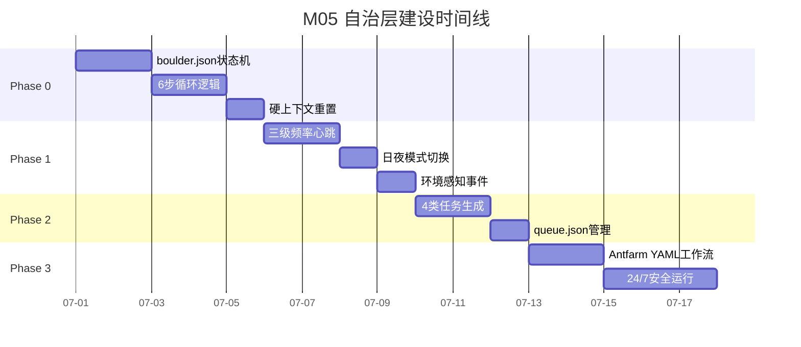
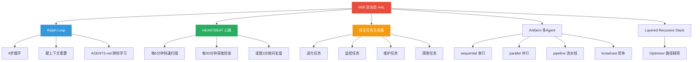
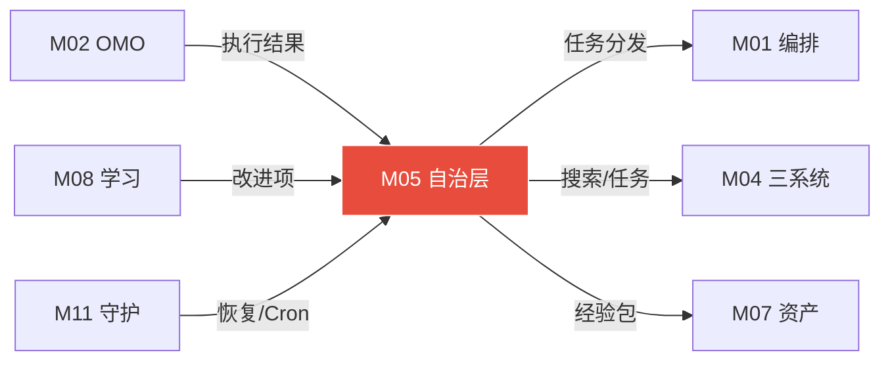

# 模块 05: 自治层与 AAL（自主代理层）

> **本文档定义 Ralph Loop 自主循环·Antfarm 多Agent协作·HEARTBEAT 心跳调度·自主任务生成器·24/7不间断运行的完整自治引擎。**
> **接管目标 (V3.0)**: 接管 OpenClaw 原生 `cron/jobs.json` (4个定时任务: github-auto-update/self-reflection-hourly/self-improving-check/self-exploration-cycle)，将固定 cron 表达式升级为 HEARTBEAT 智能心跳 + Ralph Loop 自主循环。
> 跨模块引用：M00（系统总论）·M01（编排引擎）·M02（OMO特工矩阵）·M04（三大系统协同）·M08（学习系统）·M11（执行环境）

---

## 1. AAL 总论

### 1.1 自治层定位

```
用户
 ↓ 任务/消息（可选·不一定需要用户触发）
┌──────────── 自治层 (AAL) ────────────┐
│  HEARTBEAT   → 环境感知·定时触发      │
│  Ralph Loop  → 持续执行·不停不休      │
│  Antfarm     → 多Agent·团队协作       │
│  自主任务生成 → 自己给自己找活干       │
│  日夜模式    → 白天全力·深夜低功耗     │
└──────────────────────────────────────┘
 ↓
DeerFlow（编排核心）→ 搜索/任务/工作流系统
 ↓
执行层（Claude Code·CLI-Anything·Midscene.js）
```

### 1.2 两大引擎协同

| 引擎 | 触发方式 | 工作模式 | 类比 |
|---|---|---|---|
| **HEARTBEAT** | 定时触发 | 心脏跳动·保持"活着"·主动感知环境 | 心跳·生命维持 |
| **Ralph Loop** | 任务驱动 | 接活干完·不达目标不停·专注执行 | 手臂·主动工作 |

协同方式：
```
HEARTBEAT 每5分钟醒来
 ↓ 扫描环境
有任务 → 启动 Ralph Loop 执行
无任务 → 自主任务生成器评估
生成新任务 → 写入 queue.json → 下次心跳启动 Ralph Loop
```

---

## 2. Ralph Loop 自主循环

### 2.1 核心理念

**不是单次问答，而是持续运行直到目标完成的闭环循环。**

加前缀 `Ralph:` 即进入自主模式。

### 2.2 执行流程

```
任务进入 Ralph Loop
 ↓
Step 1: 读取 boulder.json
 · 当前任务目标
 · 已完成节点
 · 当前进度
 ↓
Step 2: DeerFlow 执行一轮
 · 搜索 / 任务 / 工具调用
 · 按 DAG 拓扑执行下一个待完成节点
 ↓
Step 3: PostToolUse 钩子
 · 评估结果
 · 学习系统记录
 · 更新 boulder.json 进度
 ↓
Step 4: 目标判断
 · 当前节点完成？→ 继续下一节点
 · 当前节点失败？→ 调整策略重试（最多3次）
 · 失败超限？→ 标记为失败 → 切换备用路径
 ↓
Step 5: 上下文管理
 · 接近 90k token？→ ReMe compact_memory
 · 超过上限？→ 执行硬重置（见下文）
 ↓
Step 6: 全部节点完成？
 · 否 → 回到 Step 2 继续循环
 · 是 → 生成最终报告
   → 推送飞书汇报
   → 写经验包
   → 自主任务生成器评估下一步
```

### 2.3 硬上下文重置（核心机制）

当上下文过长时的干净重启：

```
上下文接近上限
 ↓
Step 1: 压缩关键信息
 · 提取本轮学到的规律 → 写入 AGENTS.md
 · 保存 boulder.json 当前进度
 · git commit 当前状态
 ↓
Step 2: 创建全新 Agent 实例
 · 干净上下文（零历史）
 · 只读取: SOUL.md + AGENTS.md + boulder.json
 ↓
Step 3: 新实例继续执行
 · 从 boulder.json 的下一个未完成节点开始
 · AGENTS.md 中的规律自动应用
 · 不重复已完成的步骤
 ↓
效果: 无限长任务执行·零上下文漂移
```

### 2.4 AGENTS.md 跨轮学习

```markdown
## AGENTS.md — Ralph Loop 每轮自动更新

### 已发现的规律
- 使用Tavily搜索AI论文比SearXNG效果更好（3次验证）
- 用户偏好Markdown格式的输出（5次确认）
- 图片批处理任务使用ImageMagick比GIMP-CLI快60%

### 当前任务进展
- boulder.json 记录的技术性进度
- 关键决策理由的文字记录
- 待下轮处理的遗留问题

### 本轮学到的教训
- CLI-Anything对Blender分析需要指定--background模式
- SearXNG在凌晨2点稳定性下降，切换到Tavily
```

---

## 3. Antfarm 多Agent协作

### 3.1 核心定位

一条命令构建 Agent 团队·YAML+SQLite+cron·零外部依赖。

### 3.2 YAML 工作流定义

```yaml
# ~/.deerflow/antfarm/research-team.yaml
workflow:
  name: "深度研究团队"
  agents:
    - id: researcher
      role: "信息搜集"
      category: search
      tasks:
        - "搜索${topic}的最新进展"
        - "收集≥3个独立来源"
      output: research_results.md
      
    - id: analyst
      role: "深度分析"
      category: research
      depends_on: [researcher]
      tasks:
        - "基于research_results.md进行横向对比"
        - "提取核心观点·标注来源"
      output: analysis_report.md
      
    - id: writer
      role: "报告撰写"
      category: deep
      depends_on: [analyst]
      tasks:
        - "将analysis_report.md整理为结构化报告"
        - "添加图表·格式化·引用注释"
      output: final_report.md
      
  execution:
    mode: sequential
    timeout_per_agent: 15min
    failure_strategy: retry_then_skip
```

### 3.3 与 Ralph Loop 的关系

```
Ralph Loop（单Agent持续循环）
 ↓ 遇到需要多角色协作的复杂任务
启动 Antfarm 工作流
 · 每个Agent在新会话中以干净上下文运行
 · 记忆通过 git history 和进度文件持久化
 · SQLite 记录每个Agent的执行状态
 ↓ 所有Agent完成
结果汇聚回 Ralph Loop
 → 继续持续循环
```

### 3.4 多Agent执行策略

| 策略 | 说明 | 适用场景 |
|---|---|---|
| **sequential** | Agent A完成后Agent B开始 | 有依赖关系·需要前序输出 |
| **parallel** | 多个Agent同时运行 | 无依赖·独立子任务 |
| **pipeline** | 流水线式·A的输出=B的输入 | 处理链·转换任务 |
| **broadcast** | 同一任务分发给多个Agent·取最优 | 竞争搜索·结果对比 |

---

## 4. HEARTBEAT 心跳调度中心

### 4.1 三级频率配置

```yaml
# HEARTBEAT.md

## 触发频率
heartbeat: every 5min          # 快速扫描
deep_check: every 30min        # 深度检查
nightly_review: "0 2 * * *"    # 凌晨2点复盘

## 每5分钟: 快速扫描
- 任务队列是否有待执行任务
- 用户是否有未读消息（飞书/邮件）
- 监控列表是否有变化（on_change模式）
- 正在执行的任务是否需要帮助

## 每30分钟: 深度检查
- 评估自身能力状态
- 检查资产库是否有待应用的改进
- 执行低优先级主动任务（学习/维护）
- 更新环境感知状态

## 空闲时: 自主进化
- 从学习系统获取待改进项
- 生成并执行自主进化任务
- 测试新能力·验证改进效果
- 记录进化过程到经验包

isolatedSession: true  ## 每次心跳干净上下文
```

### 4.2 日夜模式自动切换

| 模式 | 时段 | 心跳频率 | 执行范围 | TTS | Token预算 |
|---|---|---|---|---|---|
| **白天活跃** | 06:00-24:00 | 每5分钟 | 全部任务·全力执行 | 开启 | 正常 |
| **深夜低功耗** | 00:00-06:00 | 每30分钟 | 仅复盘/维护·低资源 | 静音 | 最低 |
| **异常响应** | 任意时段 | 即时 | 异常检测→立即推飞书 | 告警音 | 无限制 |

### 4.3 环境感知事件分类

| 优先级 | 事件类型 | 处理方式 |
|---|---|---|
| **高**（即时触发） | 用户消息 · 系统错误 · 安全告警 | 立即进入 Ralph Loop |
| **中**（加入队列） | 文件变化 · 定时任务到期 · 监控列表更新 | 加入 queue.json · 下次心跳执行 |
| **低**（心跳处理） | 系统资源检查 · 资产库健康 · 缓存清理 | HEARTBEAT 常规处理 |

---

## 5. 自主任务生成器

### 5.1 触发时机

```
时机1: 当前任务队列为空
 → "我现在应该做什么？"

时机2: Ralph Loop 完成一个任务后
 → "基于刚才的结果，下一步是什么？"

时机3: HEARTBEAT 扫描发现环境变化
 → "这个变化需要我做什么？"

时机4: 夜间复盘后
 → "明天我应该主动改进什么？"
```

### 5.2 四类自主任务

| 类型 | 说明 | 优先级 | 示例 |
|---|---|---|---|
| **进化任务** | 根据盲区/弱点/低效模式主动改进 | 低 | "搜索引擎路由权重偏差·优化配置" |
| **监控任务** | 检查用户关心的变化 | 中 | "检查关注仓库的新Release" |
| **维护任务** | 清理/更新/健康检查 | 低 | "清理过期资产·更新工具版本" |
| **探索任务** | 用户曾提到但未深入的话题 | 最低 | "用户提过想了解RAG·主动搜索" |

### 5.3 任务队列

```json
// ~/.deerflow/tasks/queue.json
{
  "pending": [
    {
      "id": "task-uuid",
      "source": "self_generated",
      "type": "evolution",
      "goal": "优化搜索引擎路由权重",
      "priority": 3,
      "created_at": "ISO8601",
      "estimated_tokens": 5000
    }
  ],
  "in_progress": [],
  "completed": [],
  "self_generated": []
}
```

### 5.4 优先级排序

```
用户任务(最高)
 > 监控触发任务
 > 异常处理任务
 > 维护任务
 > 进化任务
 > 探索任务(最低)

规则:
 · 用户任务始终最优先
 · 同优先级按创建时间排序
 · 预估token超过日预算剩余 → 推迟到明天
```

---

## 6. 24/7 全天候运行架构

### 6.1 完整运行状态图

```
白天活跃模式 (06:00-24:00):
 感知层持续监控
   → HEARTBEAT每5分钟触发
   → 有任务立即执行
   → Ralph Loop持续直到完成
   → 完成后自主任务生成器评估下一步

深夜模式 (00:00-06:00):
 低频心跳（每30分钟）
   → 夜间复盘（02:00）→ 6阶段完整复盘
   → 只执行低资源任务（复盘/维护）
   → TTS静音·不打扰用户

异常响应（任意时段）:
 感知层检测到异常
   → 立即推飞书通知
   → 等待用户确认是否处理
   → 紧急情况自动处理 + 事后汇报

自主进化（队列空闲时）:
 从学习系统取待改进项
   → 自动执行进化任务
   → 早晨推送进化报告
```

### 6.2 安全保障机制

| 保护机制 | 触发条件 | 动作 |
|---|---|---|
| **Token日预算** | 超过每日上限 | 暂停自主任务·保留紧急预算 |
| **连续失败** | 3次同类任务失败无解 | 推飞书请求人工介入 |
| **危险操作** | 删除/格式化/发送/支付 | 必须人工确认 |
| **用户命令** | 用户说"停止" | 立即停止所有循环 |
| **深夜模式** | 00:00-06:00 | 只执行低消耗任务 |
| **看门狗** | 主循环崩溃 | HEARTBEAT自动重启 |
| **崩溃恢复** | 系统重启 | Dapr恢复 + boulder.json继续 |
| **资源监控** | CPU>90% / 内存>90% | 暂停非紧急任务 |

### 6.3 Cron 定时任务清单

| 任务 | Cron 表达式 | 执行内容 | 模型消耗 |
|---|---|---|---|
| 快速心跳 | `*/5 * * * *` | 队列检查·消息扫描 | ~500 token |
| 深度检查 | `*/30 * * * *` | 能力评估·资产检查 | ~2000 token |
| 夜间复盘 | `0 2 * * *` | 6阶段完整复盘 | ~15000 token |
| 周度深化 | `0 1 * * 0` | 跨日分析·能力版图 | ~30000 token |
| 资产清理 | `0 3 * * *` | 过期降级·冲突解决 | ~3000 token |
| 备份 | `0 4 * * *` | 全量备份 | 0 token |

---

## 7. Layered Recursive Stack（自进化架构）

### 7.1 完整执行链

```
Orchestrator（编排者）
 → 读取SkillLibrary最优路径 → 分解目标
 ↓
Executor（执行者 — DeerFlow任务Agent）
 → 在Sandbox中执行具体工具调用
 ↓
Sandbox（沙盒 — DeerFlow Docker）
 → 隔离测试·运行单测/健康检查
 → 产生客观评分（非模型自评）
 ↓
Evaluator/Critic（评估者 — 监督Agent）
 → 对比预期与实际 → 量化偏差
 → Success → Optimizer
 → Failure → Debugger → 重新Executor
 ↓
Optimizer（优化者 — 关键新增环节）
 → 元推理: "用更少步骤解决同样问题？"
 → 分析冗余·识别可并行·识别可缓存
 → 精简路径 → 写入SkillLibrary
 ↓
SkillLibrary（技能库 — DeerFlow assets/）
 → 存储最优路径模板
 → Orchestrator下次直接复用
 → 形成闭环
```

### 7.2 即时优化 vs 夜间复盘

| 维度 | Optimizer（即时） | 夜间复盘（批量） |
|---|---|---|
| 触发时机 | 每次任务成功后立即 | 凌晨2:00 cron |
| 分析范围 | 本次任务的执行路径 | 当日所有任务的跨任务模式 |
| 输出 | 单任务精简路径→写资产 | 宏观规律·配置调整·日报 |
| Token消耗 | 低（只分析单次轨迹） | 中（汇聚当日所有数据） |
| 优化粒度 | 步骤级·精确 | 模式级·宏观 |
| 关系 | 即时补充·发现单次问题 | 深度整合·发现系统性问题 |

### 7.3 Optimizer Skill 文件

```markdown
## ~/.deerflow/skills/optimizer/SKILL.md

触发：任务成功完成且Sandbox验证通过后自动调用

执行步骤：
1. 读取本次任务的完整执行轨迹（tool_calls序列）
2. 计算总耗时·总token·步骤数
3. 比对同类任务历史均值
4. 标记：冗余步骤（重复搜索·无增量的验证）
5. 标记：可并行步骤（无依赖关系的相邻步骤）
6. 生成精简路径（去除冗余·并行化可并行）
7. 若精简后步骤数 < 原步骤数×0.8 → 写入工作流资产
8. 更新 asset-index.json

判断标准：
- 同类任务执行≥3次 → 可信的优化建议
- 节省步骤≥20% → 值得固化
- 质量分≥0.8 → 允许晋升
```

---

## 8. 完整自治运行示例

### 8.1 一天24小时的系统行为

```
06:00 — 白天模式启动
 HEARTBEAT 切换到每5分钟频率
 检查 queue.json: 昨晚复盘生成了2个进化任务
 启动 Ralph Loop 执行第一个进化任务

07:30 — 用户上线
 飞书消息: "帮我查一下最近一周的AI新闻"
 意图路由器: OPT模板检索 → 命中"新闻汇总SOP"
 DeerFlow 直接加载SOP → 执行 → 5分钟内推送结果

09:00 — 用户发送复杂任务
 "帮我开发一个Python脚本，用于批量处理PDF"
 Ralph Loop 接手 → DAG分解 → Claude Code 执行
 持续30分钟 → 途中检查点自动 checkpoint
 完成 → 推送飞书 → Optimizer 优化路径

12:00 — 队列空闲
 自主任务生成器: 发现用户曾提到"想学Rust"
 生成探索任务: "整理Rust入门学习路径"
 写入 queue.json → 低优先级

14:00 — HEARTBEAT 检测到环境变化
 监控列表: 用户关注的GitHub仓库发布新Release
 推送飞书通知: "@用户 项目XX发布了v2.0"

18:00 — 用户下线
 继续执行队列中的低优先级任务
 学习系统: 回顾当天执行记录 → 准备复盘数据

00:00 — 切换深夜模式
 HEARTBEAT 降频到每30分钟
 TTS 静音

02:00 — 夜间复盘
 6阶段复盘 → 发现3个可优化点
 生成2个进化任务 → 写入queue.json
 日报: "今日执行8个任务·成功7个·新增2个SOP"

04:00 — 资产清理
 扫描过期资产(30天无调用) → 降级为archived
 cleam __pycache__ 和临时文件

06:00 — 新的一天开始
 (循环 ♻️)
```

---

## 附录 A: 建设蓝图 (Construction Roadmap)

### 阶段划分

| 阶段 | 目标 | 关键交付物 | 验收标准 | 预估工期 |
|:---:|---|---|---|:---:|
| **Phase 0** | Ralph Loop 核心循环 | boulder.json 状态机、6步循环逻辑、硬上下文重置 | 单任务 Ralph Loop 完整执行→目标完成→经验包写入 | 5 天 |
| **Phase 1** | HEARTBEAT 心跳 | 三级频率配置（5min/30min/nightly）、日夜模式切换、环境感知 | HEARTBEAT 每5分钟触发 → 有任务自动启动 Ralph Loop | 4 天 |
| **Phase 2** | 自主任务生成器 | 4类任务生成、queue.json 队列管理、优先级排序 | 队列空闲→自主生成进化任务→写入queue→下次心跳执行 | 3 天 |
| **Phase 3** | Antfarm + 24/7 | 多Agent YAML 工作流、4种执行策略、安全保障机制 | 3个Agent协作完成研究任务；系统无人值守运行24小时 | 5 天 |

### 里程碑时间线



---

## 附录 B: 模块结构脑图 (Architecture Mind Map)



---

## 附录 C: 跨模块关系图 (Cross-Module Dependencies)

### 数据流向表

| 方向 | 对端模块 | 交换内容 | 触发条件 |
|:---:|---|---|---|
| → 输出 | **M01 编排引擎** | Ralph Loop 任务分发到 DeerFlow 编排 | 每轮循环的 Step 2 |
| ← 输入 | **M02 OMO矩阵** | Agent 执行结果回流 | 每轮执行完成时 |
| → 输出 | **M04 三大系统** | 自主生成的搜索/任务/工作流请求 | 心跳或自主任务触发 |
| → 输出 | **M07 数字资产** | 经验包、工作流资产 | SessionEnd / 任务完成 |
| ← 输入 | **M08 学习系统** | 待改进项列表、夜间复盘结果 | 自主进化任务生成时 |
| ← 输入 | **M11 执行与守护** | Dapr Actor 恢复状态、Cron 触发信号 | 崩溃恢复、定时任务 |

### 关系拓扑图



---

## 附录 D: GitHub 项目与相关文献 (References)

### 核心开源项目

| 项目 | GitHub 链接 | 在本模块中的角色 |
|---|---|---|
| **DeerFlow 2.0** | https://github.com/bytedance/deer-flow | Ralph Loop、HEARTBEAT 的宿主框架 |
| **Temporal.io** | https://github.com/temporalio/temporal | 持久化工作流，崩溃后精确恢复 |
| **Dapr** | https://github.com/dapr/dapr | Actor Reminder 持久化，Cron 定时触发 |
| **LangGraph** | https://github.com/langchain-ai/langgraph | DAG 状态循环引擎 |

### 技术文献

| 标题 | 链接 | 核心贡献 |
|---|---|---|
| *OMO Self-Evolving Agent Framework* | https://github.com/bytedance/deer-flow | Ralph Loop 不间断循环的设计原型 |
| *Antfarm Multi-Agent Orchestration* | https://github.com/bytedance/deer-flow | YAML+SQLite+Cron 的轻量多Agent协作 |

---

## 附录 E: 方法论参考 (Methodology Sources)

| 方法论 | 来源网址 | 在本模块中的应用点 |
|---|---|---|
| **Ralph Loop 持续循环** | https://github.com/bytedance/deer-flow | 不达目标不停止的任务驱动闭环 |
| **HEARTBEAT 心跳调度** | https://github.com/bytedance/deer-flow | 定时环境感知 + 自主触发任务 |
| **Antfarm 多Agent协作** | https://github.com/bytedance/deer-flow | YAML 声明式多Agent工作流 |
| **Layered Recursive Stack** | 本项目 M05 设计 | 编排→执行→沙盒→评估→优化→技能库的递归自进化 |
| **Actor Model (Dapr)** | https://docs.dapr.io/developing-applications/building-blocks/actors/ | 状态持久化+定时器+崩溃恢复 |

---

## 校验清单

- [x] AAL 自治层总论（两大引擎协同·层次定位）
- [x] Ralph Loop 完整执行流程（6步循环·目标判断·上下文管理）
- [x] 硬上下文重置机制（3步干净重启）
- [x] AGENTS.md 跨轮学习格式
- [x] Antfarm 多Agent协作（YAML定义·4种执行策略）
- [x] Antfarm 与 Ralph Loop 关系
- [x] HEARTBEAT 三级频率配置
- [x] 日夜模式自动切换（3种模式）
- [x] 自主任务生成器（4种触发·4类任务·优先级排序）
- [x] 任务队列 queue.json 结构
- [x] 24/7 运行架构（白天/深夜/异常/自主进化）
- [x] 安全保障机制（8个保护点）
- [x] Cron 定时任务清单（6项·含token预估）
- [x] Layered Recursive Stack（含Optimizer Skill）
- [x] 即时优化 vs 夜间复盘对比
- [x] 完整24小时运行示例
- [x] 接管清单（V3.0 接管 cron/jobs.json）

---

## 接管清单 (Takeover Manifest)

> **V3.0 接管式升级 — 2026-04-11 新增**

### 接管目标

- **文件**: `.openclaw/cron/jobs.json`
- **内容**: 4 个定时任务
- **获取方式**: 备份原文件 → 迁移为 HEARTBEAT 子任务 → 验证后切换

### 原生 4 个任务迁移方案

| 原生任务 | Cron表达式 | 当前状态 | M05 升级后 |
|---|---|:---:|---|
| `github-auto-update` | 每周一9:00 | ✅ 启用 | → 纳入 HEARTBEAT 外部情报扫描 |
| `self-reflection-hourly` | 每3h | ❌ 已禁用 | → 纳入 HEARTBEAT 感知-反思循环 |
| `self-improving-check` | 每4h | ❌ 已禁用 | → 纳入 M08 学习系统的持续改进 |
| `self-exploration-cycle` | 每10min | ❌ 已禁用 | → 纳入 Ralph Loop 自主探索任务 |

### M05 增强能力（超出原生）

| 新增能力 | 原生没有 |
|---|---|
| HEARTBEAT 智能心跳（环境感知+动态调频） | 原生只有固定 cron 表达式 |
| Ralph Loop（不达目标不停·含重试和备用路径） | 原生触发即执行，不管结果 |
| 自主任务生成器（自己给自己找活干） | 原生只能执行预定义任务 |
| 日夜模式（白天全力/深夜低功耗+提纯） | 原生无 |
| Antfarm 多Agent协作 | 原生无 |
