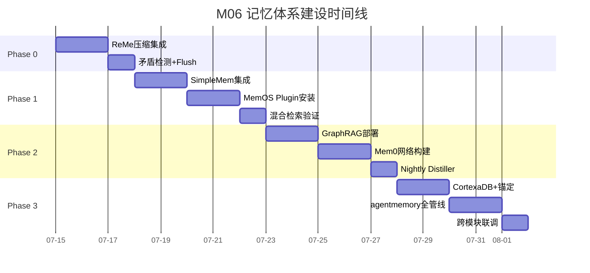
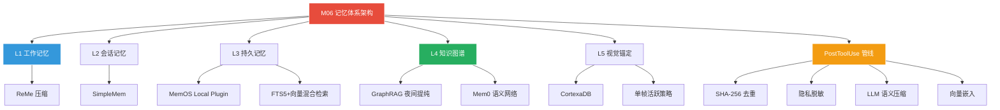
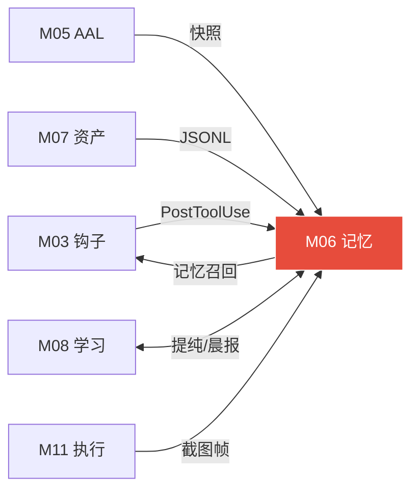

# 模块 06: 记忆体系架构 (Memory Architecture)

> **本文档定义 OpenClaw 系统的完整记忆体系——五层记忆架构、双轨存储策略、GraphRAG 夜间提纯、视觉GUI记忆锚定、PostToolUse 语义写入管线、以及防灾难性遗忘的长期知识图谱机制。**
> 跨模块引用：M03（驾驭钩子·PostToolUse 触发）·M05（AAL·Shadow Mode 记忆快照）·M07（数字资产·经验包）·M08（学习系统·夜间复盘）·M11（执行环境·修正项7）

---

## 1. 核心设计哲学

### 1.1 为什么记忆是生死线

> [!CAUTION]
> 记忆系统是整个自主 AI 操作系统中**最致命的瓶颈**。如果没有精心设计的记忆管理，系统在连续运行约 2 周后必然陷入"灾难性遗忘 (Catastrophic Forgetting)"——AI 会"越迭代越智障"。

**上下文崩溃的完整危害链**：
```
长任务执行 → 上下文超过 200k token → Claude 强制压缩
→ 步骤中失去早期决策依据 → 重复搜索已知信息
→ 任务质量退化 → 系统"越运行越蠢"
```

**关键数据**：
- DeerFlow 2.0 一个典型研究任务可产生 **300-500k token**
- 无上下文管理时，系统在超限后**必然崩溃**

### 1.2 双轨记忆总原则

| 轨道 | 载体 | 职责 | 时间尺度 |
|---|---|---|---|
| **OpenClaw 原生轨** | MEMORY.md · AGENTS.md · boulder.json | 用户手写知识 · 跨轮行为学习 · 任务状态 | 即时-永久 |
| **DeerFlow 认知轨** | experiences/ · GraphRAG图谱 · Mem0网络 | 执行经验 · 结构化知识图谱 · 语义记忆网 | 日-年 |

**铁律**：两轨独立运行，互不覆盖。OpenClaw 轨由用户掌控（MEMORY.md 禁止 Agent 追加），DeerFlow 轨由 AI 自主维护。

---

## 2. 五层记忆架构

### 2.1 架构总览

```
┌─────────────────────────────────────────────────────────┐
│  L1: 工作记忆 (Working Memory)                          │
│  当前任务完整上下文 · 最近 10k token + 结构化摘要        │
│  ★ 引擎: ReMe 实时压缩框架                              │
├─────────────────────────────────────────────────────────┤
│  L2: 会话记忆 (Session Memory)                          │
│  近期 N 个会话知识积累 · 语义无损压缩                    │
│  ★ 引擎: SimpleMem (跨会话 LoCoMo F1=0.613)            │
├─────────────────────────────────────────────────────────┤
│  L3: 持久记忆 (Persistent Memory)                       │
│  跨任务知识库 · FTS5+向量混合检索 · 多 Agent 共享        │
│  ★ 引擎: MemOS Local Plugin (官方·降 token 72%)         │
├─────────────────────────────────────────────────────────┤
│  L4: 知识图谱 (Knowledge Graph)                         │
│  实体-关系结构化网络 · 防灾难性遗忘 · 夜间提纯           │
│  ★ 引擎: GraphRAG (微软) + Mem0 语义节点网              │
├─────────────────────────────────────────────────────────┤
│  L5: 视觉锚定记忆 (Visual Anchor Memory)                │
│  GUI 操作快照 · 单帧活跃策略 · 历史步骤文本锚定          │
│  ★ 引擎: CortexaDB 本地向量/图数据库                    │
└─────────────────────────────────────────────────────────┘
```

### 2.2 各层详细规格

#### L1: 工作记忆 (Working Memory) — 热区

| 属性 | 规格 |
|---|---|
| **存储引擎** | ReMe (三阶段压缩框架) |
| **容量阈值** | 90k token 触发 `compact_memory` |
| **压缩策略** | 保留最近 10k token + 结构化摘要 |
| **压缩时行为** | 自动检测矛盾 · 时序排列 · 标记 `UNVERIFIED` |
| **Flush 保障** | 压缩前自动 Flush 至 L2 防丢失 (compactionFlush: true) |
| **生命周期** | 当前任务期间 · 任务完成后沉降至 L2 |

```typescript
// 工作记忆压缩触发逻辑（概念代码）
interface WorkingMemoryConfig {
  maxTokens: 90_000;           // 触发阈值
  retainRecent: 10_000;        // 保留最近 token 数
  summaryModel: 'claude-haiku'; // 压缩用轻量模型
  contradictionCheck: true;     // 压缩时检测矛盾
  flushBeforeCompact: true;     // 压缩前先 Flush 到 L2
}
```

#### L2: 会话记忆 (Session Memory) — 温区

| 属性 | 规格 |
|---|---|
| **存储引擎** | SimpleMem (语义无损压缩) |
| **精度基准** | 跨会话 LoCoMo 基准 F1=0.613 (比 Claude-Mem 高 64%) |
| **压缩方式** | 语义结构化压缩 → 向量索引 → 精准检索 |
| **多模态** | 文字 + 图片 + 音频 |
| **保留策略** | 最近 N 个会话 (N 可配，默认 50) |
| **触发时机** | 会话结束时 `agent_end` 钩子自动写入 |

#### L3: 持久记忆 (Persistent Memory) — 冷区

| 属性 | 规格 |
|---|---|
| **存储引擎** | MemOS Local Plugin (OpenClaw 官方插件) |
| **核心收益** | 降 token 72% · 多 Agent 共享记忆 |
| **检索方式** | FTS5 + 向量混合检索 (BM25 + RRF 融合) |
| **存储后端** | 本地 SQLite |
| **内容类型** | Skill 记忆 · 工具记忆 · 用户偏好 · 能力版图 |
| **夜间整合** | 每日 02:00 Dreaming 进程 → 短期信号评估 → 达标后晋升至 MEMORY.md |

> [!WARNING]
> **Windows 安装注意**：MemOS Local Plugin 在 Windows 上必须使用 **Method B 手动安装**（`npm pack` → 解压到 extensions → 手动配置），不可使用 OpenClaw 自动安装功能，否则会因 EINVAL 路径编码问题导致失败。

#### L4: 知识图谱 (Knowledge Graph) — 深层结构区

| 属性 | 规格 |
|---|---|
| **提纯引擎** | GraphRAG (microsoft/graphrag) |
| **语义网络** | Mem0 (mem0ai/mem0) |
| **提纯时机** | 每日夜间自净化进程 (Nightly Distiller) 00:30-06:00 |
| **提纯方式** | AI 调用轻量模型重审全天流水 → 抽取实体+关联 → 组建本地知识图谱 |
| **存储格式** | 实体-关系三元组 (如: `[Python3.12] --不兼容--> [模块X]`) |
| **核心价值** | 系统运转 5 年后经验仍如"肌肉记忆"——精准、系统、永不遗忘 |

> [!IMPORTANT]
> **已锁定设计决策 (决策 #18)**：GraphRAG+Mem0（非扁平 RAG），防灾难性遗忘·5 年经验如肌肉记忆。
> 详见修正项 7 (M11 §4.7)。

```
GraphRAG 夜间提纯流程：

全天执行流水账（JSONL 经验包）
    ↓ Nightly Distiller 00:30 启动
轻量模型深度阅读 → 抽取核心知识
    ↓
实体特征提取: [飞书API] [gVisor] [Temporal] ...
    ↓
多级关联建模: [飞书API] --属于--> [高危组件]
              [gVisor]  --保护--> [沙盒环境]
              [Temporal] --提供--> [状态恢复]
    ↓
本地知识图谱更新 → 次日检索时直接查图谱逻辑网格
```

#### L5: 视觉锚定记忆 (Visual Anchor Memory) — GUI 专区

| 属性 | 规格 |
|---|---|
| **存储引擎** | CortexaDB (本地 local-first 向量/图数据库) |
| **核心策略** | **单帧活跃 (Single-Frame-Active)** 策略 |
| **活跃帧** | Agent 只看当前屏幕截图 (防 Token 爆炸) |
| **历史帧** | 自动坍缩为轻量文本锚 (text anchor) / 向量 |
| **锚定格式** | `{step_id, action, target_element, result, timestamp}` |
| **召回方式** | 需要时按 step_id 或语义相似度从 CortexaDB 召回 |

> 此层专门解决 GUI 自动化（UI-TARS / Midscene.js）产生的视觉数据 Token 爆炸问题。
> 详见修正项 3 (M11 §4.3): Anchored State Memory (ASM)。

---

## 3. PostToolUse 语义写入管线

### 3.1 完整数据流

每次工具调用完成后，PostToolUse 钩子触发以下**七阶段管线**：

```
PostToolUse 钩子触发
    ↓
① SHA-256 去重 (5分钟窗口·重复调用直接跳过)
    ↓
② 隐私脱敏 (移除 API Key / 密码 / <private> 标签)
    ↓
③ 观察存储 (原始事件流·只追加不修改)
    ↓
④ LLM 语义压缩 (轻量模型提取: 类型/事实/叙述/概念/涉及文件)
    ↓
⑤ Zod 格式验证 (失败自动重试一次)
    ↓
⑥ 质量打分 (0-100·低于30分的碎片直接丢弃)
    ↓
⑦ 向量嵌入生成 → 写入对应记忆层
    ├── 高紧急度 → L1 工作记忆
    ├── 中重要度 → L2 会话记忆
    └── 持久价值 → L3 持久记忆 + L4 图谱候选
```

### 3.2 语义压缩引擎: agentmemory

| 属性 | 规格 |
|---|---|
| **安装** | `npm install -g agentmemory` |
| **启动** | `agentmemory start` (默认端口 3111) |
| **MCP 注册** | DeerFlow `conf.yaml` → `mcp_servers` → `http://localhost:3111/mcp` |
| **去重** | SHA-256 · 5 分钟窗口 |
| **脱敏** | 自动移除 API Key / 密码 / 标记 `<private>` 的内容 |
| **检索** | BM25 + 向量 RRF 融合 (混合检索·SOTA 精准度) |
| **评分** | 0-100 质量打分 · 带电路断路器 |

---

## 4. 夜间记忆整合 (Dreaming + GraphRAG 提纯)

### 4.1 两阶段夜间进程

| 阶段 | 时间 | 引擎 | 动作 |
|---|---|---|---|
| **阶段 1: Dreaming 整合** | 每日 02:00 | OpenClaw 内置 | 短期信号整合 → 评分+频率+多样性门槛 → 达标晋升 MEMORY.md |
| **阶段 2: GraphRAG 炼金** | 每日 00:30-06:00 | GraphRAG + Mem0 | 全天流水深度阅读 → 实体-关系提取 → 知识图谱更新 |

### 4.2 Dreaming 进程配置

```json
{
  "memory": {
    "dreaming": {
      "enabled": true,
      "schedule": "0 2 * * *",
      "promotion_threshold": {
        "quality_score": 75,
        "frequency": 3,
        "diversity_gate": true
      }
    }
  }
}
```

### 4.3 GraphRAG 提纯与学习系统联动

```
夜间自净化进程 (Nightly Distiller)
    │
    ├── 任务 A: 沙盒试毒 (gVisor 沙盒·修正项5)
    ├── 任务 B: 影子模式预执行 (Shadow Mode·修正项6)
    └── 任务 C: 记忆提纯 (GraphRAG·本模块)
         │
         ├── 读取 experiences/YYYY-MM-DD.jsonl
         ├── 轻量模型深度分析 → 实体-关系三元组提取
         ├── 与现有图谱合并去重
         ├── 图谱质量评估 (孤立节点清理·矛盾关系标记)
         └── 输出: 更新后的知识图谱 + 次日晨报摘要
```

---

## 5. 三层记忆数据流向（完整生命周期）

### 5.1 执行时（实时）

```
工具调用 → PostToolUse 钩子 → agentmemory 处理
  (去重 → 脱敏 → 压缩 → 向量索引)
  → L3 持久记忆写入
```

### 5.2 会话中（上下文管理）

```
上下文接近 90k token → ReMe compact_memory 触发
  → 保留最近 10k + 结构化摘要
  → L1 工作记忆压缩继续
```

### 5.3 会话结束（持久化）

```
MemOS Local Plugin agent_end 钩子
  → 对话亮点提取 → SQLite 持久化
  → 下次会话 before_agent_start 自动召回
```

### 5.4 每日 02:00（Dreaming 整合）

```
OpenClaw 内置 Dreaming
  → 短期信号整合 → 评分+频率+多样性门槛
  → 晋升到 MEMORY.md 长期记忆
```

### 5.5 每日 00:30-06:00（GraphRAG 提纯）

```
Nightly Distiller 启动
  → 全天经验包深度阅读
  → 实体-关系抽取 → 知识图谱更新
  → 次日检索时查图谱逻辑网格（非盲目搜索）
```

---

## 6. 与其他模块的集成接口

### 6.1 接口清单

| 调用方 | 接口 | 方向 | 说明 |
|---|---|---|---|
| M03 驾驭钩子 | `PostToolUse` 事件 | → 本模块 | 每次工具调用后触发语义写入管线 |
| M03 驾驭钩子 | `PreToolUse` 记忆召回 | ← 本模块 | 执行前从 L2/L3 召回相关历史经验 |
| M05 AAL | Shadow Mode 快照 | → 本模块 | 影子模式预执行的中间状态存入 L1 |
| M05 AAL | Temporal 状态冰封 | ↔ 本模块 | 高危审批等待时 L1 快照冷藏 |
| M07 数字资产 | 经验包 JSONL | → 本模块 | 原始执行数据供 GraphRAG 夜间提纯 |
| M08 学习系统 | 夜间复盘 | ↔ 本模块 | Nightly Distiller 触发 GraphRAG 提纯 |
| M08 学习系统 | 晨报生成 | ← 本模块 | 从图谱提取关键实体变化生成晨报 |
| M11 执行环境 | UI-TARS 截图 | → 本模块 | 视觉帧数据写入 L5 锚定记忆 |

### 6.2 记忆检索优先级

当 Agent 需要召回历史经验时，按以下优先级检索：

```
1. L1 工作记忆 (当前任务上下文) → 最快·最相关
2. L4 知识图谱 (结构化实体查询) → 精准·跨时间
3. L2 会话记忆 (近期会话语义) → 温热·高质量
4. L3 持久记忆 (全量混合检索) → 广泛·兜底
5. L5 视觉锚定 (GUI 操作历史) → 仅视觉任务时
```

---

## 7. 性能基准与对比

### 7.1 升级前后对比

| 指标 | 升级前 (朴素文件) | 升级后 (五层架构) | 数据来源 |
|---|---|---|---|
| token 使用量 | 无管理·任务越长越贵 | **降低 72%** | MemOS 官方数据 |
| 跨会话记忆准确率 | AGENTS.md 手工维护 | **LoCoMo F1=0.613** | SimpleMem 论文 |
| 长任务崩溃率 | 上下文超限必崩 | **自动压缩·无损继续** | ReMe 框架 |
| 记忆检索精度 | 关键词顺序检索 | **BM25+向量 RRF 融合** | agentmemory |
| 长期知识衰减 | 2 周后灾难性遗忘 | **5 年如肌肉记忆** | GraphRAG+Mem0 |

### 7.2 能力矩阵

| 能力维度 | 无记忆管理 | 三层记忆 (V1) | 五层架构 (V3) |
|---|---|---|---|
| 单任务上下文 | ⚠️ 超限即崩 | ✅ 自动压缩 | ✅ ReMe 分级压缩 |
| 跨会话持续 | ❌ 每次从零开始 | ✅ SimpleMem | ✅ SimpleMem + 图谱 |
| 长期知识积累 | ❌ 无 | ✅ MemOS | ✅ MemOS + GraphRAG |
| 结构化推理 | ❌ 平面文本 | ❌ 平面文本 | ✅ 实体-关系图谱 |
| 视觉操作记忆 | ❌ 无 | ❌ 无 | ✅ 锚定+CortexaDB |
| 多 Agent 共享 | ❌ 隔离 | ✅ MemOS | ✅ MemOS + 黑板 |

---

## 8. 安装与配置清单

### 8.1 L1 工作记忆 (OpenClaw 内置·免安装)

```json
// ~/.openclaw/openclaw.json
{
  "memory": {
    "enabled": true,
    "search": {
      "hybridSearch": true,
      "maxResults": 10
    },
    "dreaming": {
      "enabled": true,
      "schedule": "0 2 * * *"
    },
    "compactionFlush": true
  }
}
```

### 8.2 L2 会话记忆 (SimpleMem)

```bash
# 集成方式：通过 DeerFlow 2.0 内置的会话管理
# 配置 conf.yaml:
session_memory:
  engine: simplemem
  max_sessions: 50
  compression: semantic
  multimodal: true
```

### 8.3 L3 持久记忆 (MemOS Local Plugin)

```bash
# ⚠️ Windows 必须 Method B 手动安装
# 1. 下载
npm pack @memtensor/memos-local-openclaw-plugin

# 2. 解压到 extensions 目录
mkdir -p C:\Users\win\.openclaw\extensions\memos-local-openclaw-plugin
# 解压 .tgz 到上述目录

# 3. 安装依赖
cd C:\Users\win\.openclaw\extensions\memos-local-openclaw-plugin
npm install

# 4. 配置 openclaw.json
# plugins.entries: "memos-local-openclaw-plugin": {"enabled": true}
# plugins.load.paths: 添加路径

# 5. 重启
openclaw gateway restart
```

### 8.4 L4 知识图谱 (GraphRAG + Mem0)

```bash
# GraphRAG (微软)
pip install graphrag -i https://pypi.tuna.tsinghua.edu.cn/simple

# Mem0
pip install mem0ai -i https://pypi.tuna.tsinghua.edu.cn/simple

# 配置 DeerFlow conf.yaml 的夜间提纯任务
nightly_distiller:
  graphrag:
    enabled: true
    schedule: "30 0 * * *"
    input_dir: "~/.deerflow/experiences/"
    output_dir: "~/.deerflow/memory/knowledge_graph/"
    model: "claude-haiku"
  mem0:
    enabled: true
    storage: local
    embedding_model: "text-embedding-3-small"
```

### 8.5 L5 视觉锚定 (CortexaDB)

```bash
# CortexaDB 本地 local-first 向量/图数据库
# 集成方式：通过 MCP 协议
pip install cortexadb -i https://pypi.tuna.tsinghua.edu.cn/simple

# 配置
visual_memory:
  engine: cortexadb
  policy: single_frame_active
  anchor_format: text_summary
  max_anchors_per_session: 500
```

### 8.6 语义写入管线 (agentmemory)

```bash
# 安装 MCP 服务器
npm install -g agentmemory

# 启动
agentmemory start  # 默认端口 3111

# DeerFlow 注册
# conf.yaml:
mcp_servers:
  - name: agentmemory
    url: http://localhost:3111/mcp
    type: http
```

---

## 9. 开源引用与学术文献

| 组件 | GitHub / 文献 | 用途 |
|---|---|---|
| GraphRAG | [microsoft/graphrag](https://github.com/microsoft/graphrag) | 图谱增强提取法·夜间提纯 |
| Mem0 | [mem0ai/mem0](https://github.com/mem0ai/mem0) | 超长期记忆中间件·语义节点网 |
| MemOS | OpenClaw 官方插件 | 持久记忆·降 token 72%·多 Agent 共享 |
| SimpleMem | 学术论文 LoCoMo 基准 | 跨会话语义压缩·F1=0.613 |
| ReMe | 压缩框架 | 工作记忆实时压缩·矛盾检测 |
| agentmemory | npm 包 | PostToolUse 语义写入·去重·脱敏·评分 |
| CortexaDB | 本地 local-first DB | 视觉锚定·向量/图混合存储 |

---

## 附录 A: 建设蓝图 (Construction Roadmap)

### 阶段划分

| 阶段 | 目标 | 关键交付物 | 验收标准 | 预估工期 |
|:---:|---|---|---|:---:|
| **Phase 0** | L1 工作记忆 | ReMe 压缩框架集成、90k token 阈值触发、矛盾检测 | 上下文超 90k → 自动压缩 → 保留摘要 + 最近 10k | 3 天 |
| **Phase 1** | L2+L3 会话+持久 | SimpleMem 语义压缩、MemOS Local Plugin 安装、FTS5+向量混合检索 | 跨会话记忆召回 F1≥0.6；token 降低 70%+ | 5 天 |
| **Phase 2** | L4 知识图谱 | GraphRAG 夜间提纯、Mem0 语义网络、Nightly Distiller 成功运行 | 凌晨自动提纯 → 次日检索时查图谱逻辑网格 | 5 天 |
| **Phase 3** | L5+管线+集成 | CortexaDB 视觉锚定、agentmemory 七阶段管线、跨模块接口 | PostToolUse→去重→脱敏→压缩→向量→写入全链路通过 | 5 天 |

### 里程碑时间线



---

## 附录 B: 模块结构脑图 (Architecture Mind Map)



---

## 附录 C: 跨模块关系图 (Cross-Module Dependencies)

### 数据流向表

| 方向 | 对端模块 | 交换内容 | 触发条件 |
|:---:|---|---|---|
| ← 输入 | **M03 驾驭钩子** | PostToolUse 事件（工具名/结果/耗时） | 每次工具调用后 |
| → 输出 | **M03 驾驭钩子** | PreToolUse 记忆召回（历史经验） | 执行前检索 |
| ← 输入 | **M05 AAL** | Shadow Mode 快照、Temporal 状态冰封 | 高危审批等待时 |
| ← 输入 | **M07 数字资产** | 经验包 JSONL 原始数据 | GraphRAG 夜间提纯 |
| ↔ 双向 | **M08 学习系统** | Nightly Distiller 触发 / 晨报数据提取 | 每日 00:30 |
| ← 输入 | **M11 执行环境** | UI-TARS 截图帧数据 | 视觉任务执行时 |

### 关系拓扑图



---

## 附录 D: GitHub 项目与相关文献 (References)

### 核心开源项目

| 项目 | GitHub 链接 | 在本模块中的角色 |
|---|---|---|
| **GraphRAG** | https://github.com/microsoft/graphrag | L4 知识图谱夜间提纯引擎 |
| **Mem0** | https://github.com/mem0ai/mem0 | L4 超长期语义记忆网络 |
| **agentmemory** | https://github.com/autonomousresearchgroup/agentmemory | PostToolUse 语义写入管线 |
| **CortexaDB** | https://cortexadb.com/ | L5 视觉锚定的本地向量/图数据库 |
| **BGE-M3** | https://github.com/FlagOpen/FlagEmbedding | 多语言嵌入模型，向量化引擎 |

### 技术文献与论文

| 标题 | 链接 | 核心贡献 |
|---|---|---|
| *From Local to Global: A Graph RAG Approach* | https://arxiv.org/abs/2404.16130 | GraphRAG 图谱增强检索的理论基础 |
| *MemOS: An Operating System for LLM Memory* | https://arxiv.org/abs/2404.05511 | L3 持久记忆 token 降低 72% 的理论依据 |
| *SimpleMem: LoCoMo Benchmark* | 学术论文 | 跨会话语义压缩 F1=0.613 |

---

## 附录 E: 方法论参考 (Methodology Sources)

| 方法论 | 来源网址 | 在本模块中的应用点 |
|---|---|---|
| **五层分级存储** | 本项目 M06 原创设计 | L1热区→L5深层区的分级检索策略 |
| **双轨记忆** | 本项目 M06 原创设计 | OpenClaw 轨(用户掌控) + DeerFlow 轨(AI自维护) |
| **GraphRAG 提纯** | https://github.com/microsoft/graphrag | 夜间实体-关系三元组提取，防灾难性遗忘 |
| **Single-Frame-Active** | 本项目修正项3 | 视觉记忆只保留当前帧，历史帧坍缩为文本锚 |
| **PostToolUse 七阶段管线** | https://github.com/autonomousresearchgroup/agentmemory | 去重→脱敏→压缩→验证→评分→嵌入→写入 |
| **电路断路器** | https://docs.microsoft.com/en-us/azure/architecture/patterns/circuit-breaker | agentmemory LLM 连续失败降级策略 |

---

## 校验清单

- [x] 五层记忆架构完整定义 (L1-L5)
- [x] 双轨存储策略 (OpenClaw 轨 + DeerFlow 轨)
- [x] PostToolUse 语义写入七阶段管线
- [x] GraphRAG 夜间提纯流程与配置
- [x] Dreaming 整合进程
- [x] 视觉锚定记忆 (Single-Frame-Active 策略)
- [x] 性能基准对比表 (token 降 72%·跨会话 F1=0.613)
- [x] 完整安装与配置清单 (6 个子系统)
- [x] 与 M03/M05/M07/M08/M11 的集成接口定义
- [x] 记忆检索优先级策略
- [x] 开源引用与学术文献索引

---

## 接管清单 (Takeover Manifest)

> **V3.0 接管式升级 — 2026-04-11 新增**

### 接管目标

- **文件**: `.openclaw/memory/*.sqlite` + `.openclaw/lancedb-pro/`
- **数据量**: main.sqlite(8MB) / doudian.sqlite(4.3MB) / ceo.sqlite(68KB) / a2a__main.sqlite(68KB)
- **获取方式**: 在原有SQLite数据库上**新增表**，不修改已有表结构和数据（数据保护宪法第三条）

### 新增表（不影响原有数据）

`sql
-- ReMe 四层记忆扩展
CREATE TABLE IF NOT EXISTS memory_layers (
    id INTEGER PRIMARY KEY,
    layer TEXT CHECK(layer IN ('working','episodic','semantic','procedural')),
    content TEXT, ttl INTEGER, source_table TEXT, created_at INTEGER
);

-- GraphRAG 关联图谱
CREATE TABLE IF NOT EXISTS graph_edges (
    id INTEGER PRIMARY KEY,
    from_node TEXT, to_node TEXT, relation TEXT, weight REAL, created_at INTEGER
);
`

### M06 增强能力

| 新增能力 | 原生没有 |
|---|---|
| ReMe四层记忆（工作/情景/语义/程序） | 原生单层SQLite存储 |
| GraphRAG夜间提纯 | 原生无图谱关联 |
| 视觉GUI记忆锚定 | 原生无 |
| PostToolUse语义写入管线 | 原生无 |
| 防灾难性遗忘机制 | 原生无 |
