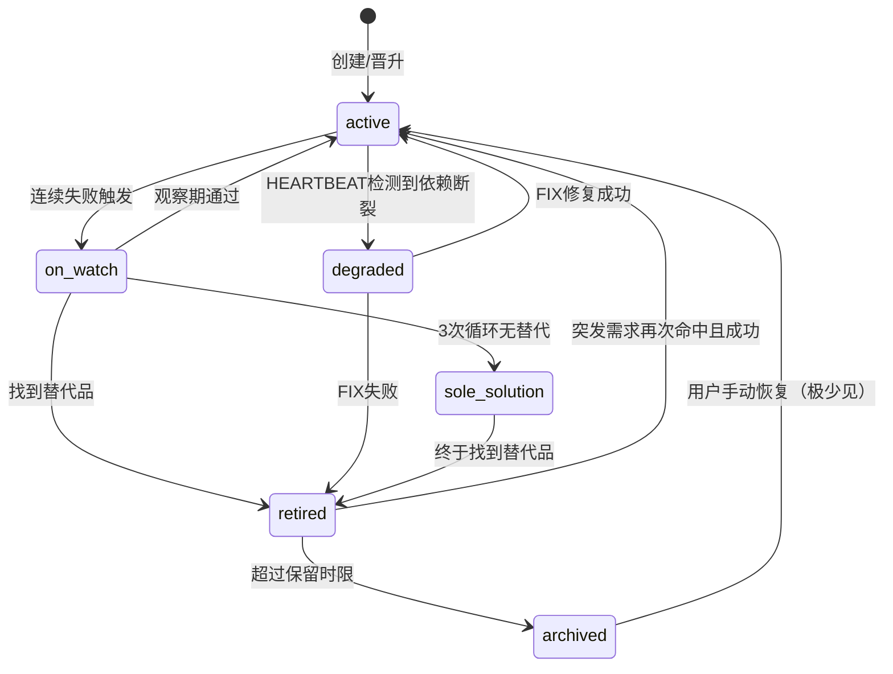
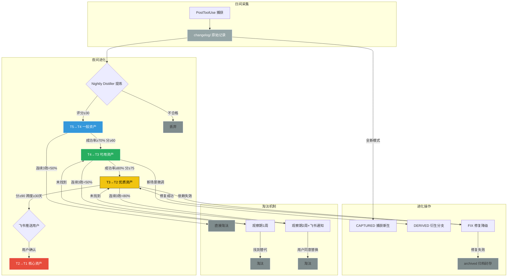
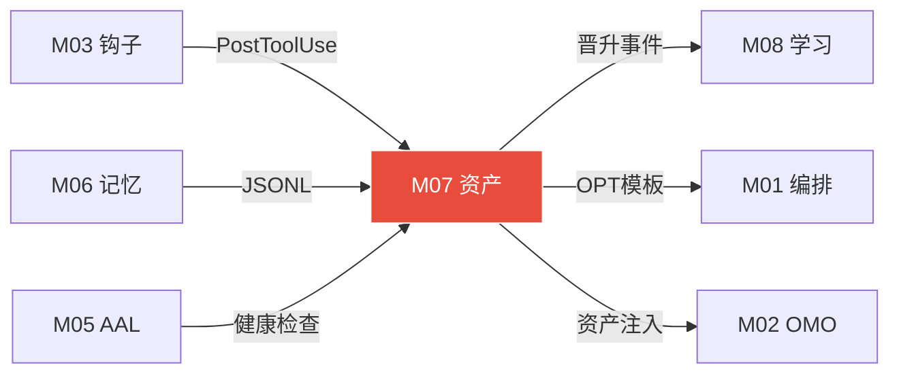

# 模块 07: 数字资产体系 (Digital Asset System)

> **版本定义：OpenClaw V3 核心机制档案**
> **核心使命：实现 AI 经验与能力从短期缓存向持久化"肌肉记忆"的转化，保障零技术丢失（Zero Tech Loss）的跨主机存活体系。**
> **接管目标 (V3.0)**: 接管 OpenClaw 原生 `core/dynamic-platform-binding.js` (578行)，将其平台发现/评估/淘汰机制升级为九类资产+五级分级+五维评分的完整数字资产体系。
> 跨模块级联引用：M00（系统总论）·M04（三大系统协同）· M06（记忆架构）· M08（学习系统与资产智能体）· M09（DSPy提示词编译）· M12（跨端协同拓扑）

---

## 1. 数字资产定义

### 1.1 资产本质

在 OpenClaw 中，**数字资产（Digital Asset）** 的唯一判定标准是：

> **下次遇到相似情况，能让系统更好、更快、更省的东西。**

大模型本身是易耗品——Sonnet 换代、GPT 迭代、DeepSeek 出新版——但基于企业/个人私有场景跑出来的
「失败摸索经验」和「SOP 步骤」才是系统的护城河。资产的价值不在于单次执行的输出物，而在于
其可被泛化、可被复用、可被量化评估的特性。

- **越用越富效应**：前两次任务靠大模型硬凑逻辑耗费 200 秒；第三次任务直接检索衍生出的
  Tier-2 资产，耗时 10 秒以内（确定性执行，跳过大模型推理）。
- **模型无关性**：资产存储的是流程、参数、策略，而非依赖特定模型的 token 格式。
  换模型不必重建资产库。

### 1.2 不是资产的东西

以下内容**严禁**进入资产库，否则会制造噪音、拖慢检索、污染评分体系：

| 类型 | 原因 | 归属 |
|------|------|------|
| 单次任务的具体内容 | 例如「帮我翻译的那篇文章」——这是产出物，不是能力 | 用户文件系统 |
| 对话历史 | 漫长的聊天记录是上下文，不是可复用知识 | M06 记忆系统管辖 |
| 中间过程数据 | 未经验证的临时变量、调试输出 | 任务系统临时目录 |
| 未验证的情绪化反馈 | 「感觉不错」「大概可以」——不是客观可衡量的质量信号 | 丢弃 |

### 1.3 资产存储三大底线

1. **绝对剥离性**：无论宿主机崩溃还是迁移新设备，只要 `~/.deerflow/assets/` 目录不被
   物理销毁，OpenClaw 在新机器上 30 分钟内即可 100% 找回过去所有经验认知。
2. **纯粹非废话原则**：所有资产必须是高度凝练的结构化 JSON，接受五维评分模型持续考核。
3. **独立特权干预**：Worker Agent 只能「提议生成」资产，**没有权限直接写入**。
   只有 M08 定义的独立进程——资产智能体（Asset Guardian Agent）拥有最终裁决权。

---

## 2. 九类资产完整定义

基于任务系统的流转特性，数字资产被严格划分为九个亚类。每一类回答一个不同的核心问题：

| 类别 | 资产名称 | 核心问题 | 典型内容 |
|:---:|---|---|---|
| **A1** | 能力工具资产 | 系统能做什么？ | 第三方工具的最佳调用参数、安全边界、重试策略。如 `ffmpeg -hwaccel cuda` 的甜点参数组合 |
| **A2** | 外部资源资产 | 去哪里找什么？ | API Endpoint 地址簿、高质量文档入口、镜像源最优策略。如「查 Python 异常优先走 docs.python.org」 |
| **A3** | 解决方案资产 | 特定问题怎么解？ | 经夜间压缩优化的 Workflow DAG 图。如「自动提取邮箱附件票据 → OCR → 登录内网提交」的完整工作流 |
| **A4** | 执行经验资产 | 做过什么、效果如何？ | 特定环境中的踩坑记录与绕行方案。如「Windows 下该 npm 库必须加 `--no-optional`」 |
| **A5** | 认知方法资产 | 怎么想清楚问题？ | 复杂任务的拆解思维模板。如「收到'写一本书'的指令时，先套用十步纲要法构建骨架」 |
| **A6** | 信源人脉资产 | 高质量信息来源在哪？ | GitHub 高能组织列表、arXiv 高引作者追踪、细分技术圈 Discord 入口索引 |
| **A7** | 提示词指令资产 | 如何驱动 AI 最优输出？ | 经 GEPA/DSPy 多轮突变迭代的 System Prompt 和 Few-shot Examples |
| **A8** | 用户偏好资产 | 按你的方式工作？ | 用户的刚性设定。如「代码必须 typed Python 3.12+」「周日不发通知」「AWS 操作必须人工确认」 |
| **A9** | 领域知识地图 | 体系化认知？ | 由 GraphRAG 夜间生成的知识节点图谱，梳理出新技术栈的核心要点与关联关系 |

### 各类资产的存储路径规划

```
~/.deerflow/assets/
├── tools/              # A1 能力工具资产
├── resources/           # A2 外部资源资产
├── workflows/           # A3 解决方案资产（Workflow JSON）
├── experiences/         # A4 执行经验资产
├── cognitive/           # A5 认知方法资产
├── networks/            # A6 信源人脉资产
├── prompts/             # A7 提示词指令资产
│   └── {module}/v_{timestamp}.md
├── preferences/         # A8 用户偏好资产
├── knowledge-maps/      # A9 领域知识地图
├── changelog/           # T5 记录层原始数据
└── archived/            # 归档封存区（.gz 压缩）
```

---

## 3. 五级分级体系（最终修订版）

所有资产从诞生到消亡，都严格在五级金字塔中流转。每一级有其独立的淘汰规则、更新权限和存储位置。

### 3.1 📋 记录层（< 30 分）

- **本质**：执行中产生的原始记录，尚未验证任何价值
- **来源**：PostToolUse 钩子自动捕获的执行日志碎片
- **系统行为**：只记录不入库，不参与任何检索，对大模型完全隐形
- **保留时限**：180 天自动清除（防止磁盘膨胀）
- **存储位置**：`assets/changelog/`
- **唯一出路**：被夜间 Distiller 提炼为 T4 资产

### 3.2 🔵 一般资产（30-59 分）

- **本质**：初步成型的粗坯，刚刚够用但远未成熟
- **淘汰触发**：连续 3 次成功率 < 50%，直接淘汰（无观察期）
- **唯一解保护**：若全网无替代品，赋予 3 个月无条件使用保护
- **外部更新**：智能体可自主替换，次日晨报中汇总告知用户
- **晋升条件**：评分达 60 分且连续成功率 ≥ 70%
- **存储位置**：`assets/active/general/`

### 3.3 🟢 可用资产（60-74 分）

- **本质**：通过初步验证的可靠战力，但仍可能存在偶发震荡
- **淘汰触发**：连续 3 次成功率 < 50%，进入观察期 1 周
- **唯一解保护**：经历 3 次淘汰循环后仍无替代品，自动赋予
- **外部更新**：智能体自主替换，晨报汇总
- **晋升条件**：评分达 75 分 + 成功率 ≥ 80%
- **存储位置**：`assets/active/usable/`

### 3.4 🟡 优质资产（75-89 分）

- **本质**：业务主力军，大幅降低 Token 消耗的核心弹药
- **淘汰触发**：连续 3 次成功率 < 80%，进入观察期 2 周，同时飞书通知用户
- **唯一解保护**：3 次循环后赋予
- **外部更新**：必须飞书告知用户确认后方可执行
- **晋升条件**：评分达 90 分 + 成功率 ≥ 85% + 稳定运行跨度 ≥ 30 天 → 进入核心候选 → 飞书推送 → 用户确认
- **存储位置**：`assets/active/prime/`

### 3.5 💎 核心资产（≥ 90 分）

- **本质**：系统脊梁，宪法级保护对象
- **淘汰规则**：完全由用户决断，智能体不做任何自主淘汰决策
- **智能体职责**：仅限于新版本沙盒测试、优化更新建议、异常报告
- **异常处理**：任何异常 → 飞书通知 → 等待用户指令 → 执行用户决定
- **存储位置**：`assets/core/`

### 五级完整对比表格

| 级别 | 评分范围 | 淘汰触发 | 观察期 | 唯一解保护 | 外部更新权限 | 操作者 |
|:---:|:---:|---|:---:|---|---|---|
| 📋 记录层 | < 30 | 180天自然过期 | 无 | 不适用 | 不适用 | 系统自动清理 |
| 🔵 一般 | 30-59 | 连续3次<50% | 无（直接淘汰） | 3个月保护 | 智能体自主+晨报 | 智能体 |
| 🟢 可用 | 60-74 | 连续3次<50% | 1周 | 3次循环后 | 智能体自主+晨报 | 智能体 |
| 🟡 优质 | 75-89 | 连续3次<80% | 2周 | 3次循环后 | 飞书→用户确认 | 智能体+用户 |
| 💎 核心 | ≥ 90 | 不自动淘汰 | 不适用 | 永久 | 飞书详报→用户决断 | 用户独占 |

---

## 4. 综合评分体系（五维度加权）

决定资产存亡的唯一法则是客观数学模型——**五维评分公式**，满分 100 分：

### 4.1 核心公式

$$S_{total} = S_f \times 0.25 + S_s \times 0.30 + S_t \times 0.20 + S_c \times 0.15 + S_u \times 0.10$$

### 4.2 五维度详解表格

| 维度 | 权重 | 计算方式 | 满分条件 | 0分条件 |
|---|:---:|---|---|---|
| **使用频率 $S_f$** | 25% | 指数抗衰减法：$S_f = 100 \times (1 - e^{-0.5 \cdot N_{7d}}) \times \frac{1}{1 + 0.05 \cdot \Delta T_{idle}}$，其中 $N_{7d}$ 为近7天调用次数，$\Delta T_{idle}$ 为闲置天数 | 每周调用 ≥ 5 次且持续稳定 | 超过 90 天未被调用 |
| **成功率 $S_s$** | 30% | 近 10 次调用的布尔通过率。连续 2 次引发 System Panic 则强制清零 | 近 10 次 100% 无错 | 最近一次导致系统崩溃死锁 |
| **时效性 $S_t$** | 20% | 检测资产绑定的 API/包/网址是否仍然有效。夜间探针每 3 天扫描一次 | 依赖源上周刚确认可用 | 依赖链返回 404/DEPRECATED |
| **场景覆盖 $S_c$** | 15% | 该资产在多少种不同类型的任务中充当过关键节点 | 跨 4 种以上正交任务类型 | 仅在 1 个极冷门场景使用 |
| **唯一性 $S_u$** | 10% | 评估不可替代性：删除该资产后，系统重做 5 次能否达到同等效果？ | 全网缺乏替代方案，系统 5 次重做均失败 | 同质化竞争激烈，平替方案随处可见 |

### 4.3 各类资产评分侧重差异表

不同类别的资产天然应侧重不同维度。系统在评分时动态调整权重：

| 资产类别 | 最重要维度 | 次重要维度 | 特殊说明 |
|---|---|---|---|
| A1 能力工具 | 时效性(35%) | 成功率(30%) | 工具版本更新快，过期即废铁 |
| A2 外部资源 | 时效性(35%) | 唯一性(20%) | 网站倒闭/API关停直接归零 |
| A3 解决方案 | 成功率(35%) | 场景覆盖(20%) | 工作流必须可靠，越通用越有价值 |
| A4 执行经验 | 唯一性(30%) | 成功率(25%) | 踩坑经验可能一年才用一次，取消频率惩罚 |
| A5 认知方法 | 场景覆盖(30%) | 成功率(25%) | 思维模板越通用越有价值 |
| A6 信源人脉 | 时效性(30%) | 唯一性(25%) | 社区活跃度和信息质量随时间变化大 |
| A7 提示词 | 成功率(40%) | 使用频率(25%) | 提示词的唯一标准就是效果 |
| A8 用户偏好 | 成功率(50%) | — | 偏好满足率即一切 |
| A9 领域知识 | 场景覆盖(35%) | 时效性(25%) | 知识图谱的价值在于覆盖广度和时效 |

### 4.4 挂起一票否决机制

在 $S_{total}$ 计算完成后，还要经历两重惩罚审查：

1. **连续灾难挂起法则**：该资产在最近连续测试中造成 System Panic 达 2 次，无论过去
   成功率多高，总分直接腰斩并标记为 `degraded`。
2. **依赖清零法则**：夜间探针探测到该资产绑定的 Docker Hub/APT 包/GitHub 仓库发生
   `404 Not Found`，$S_t$ 归零，触发惩罚器将总分压低至 15% 以下。

---

## 5. 晋升规则（完整五级晋升路径）

所有资产的进阶都遵循严格的漏斗模型，没有捷径：

### 5.1 四级晋升路径

| 晋升路径 | 门槛条件 | 决策者 | 备注 |
|---|---|---|---|
| 候选 → 记录层(T5) | PostToolUse 捕获 / 手动标记 / 执行后分析 | 系统自动 | 零门槛落盘 |
| 记录层(T5) → 一般(T4) | 评分达 30 分 | 夜间 Distiller | 夜间复盘自动提炼 |
| 一般(T4) → 可用(T3) | 评分达 60 分 + 成功率 ≥ 70% | 智能体 | 需多次跨日实战验证 |
| 可用(T3) → 优质(T2) | 评分达 75 分 + 成功率 ≥ 80% | 智能体 | 黄金跃迁，最难跨越 |
| 优质(T2) → 核心(T1) | 评分达 90 分 + 成功率 ≥ 85% + 跨度 ≥ 30 天 → 飞书推送 → 用户确认 | 用户 | 宪法级加封 |

### 5.2 各类资产额外晋升条件

部分类别有特殊要求，仅满足通用条件不足以晋升：

| 资产类别 | 额外晋升到 T2 的条件 | 额外晋升到 T1 的条件 |
|---|---|---|
| A1 能力工具 | 必须在 gVisor 沙盒中通过安全审查 | 工具依赖链完整且无 CVE 漏洞 |
| A2 外部资源 | 信息源至少 3 个月稳定可达 | 信息源有冗余备份方案 |
| A3 解决方案 | DAG 路径经过至少 1 次压缩优化 | 工作流在 ≥ 3 种不同输入条件下验证通过 |
| A7 提示词 | 经过至少 1 次 GEPA 反射式优化 | 经过 DSPy 编译且跨模型验证有效 |

---

## 6. 快速淘汰机制（连续 3 次为核心指标）

错误的资产比没有资产更危险。OpenClaw 内置无死角的快速淘汰剪枝网。

### 6.1 一般资产淘汰流程

```
连续3次成功率<50%
    ├─→ 直接淘汰（无观察期）
    └─→ 启动替代搜索
         ├─→ 找到替代品 → 沙盒验证通过 → 入库替代
         └─→ 无替代品 → 赋予3个月唯一解保护 → 期满重评
              ├─→ 仍无替代 → 继续保护
              └─→ 找到替代 → 淘汰原资产
```

### 6.2 可用资产淘汰流程

```
连续3次成功率<50%
    └─→ 进入观察期（1周）
         └─→ 搜索替代品
              ├─→ 找到且验证通过（3次成功率 > 原资产）→ 原资产淘汰
              └─→ 1周期满未找到
                   └─→ 重新启用 → 再次触发 → 循环
                        └─→ 3次循环后仍无替代 → 唯一解3个月保护
```

### 6.3 优质资产淘汰流程

```
连续3次成功率<80%
    └─→ 飞书通知用户 → 进入观察期（2周）
         └─→ 搜索替代品
              ├─→ 找到且验证通过 → 飞书建议替换 → 等用户确认 → 执行替换
              └─→ 2周期满未找到
                   └─→ 重新启用 → 再次触发 → 循环
                        └─→ 3次循环后仍无替代 → 唯一解3个月保护
```

### 6.4 核心资产

核心资产**不参与任何自动淘汰**。无论检测到什么异常，智能体只能：
- 向飞书发送紧急告警
- 暂停该资产的自动调用
- 等待用户登录后亲自决断

### 观察期快速判断标准表格

| 级别 | 淘汰阈值 | 观察期时长 | 替代品验证标准 | 无替代处理 |
|:---:|---|:---:|---|---|
| 📋 记录层 | 180天过期 | 无 | 不适用 | 自动清除 |
| 🔵 一般 | <50% ×3 | 0（直接淘汰） | 无需严苛测试 | 3个月唯一解保护 |
| 🟢 可用 | <50% ×3 | 1 周 | 新方案 3 次成功率 > 70% | 归位，3次循环后封为唯一解 |
| 🟡 优质 | <80% ×3 | 2 周 | 新方案碾压旧方案（需飞书确认） | 继续坚守 |
| 💎 核心 | 不自动淘汰 | 不适用 | 用户亲自评估 | 永久保护 |

---

## 7. 三种进化操作（借鉴 OpenSpace）

数字资产绝非放入保险柜后就陷入僵化。系统守护进程犹如园丁，依靠三大进化器裁剪修正。

### 7.1 CAPTURED — 提取全新资产

**触发条件**：执行成功 + 可复用模式识别 + 与现有资产相似度 < 0.7

**完整流程**：
1. **输入**：PostToolUse 捕获到一次高质量执行记录（成功 + 用户无负面反馈）
2. **分析**：夜间 Distiller 提取执行路径中的核心步骤，剥离具体业务参数，生成泛化模板
3. **查重**：计算新模板与资产库所有现有资产的语义向量余弦相似度
   - 相似度 ≥ 0.7：判定为已有资产的重复，放弃创建，标记为增量证据
   - 相似度 < 0.7：确认为全新资产
4. **产出**：生成 `$NEW_ASSET.json`，打上 `CAPTURED` 标记，初始评分 25-35 分，归入 T5 等待晋升

### 7.2 DERIVED — 从父资产衍生

**触发条件**：现有资产在新场景中被使用且需要微调才能成功

**完整流程**：
1. 现有 T2 资产「PDF 内容提取器」在处理「日文医学文档」时需要额外加入 OCR 语言包参数
2. 智能体判定该变异有独立价值，但直接修改父资产会导致其在原场景中失焦
3. 生成子资产，结构中写明 `"linked_parent": "PDF_EXTRACTOR_X1"`
4. 子资产独立计分、独立晋升，但继承父资产的基础评分作为起点（父分 × 0.6）
5. 当子资产独立晋升到 T2 后，系统考虑是否将父子合并为一个带参数分支的超级资产

### 7.3 FIX — 修复降级资产

**触发条件**：成功率下降 / 外部工具失效 / 资产状态变为 `degraded`

**完整流程**：
1. **根因分析**：智能体读取最近失败的执行轨迹，定位具体失败点
   - 是 API 变更？是依赖包版本不兼容？是外部网站结构变化？
2. **修复尝试**：在 gVisor 沙盒中尝试修复
   - 修改 URL/参数/Header 等适配变化
   - 最多尝试 3 轮不同修复策略
3. **验证**：修复后的资产在沙盒中用历史 case 集跑 3 次
   - 3 次全通过 → 版本号 +1（如 v1.2 → v1.3），恢复健康状态
   - 1-2 次通过 → 继续尝试修复
   - 3 次全失败 → 宣告修复失败，降级或归档

---

## 8. 三重触发机制

资产系统并非只在深夜运转。三重触发机制确保任何腐败在最早期被发现：

### 触发 1：执行后分析（PostToolUse - 实时）

每一次工具调用完毕，PostToolUse 钩子立即触发：
- 记录本次调用消耗的 Token、用时、成功/失败状态
- 若调用了某个资产，更新该资产的 `total_uses`、`success_rate` 等统计字段
- 若执行时间超过该资产历史平均值的 200%，标记为「性能异常」供夜间审查
- 若用户给出了显式负面反馈（如「这个方法不好」），立即记录并触发降分

### 触发 2：工具退化检测（HEARTBEAT - 每 5 分钟）

看门狗子进程持续运行，每 5 分钟执行一轮心跳检测：
- 核验 T1/T2 资产中引用的外部 URL 是否可达（HTTP HEAD 请求）
- 检查关键依赖包的 Docker Hub / npm / pip 状态
- 若发现任何 T1/T2 资产的依赖链断裂：
  - 立即下线该资产（标记 `degraded`），防止大模型在下一次调度时踩雷
  - 触发 FIX 流程启动修复
  - 向飞书发送预警通知

### 触发 3：指标周期扫描（夜间 02:00）

这是整个资产体系的「大换血」时刻：
- 重新计算所有资产的五维评分（使用最新的统计数据）
- 运行时间衰减公式，惩罚长期未使用的资产
- 执行晋升/降级判定
- 触发 CAPTURED/DERIVED/FIX 进化操作
- 生成次日晨报数据

---

## 9. 老化检测与淘汰信号（五类触发条件）

所有事物都会老化。五类检测信号构成资产系统的「防腐网络」：

### 五类老化信号

| 信号类型 | 检测机制 | 触发条件 | 处理策略 |
|---|---|---|---|
| **时间自然衰减** | $S_f$ 频率维度的衰减公式 | 闲置超过 90 天 | 降级至 T5，180 天未恢复则清除 |
| **工具失效检测** | HEARTBEAT 探针 DNS/HTTP 检测 | API 返回 404 / 包标记 deprecated | 立即标记 `degraded`，触发 FIX |
| **成功率下降** | 月度成功率曲线分析 | 月成功率连续 3 个月下降趋势 | 进入观察期，搜索替代方案 |
| **更优替代品** | 周日深化复盘扫描 GitHub/npm/pip | 发现星标增长 > 500/月的同类工具 | 引入 10% 算力做对比实验 |
| **人工标记过期** | 用户显式操作 | 用户说「这个不要了」 | 立即归档，不可自动恢复 |

### 老化处理流程

所有老化信号遵循统一的处理管道：

```
老化信号触发 → FIX 尝试修复（最多3轮）
    ├─→ 修复成功 → 恢复健康状态，版本号 +1
    └─→ 修复失败 → 降级（Degrade）
         ├─→ 找到替代方案 → 淘汰原资产
         └─→ 无替代方案 → 归档（Archive）
              └─→ 若未来相似需求再次出现且无更好方案 → 可唤醒恢复
```

### 各级别老化时限表

| 级别 | 闲置多久触发降分 | 从降级到归档的最长宽限 | 归档后保留时长 |
|:---:|---|---|---|
| T5 记录层 | 不适用（180天自动清除） | 不适用 | 0 |
| T4 一般 | 30 天 | 7 天 | 90 天 |
| T3 可用 | 60 天 | 14 天 | 180 天 |
| T2 优质 | 90 天 | 30 天 | 永久（.gz 压缩） |
| T1 核心 | 不自动降分 | 不适用（用户决断） | 永久 |

---

## 10. 外部更新自循环

封闭系统终将走向热寂。资产智能体（Asset Guardian）承担着系统与外界同步的重任。

### 10.1 external_intel 完整 schema

对有外部依赖的资产，元数据中嵌入情报雷达：

```json
{
  "external_intel": {
    "has_upstream": true,
    "github_repo": "yt-dlp/yt-dlp",
    "package_name": "yt-dlp",
    "package_manager": "pip",
    "current_version": "2024.11.16",
    "latest_known_version": "2025.01.03",
    "check_interval_days": 3,
    "last_scouted": "2026-04-10T01:10:00Z",
    "known_break_versions": ["2023.09.01"],
    "upstream_status": "active",
    "changelog_url": "https://github.com/yt-dlp/yt-dlp/releases",
    "fallback_alternative": null
  }
}
```

### 10.2 外部更新流程

夜间情报侦察按以下流程运转：

```
情报侦察（检查 GitHub Release / npm / pip）
    ├─→ 无更新 → 记录 last_scouted，跳过
    ├─→ 项目废弃（archived/deprecated）→ 标记资产 degraded → 搜索替代品
    └─→ 有新版本 → 判断更新级别
         ├─→ Patch（如 v1.1.2 → v1.1.3）
         │   └─→ 静默更新 → 晨报附注一行
         ├─→ Minor（如 v1.1.x → v1.2.0）
         │   └─→ 沙盒测试 3 次
         │        ├─→ 3 次全通过 → 自动升级 → 晨报通知
         │        ├─→ 部分通过 → 修复尝试 → 重测
         │        └─→ 3 次全失败 → 保持原版 → 记录 known_issues
         └─→ Major（如 v1.x → v2.0）
              └─→ 沙盒测试 + 新旧差异报告 → 飞书详报 → 等待用户裁决
```

### 10.3 主动寻找更优替代品

不只是被动接收更新，资产智能体还会主动探索：

- **触发时机**：周日深化复盘 + 某资产成功率呈现连续下降趋势
- **搜索策略**：
  - GitHub trending（按语言/领域过滤）
  - ClawHub 社区共享资产库
  - npm / pip / cargo 包排行榜
  - Hacker News / Reddit 热帖扫描
- **分级处理**：
  - 一般/可用资产（T4/T3）：智能体沙盒验证后自主替换，晨报汇总
  - 优质资产（T2）：飞书推送替换建议，等用户确认
  - 核心资产（T1）：飞书发送完整对比详报，附沙盒测试结果，用户全权决断

---

## 11. 资产数据结构 asset.json 标准格式

所有数字资产必须符合以下标准化 JSON schema：

```json
{
  // ===== 基础信息 =====
  "asset_id": "OPC-A3-WF-2026-0425",
  "category": "A3",
  "display_title": "FFmpeg GPU 硬解降噪 + H.265 转码工作流",
  "description": "利用 NVENC 对老旧胶片做去噪预压制，解决显存溢出问题",
  "tags": ["video", "ffmpeg", "h265", "gpu", "denoise"],
  "created_at": "2026-03-01T08:00:00Z",
  "updated_at": "2026-04-09T02:30:00Z",

  // ===== 来源追踪 =====
  "lineage": {
    "origin_type": "CAPTURED",
    "derived_from": ["EXP-20260301-011", "EXP-20260302-022"],
    "linked_parent": null,
    "authors": ["nightly_distiller", "dspy_compiler"],
    "last_modifier": "asset_guardian",
    "revision": "v1.4"
  },

  // ===== 级别与评分 =====
  "grading": {
    "tier": "T2",
    "comprehensive_score": 82.4,
    "score_breakdown": {
      "frequency": 19.1,
      "success_rate": 28.5,
      "timeliness": 20.0,
      "coverage": 7.5,
      "uniqueness": 7.3
    },
    "last_scored_at": "2026-04-10T02:00:00Z"
  },

  // ===== 使用统计 =====
  "usage_stats": {
    "total_invocations": 45,
    "recent_7d_uses": 6,
    "recent_30d_uses": 18,
    "avg_latency_ms": 12000,
    "avg_token_saved": 4500,
    "success_history": [true, true, false, true, true, true, true, true, true, true]
  },

  // ===== 健康状态 =====
  "health": {
    "current_state": "active",
    "consecutive_fails": 0,
    "last_fail_reason": null,
    "watch_countdown_expires": null,
    "degraded_since": null,
    "fix_attempts": 0
  },

  // ===== 核心内容 =====
  "payload": {
    "content_type": "workflow_dag",
    "content": {
      "steps": [
        {"id": "s1", "tool": "ffmpeg", "args": "-hwaccel cuda -i {{INPUT}} -vf hqdn3d=4:3:6:4.5"},
        {"id": "s2", "tool": "ffmpeg", "args": "-c:v hevc_nvenc -preset p4 {{OUTPUT}}", "depends_on": "s1"}
      ]
    },
    "dspy_signature": "video_conversion",
    "embedding_cache": [0.0331, -0.0152, 0.0801]
  },

  // ===== 外部情报（可选）=====
  "external_intel": {
    "has_upstream": true,
    "github_repo": "FFmpeg/FFmpeg",
    "current_version": "6.1",
    "check_interval_days": 7,
    "last_scouted": "2026-04-09T01:00:00Z"
  }
}
```

---

## 12. 三类资产记录状态

除了常规的 `active`（健康运行中）状态外，资产还可能处于以下三种边缘状态：

| 状态 | 含义 | 是否参与索引 | 是否保留文件 | 恢复条件 |
|---|---|:---:|:---:|---|
| **`on_watch`** (观察期) | 连续失败已触发淘汰流程，正在等待替代品搜索结果 | ⚠️ 降权索引（权重 ×0.3） | ✅ 保留 | 观察期内沙盒重测通过，或期满未找到替代品 |
| **`sole_solution`** (唯一解) | 评分很低但全网无替代品，含泪保留 | ✅ 正常索引 | ✅ 保留 | 找到更优替代方案后自动摘除保护 |
| **`retired`** (退休归档) | 因时效过期或被更优方案替代而退市 | ❌ 完全移出索引 | ✅ .gz 压缩归档 | 用户手动撤销翻案指令（极少见） |
| **`archived`** (深度封存) | 长期未使用且空间占用过大，被清理到冷存储 | ❌ 完全移出索引 | ⚠️ 90天后可删 | 特殊需求时用户手动恢复 |

### 状态流转关系



---

## 13. 自循环完整闭环

整个数字资产体系的终极目标是：**无需用户操心，系统自动完成采集→评估→晋升→淘汰→替代的完整生命周期管理。**

### 三段闭环

#### 日间（Daytime）— 消费与采集

- Agent 在任务中大量消费 T1/T2/T3 资产
- 每次调用结束后，PostToolUse 钩子自动记录执行结果到 `changelog/`
- 用户的显式反馈（赞/踩/忽略）实时写入资产的 `usage_stats`
- 整个过程对用户完全透明，不中断任何工作流

#### 夜间（02:00 AM）— 评估与进化

- Nightly Distiller 从 `changelog/` 中提炼新资产候选
- 全库重新评分，执行晋升/降级判定
- 触发 CAPTURED/DERIVED/FIX 进化操作
- 外部情报侦察，检查依赖链健康
- 生成次日晨报数据

#### 持续（周日 01:00）— 深度整合

- 跨日模式分析：识别重复资产并执行合并
- 全库健康检查：扫描所有资产的依赖链完整性
- 主动替代品搜索：在 GitHub/npm/pip 中探索更优方案
- 能力边界识别：标记系统反复失败的领域

### 用户日常工作量

这一切复杂的后台运转，用户只需要：
- **每天早上**：花 2 分钟看一眼飞书晨报
- **偶尔**：回复飞书消息确认核心资产的变动决策
- **极少见**：手动干预某个核心资产的生死

---

## 14. 飞书周度资产报告样式

资产智能体每周末自动生成的周报模板：

```markdown
# 📊 【OpenClaw 资产管家】 本周系统大盘
*报告时窗: 2026-04 第2周 (覆盖 04-07 至 04-13)*

---

## ⭐️ 资产格局总览
| 级别 | 数量 | 变动 |
|---|---|---|
| 💎 T1 核心资产 | 14 | 无变动 |
| 🟡 T2 优质资产 | 105 | ↑4 新晋级 |
| 🟢 T3 可用资产 | 314 | ↑12 / ↓3 |
| 🔵 T4 一般资产 | 89 | ↑21（夜间提炼） |
| 💀 本周淘汰 | 12 | 死因：API停服×5、成功率暴跌×4、人工标记×3 |
| 💰 省钱估算 | — | 本周替您节省约 $8.35 Token 费用 |

---

## 🔍 新秀提名（本周最佳资产）
您在周五推进『批量漫画下载器』项目时，经历多次试错后跑通的防封爬虫流程：

**[CAPTURED]** `A3_Workflow_MangaDownloader`
- 初始评分: 81 分
- 成功率: 92%（3次验证全通过）
- 预估省时: 每次调用节省约 45 秒

👉 默认留在 T2 打工。如需提权至 T1 请点击 【🌟 批准入驻核心库】

---

## ⚠️ 退化告警
**[紧急]** 资产 `A1_Tool_npm_legacy_bind`（原 T2）
- 状态: 连续 4 次 Fatal Error
- 原因: 您昨日升级 Node.js 版本导致环境不兼容
- 处置: 夜间特工已在 GitHub 找到替代方案，沙盒测试 3 次全通过

👉 请点击 【🔄 同意替换】 完成修复

---

## 💡 外部情报
**[侦听]** `yt-dlp` v3.0 Major 更新发布
- 带来极速多线程下载提升
- 但存在 Breaking Changes，可能影响现有 T1 资产
- 沙盒兼容性测试: 通过率 35%（不建议立即升级）

详见附件《yt-dlp v3.0 升级影响评估报告》

---

## 📋 待您决策（共 2 项）
1. 新资产 `A3_Workflow_MangaDownloader` 是否提权至 T1？ 【🌟是】【⏭️否】
2. 资产 `A1_Tool_npm_legacy_bind` 替换方案是否批准？ 【🔄是】【❌否】

---
*本报告由 Asset Guardian Agent 自动生成 | 下次报告: 2026-04-20*
```

---

## 资产生命周期全景图（Mermaid）



---

## 附录 A: 建设蓝图 (Construction Roadmap)

| 阶段 | 目标 | 关键交付物 | 验收标准 | 预估工期 |
|:---:|---|---|---|:---:|
| **Phase 0** | 资产 Schema | asset.json 完整 schema、九类资产基础模板(A1-A9) | JSON Schema 验证通过所有9类 | 3 天 |
| **Phase 1** | 五级分级引擎 | 五维评分公式实现、晋升/降级自动判定、观察期计时器 | 模拟100条资产→自动评分→正确晋升/淘汰 | 5 天 |
| **Phase 2** | 三种进化操作 | CAPTURED/DERIVED/FIX 引擎、PostToolUse 三重触发 | 工具调用后自动捕获新资产；依赖失效→FIX自动修复 | 5 天 |
| **Phase 3** | 健康监控 | 老化信号检测、外部情报侦察、飞书周报、Mermaid全景图 | 系统运行一周→自动生成资产健康报告→飞书推送 | 5 天 |

---

## 附录 B: 模块结构脑图 (Architecture Mind Map)

```mermaid
graph TD
    M07["M07 数字资产体系"]

    M07 --> CAT["九类资产 A1-A9"]
    CAT --> A1["A1 工具资产"]
    CAT --> A2["A2 资源资产"]
    CAT --> A3["A3 方案资产"]
    CAT --> A4["A4 经验资产"]
    CAT --> A5["A5 认知资产"]
    CAT --> A9["A6-A9 网络/提示/偏好/图谱"]

    M07 --> TIER["五级分级 T1-T5"]
    TIER --> T1["T1 核心层"]
    TIER --> T3["T3 优质层"]
    TIER --> T5["T5 候选层"]

    M07 --> SCORE["五维评分公式"]
    SCORE --> S1["成功率"]
    SCORE --> S2["频率"]
    SCORE --> S3["效率"]
    SCORE --> S4["反馈"]
    SCORE --> S5["健康度"]

    M07 --> EVO["三种进化操作"]
    EVO --> CAPTURED["CAPTURED 捕获"]
    EVO --> DERIVED["DERIVED 衍生"]
    EVO --> FIXOP["FIX 修复"]

    M07 --> HEALTH["健康监控"]
    HEALTH --> AGING["老化信号"]
    HEALTH --> INTEL["外部情报"]

    style M07 fill:#E74C3C,stroke:#FFF,color:#FFF
    style CAT fill:#3498DB,stroke:#FFF,color:#FFF
    style SCORE fill:#27AE60,stroke:#FFF,color:#FFF
    style EVO fill:#F39C12,stroke:#FFF,color:#FFF
```



---

## 附录 C: 跨模块关系图 (Cross-Module Dependencies)

| 方向 | 对端模块 | 交换内容 | 触发条件 |
|:---:|---|---|---|
| ← 输入 | **M03 驾驭钩子** | PostToolUse 执行数据（工具/结果/耗时） | 三重触发之一 |
| ← 输入 | **M06 记忆体系** | 经验包 JSONL + GraphRAG 提纯结果 | 夜间扫描 |
| → 输出 | **M08 学习系统** | 资产晋升/降级事件、评分变化 | 状态变更时 |
| → 输出 | **M01 编排引擎** | OPT 模板资产（命中后直接加载跳过规划） | 意图路由阶段 |
| → 输出 | **M02 OMO矩阵** | 工具资产、经验资产注入 Agent 上下文 | Agent 启动时 |
| ← 输入 | **M05 AAL** | HEARTBEAT 心跳触发的资产健康检查 | 每30分钟 |



---

## 附录 D: GitHub 项目与相关文献 (References)

| 项目 | GitHub 链接 | 在本模块中的角色 |
|---|---|---|
| **DeerFlow 2.0** | https://github.com/bytedance/deer-flow | 资产存储目录 `assets/` 的宿主框架 |
| **Qdrant** | https://github.com/qdrant/qdrant | 资产向量检索引擎（语义相似度匹配） |
| **BGE-M3** | https://github.com/FlagOpen/FlagEmbedding | 资产嵌入模型（多语言支持） |
| **GraphRAG** | https://github.com/microsoft/graphrag | 夜间资产提纯的图谱引擎 |

---

## 附录 E: 方法论参考 (Methodology Sources)

| 方法论 | 来源网址 | 在本模块中的应用点 |
|---|---|---|
| **九类资产分类法** | 本项目 M07 原创设计 | A1-A9 覆盖 AI 运行所有可积累知识类型 |
| **五级分级体系** | 本项目 M07 原创设计 | T1核心→T5候选的生命周期状态机 |
| **五维评分公式** | 本项目 M07 原创设计 | 成功率×频率×效率×反馈×健康度的量化模型 |
| **Git-based 资产可移植性** | https://git-scm.com/ | 所有资产以 Git 版本控制，可跨设备迁移 |
| **外部情报侦察** | https://github.com/bytedance/deer-flow | 主动搜索依赖库更新/替代品/安全警告 |

---

## 校验确认锚标 (Compliance Hooks)

- [x] 九类资产完整定义表格（A1-A9 含核心问题和典型内容）
- [x] 五级分级完整对比表格（评分·淘汰·观察期·唯一解·更新·操作者）
- [x] 综合评分公式 + 五维度详解表（维度·权重·计算方式·满分条件·0分条件）
- [x] 各类资产评分侧重差异表（9类 × 最重要维度·次重要·特殊说明）
- [x] 晋升规则四级路径 + 各类资产额外晋升条件表
- [x] 快速淘汰完整流程（一般/可用/优质/核心四级裁决）
- [x] 观察期快速判断标准表（五级别·阈值·时长·验证标准·无替代处理）
- [x] 三种进化操作完整描述（CAPTURED/DERIVED/FIX）
- [x] 三重触发机制详解（PostToolUse/HEARTBEAT/夜间扫描）
- [x] 老化信号五类 + 处理流程 + 各级别老化时限表
- [x] external_intel 完整 JSON schema
- [x] asset.json 完整 JSON schema（基础信息·来源追踪·级别评分·score_breakdown·使用统计·健康状态·核心内容）
- [x] 三类状态表格 + Mermaid 状态流转图
- [x] 飞书周度资产报告完整模板示例
- [x] Mermaid 资产生命周期全景图

---

## 接管清单 (Takeover Manifest)

> **V3.0 接管式升级 — 2026-04-11 新增**

### 接管目标

- **文件**: `.openclaw/core/dynamic-platform-binding.js` (578行)
- **类名**: `DynamicPlatformBindingSystem`
- **获取方式**: 备份原文件 → 增强版逐步替换 → 验证通过后切换

### 保留项（升级继承）

| 原生功能 | M07 升级后 |
|---|---|
| 平台发现（GitHub/ProductHunt/HackerNews） | → 扩展为九类资产来源（PostToolUse实时+夜间扫描+外部情报） |
| 6维评估（functionality/reliability/efficiency...） | → 升级为五维评分（成功率×频率×效率×反馈×健康度） |
| approved/rejected 二值分级 | → 升级为 T1核心→T2优质→T3可用→T4候选→T5淘汰 五级 |
| 绑定/解绑/替换 生命周期 | → 升级为 捕获→候选→晋升→核心→老化→淘汰 完整状态机 |
| platforms Map 存储 | → 迁移到 memory/*.sqlite asset表体系 |

### M07 增强能力（超出原生）

| 新增能力 | 原生没有 |
|---|---|
| 九类资产分类（A1工具~A9认知地图） | 原生只有"平台"一种类型 |
| 五级分级体系（T1~T5） | 原生只有批准/拒绝二值 |
| 五维评分引擎 | 原生只有简单聚合分 |
| 资产晋升/淘汰状态机 | 原生只有绑定/解绑 |
| 飞书周度资产报告 | 原生无 |
| 资产可移植导出 | 原生无 |
