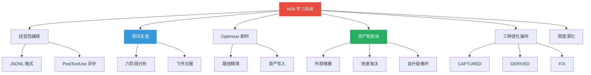
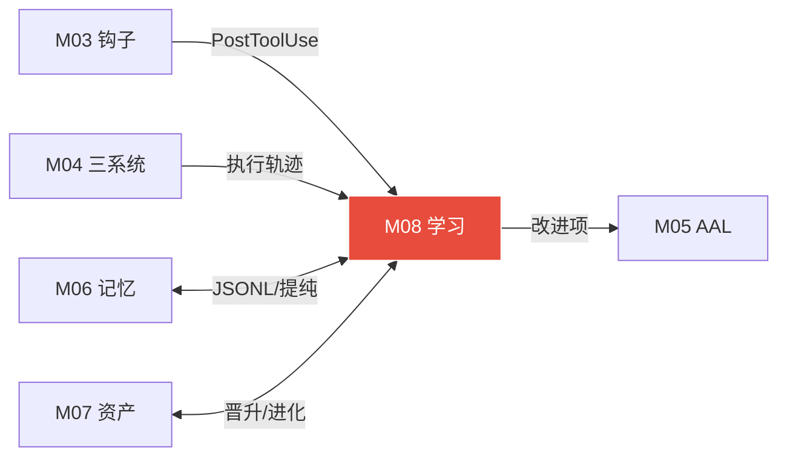

# 模块 08: 学习系统与资产智能体

> **本文档定义学习系统的完整闭环——经验包捕获·六阶段夜间复盘·资产智能体·Optimizer即时优化·周度深化·晨报推送·资产进化操作。**
> **接管目标 (V3.0)**: 接管 OpenClaw 原生 `core/universal-evolution-framework.js` (914行)，将其简单积分+定时反思机制升级为 PostToolUse 实时学习+夜间 Distiller 批量+六阶段复盘的完整闭环学习引擎。
> 跨模块引用：M00（系统总论）·M03（Harness钩子）·M04（三大系统）·M05（自治层·AAL）·M07（数字资产系统）

---

## 1. 学习系统总论

### 1.1 核心定位

```
学习系统 = 系统的"大脑后叶"
 · 不参与执行
 · 只负责：观察执行 → 提取规律 → 固化资产 → 让下次更好
```

### 1.2 双轨并行

| 轨道 | 触发 | 分析范围 | 输出 |
|---|---|---|---|
| **Optimizer（即时）** | 每次任务成功后 | 本次执行路径 | 单任务精简路径→写资产 |
| **夜间复盘（批量）** | 凌晨02:00 cron | 当日所有经验包 | 宏观规律·配置调整·日报 |
| **周度深化** | 周日01:00 cron | 本周所有日报+经验 | 跨日模式·能力版图·进化方向 |

---

## 2. 经验包捕获

### 2.1 捕获时机

经验包由 PostToolUse 钩子自动生成（参见 M03 §2.3），每次工具调用完成后写入：

```
PostToolUse钩子
 ↓ 异步（async: true · 不阻塞主流程）
agentmemory 处理:
 · 去除无关细节
 · 语义压缩
 · 抽取可复用模式
 · 写入当日 JSONL
```

### 2.2 经验包 JSONL 格式

```json
{
  "id": "exp-20260407-001",
  "timestamp": "2026-04-07T14:32:00Z",
  "session_id": "session-uuid",
  "task_goal": "批量压缩Desktop下的图片",
  "category": "task",
  "model_used": "claude-code-local",
  "tool_calls": [
    {
      "tool": "bash",
      "input": "convert -quality 85 *.jpg output/",
      "output_summary": "成功压缩12张·总大小减57%",
      "success": true,
      "duration_ms": 3200
    }
  ],
  "total_tokens": 4500,
  "total_duration_ms": 15000,
  "result_quality": 0.92,
  "reusable_patterns": [
    {
      "pattern": "imagemagick_batch_compress",
      "description": "使用convert命令批量压缩图片",
      "confidence": 0.88
    }
  ],
  "failure_info": null,
  "search_triggers": [],
  "asset_hits": ["wf-batch-image-compress-v1"]
}
```

### 2.3 DeerFlow 配置

```yaml
# config.yaml learning段
learning:
  capture_enabled: true       # 启用经验捕获
  capture_async: true          # 异步不阻塞
  retrieval_threshold: 0.85    # 资产检索阈值
  promote_min_count: 3         # 晋升最少调用次数
  promote_min_success: 0.80    # 晋升最低成功率
```

---

## 3. 六阶段夜间复盘

### 3.1 触发

```yaml
nightly_review:
  enabled: true
  cron: "0 2 * * *"          # 凌晨2点
  report_channel: feishu       # 日报推飞书
```

### 3.2 六阶段详解

```
阶段1: 聚合统计
 · 读取当日所有 JSONL 经验包
 · 统计: 任务总数·成功率·总token·总耗时·模型分布
 · 生成基础数据面板

阶段2: 瓶颈识别
 · 找出: 耗时最长的3个任务·失败次数最多的工具·token消耗最大的步骤
 · 分析: 哪些任务存在重复搜索·哪些步骤有冗余
 · 标注: 可改进点（附优先级）

阶段3: 路径萃取
 · 从成功任务中提取: 最优执行路径（工具组合+参数+顺序）
 · 与已有资产对比: 是否已存在同类资产？是否更优？
 · 标注: CAPTURED/DERIVED/FIX 候选操作

阶段4: 资产生成（核心阶段）
 · 晋升标准: 执行≥3次 + 成功率≥80%
 · 执行: candidate → active 晋升扫描
 · 执行: CAPTURED 新资产提取
 · 执行: DERIVED 衍生资产生成
 · 执行: FIX 降级资产修复
 · 更新 asset-index.json

阶段5: 配置自动更新
 · 低风险配置直接执行:
   · 搜索引擎路由权重调整
   · 工具调度优先级更新
   · 失败模式库更新
 · 高风险配置推飞书等确认:
   · 安全白名单/灰名单变更
   · 模型路由变更
   · 新工具自动注册

阶段6: 日报生成 + 推送飞书
```

### 3.3 飞书日报样式

```
📊 OpenClaw 每日复盘 (2026-04-07)

🎯 执行概览
 · 任务总数: 8 | 成功: 7 (87.5%) | 失败: 1
 · Token消耗: 45,000 | 预算剩余: 155,000
 · 总耗时: 2h 15min

📈 资产动态
 · 新增候选: 3个 | 晋升: 1个 (普通→一般)
 · FIX修复: 1个 (Tavily搜索配置更新)
 · 资产总量: 核心14 · 优质38 · 可用127 · 一般203

⚠️ 瓶颈发现
 · "PDF文本提取"耗时最长 (12min) · 建议: 引入专用PDF解析工具
 · SearXNG在凌晨搜索成功率下降20% · 已自动切换备用引擎

🔧 自动调整
 · 搜索路由: AI技术类搜索Tavily权重+10%
 · 工具优先: imagemagick优先级提升 (基于7次成功记录)

💡 建议（需你确认）
 · 建议将"代码调试SOP"提升为核心资产 (评分87.3) · 回复"确认"
```

---

## 4. 资产智能体（Asset Guardian Agent）

### 4.1 专职定位

```
专职资产维护智能体
 · 只在夜间被唤醒（02:00-06:00）
 · 能操作三大系统（搜索·任务·工作流）
 · 职责: 外部更新 + 内部淘汰 + 替代品搜索 + 资产健康维护
 · 不处理用户任务 · 只管资产
```

### 4.2 外部情报收集器

```
每个资产记录其外部信息源:
 · GitHub仓库地址 (检查: last commit · 是否archived · 最新release)
 · 官方文档URL (检查: HTTP状态码 · 内容是否更新)
 · PyPI/npm包名 (检查: 最新版本号 · changelog)
 ↓
HEARTBEAT夜间周期扫描:
 · 项目超6个月无commit + issues堆积 → 维护状态告警
 · 发现新版本 → 沙盒测试 → 通过则更新
 · 发现更优替代品 → 根据资产级别处理:
   · 一般/可用资产: 自主更换 · 无需报告
   · 优质资产: 自主更换 · 飞书简报
   · 核心资产: 飞书报告你 · 等你决策
```

### 4.3 自升级自循环机制

```
发现工具新版本
 ↓
Step 1: 沙盒测试（Docker隔离环境）
 · 安装新版本
 · 跑完整功能测试
 ↓ 通过
Step 2: 更新资产内容（版本号·配置·步骤）
 ↓ 失败
Step 3: 探明失败原因
 · 环境依赖问题 → 修复依赖 → 重试
 · 小问题 → 修复后重跑
 ↓ 3次重试仍失败
Step 4: 保持原版本（上次跑通的版本）
 · 记录失败原因到知识库
 · 等待下次版本再尝试
```

### 4.4 快速淘汰机制

**一般资产淘汰（最快速）：**

```
一般资产连续3次成功率 < 50%
 → 直接淘汰 · 状态改为 retired
 → 写入 assets/retired/（保留记录回溯）
 → 同步启动替代搜索
 → 找到替代品(3次成功率≥70%) → 入库 · 完成替换
 → 3次搜索无替代品 → 原资产赋予3个月无条件使用权
 → 3个月后重新评估 · 如此循环
```

**可用/优质资产淘汰（观察期）：**

```
可用资产: 连续3次成功率 < 50% → 进入1周观察期
优质资产: 连续3次成功率 < 80% → 进入2周观察期
 ↓ 观察期内
停用资产 → 智能体搜索替代品
 → 找到且3次成功率高于原资产 → 自动替换 · 原资产淘汰
 → 未找到 → 启用原资产 · 再观察1周
 → 仍无替代 → 3个月无条件使用权 · 循环
```

**核心资产：**
```
不参与自动淘汰 · 只做优化更新迭代
降级/去留完全由用户决断
飞书通知任何状态异常
```

---

## 5. Optimizer 即时优化

### 5.1 触发条件

每次任务成功完成 + Sandbox验证通过后自动调用。

### 5.2 执行流程

```
读取本次完整执行轨迹（tool_calls序列）
 ↓
计算: 总耗时 · 总token · 步骤数
 ↓
比对同类任务历史均值
 ↓
标记: 冗余步骤（重复搜索·无增量验证）
 ↓
标记: 可并行步骤（无依赖的相邻步骤）
 ↓
生成精简路径（去冗余·并行化）
 ↓ 精简后步骤数 < 原步骤数×0.8
写入工作流资产 → 更新 asset-index.json
```

### 5.3 即时 vs 夜间对比

| 维度 | Optimizer（即时） | 夜间复盘（批量） |
|---|---|---|
| 时机 | 每次任务成功后 | 凌晨2:00 |
| 范围 | 本次执行路径 | 当日所有任务 |
| 输出 | 单任务精简路径 | 宏观规律·配置调整 |
| Token | 低（单次轨迹） | 中（汇聚全天数据） |
| 粒度 | 步骤级·精确 | 模式级·宏观 |

---

## 6. 周度深化

### 6.1 触发

```yaml
weekly_review:
  cron: "0 1 * * 0"    # 周日01:00
```

### 6.2 分析内容

```
跨日模式分析:
 · 本周哪些任务类型最频繁
 · 哪些工具组合在多天中反复出现
 · 搜索引擎在不同时段的成功率差异

能力版图更新:
 · ~/.deerflow/memory/capability-map.json
 · 标注: 强能力区域 | 弱能力区域 | 未覆盖区域
 · 生成: 进化建议（针对弱区域的改进任务）

资产深度审计:
 · 一般→可用 晋升扫描（周度门槛更高的二次确认）
 · 可用→核心 候选提名（推飞书等你确认）
 · 跨资产重复检测（合并同类）
 · 失效资产批量归档
```

### 6.3 飞书周报样式

```
📊 OpenClaw 周度深化 (2026-04-01 ~ 04-07)

🎯 周度概览
 · 任务总数: 47 | 成功率: 89% | 总Token: 312,000
 · 成本: ¥23.40 | 日均: ¥3.34

📈 能力版图
 · 强项: 代码调试(95%) · 文档生成(92%) · 搜索研究(90%)
 · 弱项: 音频处理(60%) · 数据可视化(65%)
 · 建议: 建立音频处理SOP · 引入matplotlib工具资产

🔄 资产进化
 · 本周晋升: 一般→可用 5个 | 新增候选 18个
 · 核心资产候选: "三轮搜索SOP" (评分91.2) · 回复"确认"晋升
 · 淘汰: 2个 (替代品已验证上线)
 · FIX修复: 3个

💡 进化任务建议
 1. 安装 FFmpeg CLI 扩展音频处理能力
 2. 创建 matplotlib 数据可视化工作流模板
 3. 优化 PDF 解析流程 (本周瓶颈 TOP1)
```

---

## 7. 三种进化操作（借鉴 OpenSpace）

### 7.1 CAPTURED — 提取全新资产

```
触发: 执行成功 + 发现可复用模式 + 资产库无相似内容(相似度<0.7)
输入: 完整执行轨迹
输出: 新 candidate 资产
示例: 批量处理图片后 → 提取"imagemagick批量压缩SOP"
```

### 7.2 DERIVED — 从父资产衍生

```
触发: 现有资产在新场景使用 + 需微调适配 + 调整有通用价值
输入: 父资产ID + 场景差异
输出: 子资产(linked to 父) · 两者共存
示例: "图片压缩SOP" → 衍生"PNG透明图片专用压缩SOP"
```

### 7.3 FIX — 修复降级资产

```
触发: 成功率下降 / 工具失效 / 指标扫描发现degraded
输入: 降级资产 + 失败原因
修复: 搜索最新方案 + 更新步骤 + 重新验证
输出: 更新版本(version+1) 或 确认弃用
```

---

## 8. 完整学习闭环图

```
执行层
 ↓ PostToolUse钩子（实时·异步）
经验包 JSONL ← 每次执行自动写入
 ↓
Optimizer（即时）← 每次成功后分析 → 精简路径 → 写资产
 ↓
夜间复盘（02:00）← 6阶段批量分析 → 资产生成·配置更新·日报
 ↓
资产智能体（02:00-06:00）← 外部更新·快速淘汰·替代搜索
 ↓
周度深化（周日01:00）← 跨日模式·能力版图·进化建议
 ↓
资产库 asset-index.json ← 持续更新·持续优化
 ↓
意图路由器 → 新任务检索资产 → 命中直接复用 → 更快更好
 ↓
执行层 → 新的经验包 → 闭环 ♻️
```

---

## 附录 A: 建设蓝图 (Construction Roadmap)

| 阶段 | 目标 | 关键交付物 | 验收标准 | 预估工期 |
|:---:|---|---|---|:---:|
| **Phase 0** | 经验包捕获 | JSONL 格式定义、PostToolUse 异步写入、DeerFlow learning 配置 | 工具调用后→经验包自动写入→JSONL 文件可读 | 3 天 |
| **Phase 1** | 夜间复盘 | 六阶段复盘引擎、飞书日报推送、资产智能体基础 | 凌晨2点自动触发→6阶段完成→飞书推送日报 | 5 天 |
| **Phase 2** | Optimizer + 进化 | 即时优化路径精简、CAPTURED/DERIVED/FIX 三种操作 | 任务成功→路径精简→资产写入；降级资产→FIX自动修复 | 5 天 |
| **Phase 3** | 周度+闭环 | 周度深化分析、能力版图、外部情报侦察、快速淘汰 | 周日凌晨→跨日分析→飞书周报→进化任务生成 | 5 天 |

---

## 附录 B: 模块结构脑图 (Architecture Mind Map)



---

## 附录 C: 跨模块关系图 (Cross-Module Dependencies)

| 方向 | 对端模块 | 交换内容 | 触发条件 |
|:---:|---|---|---|
| ← 输入 | **M03 驾驭钩子** | PostToolUse 钩子事件（执行数据） | 每次工具调用后 |
| ← 输入 | **M04 三大系统** | 搜索/任务/工作流执行轨迹 | 任务完成时 |
| → 输出 | **M05 AAL** | 待改进项列表、进化任务建议 | 夜间复盘后 |
| ↔ 双向 | **M06 记忆体系** | 经验包JSONL↔GraphRAG提纯+晨报 | 每日 00:30 |
| ↔ 双向 | **M07 数字资产** | 资产晋升/降级/进化操作 | 复盘/Optimizer触发 |



---

## 附录 D: GitHub 项目与相关文献 (References)

| 项目 | GitHub 链接 | 在本模块中的角色 |
|---|---|---|
| **DeerFlow 2.0** | https://github.com/bytedance/deer-flow | 经验包捕获、Optimizer的宿主框架 |
| **agentmemory** | https://github.com/autonomousresearchgroup/agentmemory | PostToolUse 去重/压缩/评分管线 |
| **GraphRAG** | https://github.com/microsoft/graphrag | 夜间复盘的知识图谱提纯 |

---

## 附录 E: 方法论参考 (Methodology Sources)

| 方法论 | 来源网址 | 在本模块中的应用点 |
|---|---|---|
| **双轨学习（即时+批量）** | 本项目 M08 设计 | Optimizer即时精简 + 夜间六阶段批量分析 |
| **CAPTURED/DERIVED/FIX** | https://github.com/bytedance/deer-flow | 三种资产进化操作的设计参考 |
| **外部情报侦察** | 本项目 M08 设计 | GitHub/PyPI/npm 主动检测依赖健康 |
| **能力版图 (Capability Map)** | 本项目 M08 设计 | 周度分析识别强/弱/未覆盖能力区域 |

---

## 校验清单

- [x] 学习系统双轨并行定位
- [x] 经验包JSONL格式（完整字段）
- [x] DeerFlow learning配置段
- [x] 六阶段夜间复盘（每阶段详解）
- [x] 飞书日报样式模板
- [x] 资产智能体定位与职责
- [x] 外部情报收集器（GitHub/PyPI/npm检测）
- [x] 自升级自循环机制（4步）
- [x] 快速淘汰机制（一般/可用/优质/核心·四级分别）
- [x] Optimizer即时优化流程
- [x] 即时 vs 夜间对比表
- [x] 周度深化分析内容与飞书周报
- [x] 三种进化操作（CAPTURED/DERIVED/FIX）
- [x] 完整学习闭环图

---

## 接管清单 (Takeover Manifest)

> **V3.0 接管式升级 — 2026-04-11 新增**

### 接管目标

- **文件**: `.openclaw/core/universal-evolution-framework.js` (914行)
- **类名**: `UniversalEvolutionFramework`
- **实例**: `global.uef`
- **获取方式**: 备份原文件 → 增强版逐步替换 → 验证通过后切换

### 保留项（升级继承）

| 原生功能 | M08 升级后 |
|---|---|
| state.score 积分体系 | → 映射到 M07 五维评分 |
| history[] 交互历史 | → 迁移到 memory/main.sqlite |
| patterns.success/failure 模式库 | → 升级为 M08 策略图谱 |
| evolve() 进化函数 | → 替换为 M08 Distiller |
| selfReflect() 自我反思 | → 替换为 M05 HEARTBEAT 感知循环 |

### M08 增强能力（超出原生）

| 新增能力 | 原生没有 |
|---|---|
| PostToolUse 实时学习 + 夜间 Distiller 批量 | 原生只有固定间隔（每50次交互） |
| 六阶段夜间复盘 | 原生只有简单反思 |
| 经验包捕获与固化 | 原生仅内存中的 Map |
| 多层元认知（检测→评估→调整→验证） | 原生只有 setInterval 定时反思 |
| 周度深化分析 | 原生无 |
| 晨报推送 | 原生无 |
