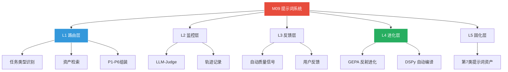
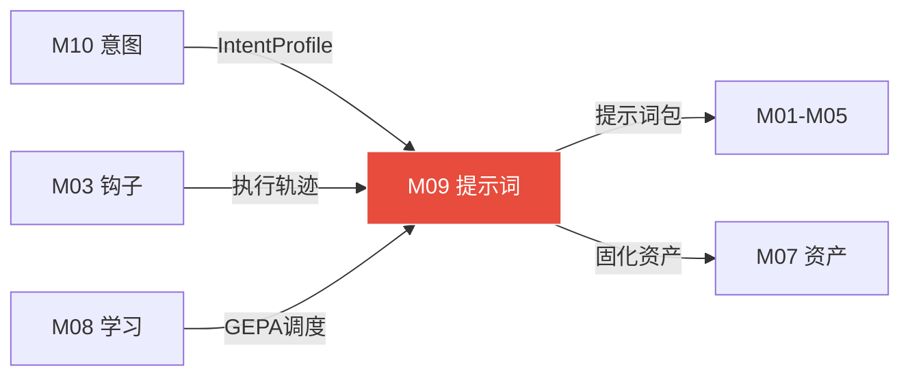

# 模块 09: 提示词系统（上下文工程基础设施层）

> **本文档定义提示词系统的完整架构——五层架构·任务感知动态组装·DSPy参数化·GEPA反射进化·搜索能力·资产固化·全系统渗透点。**
> **接管目标 (V3.0)**: 接管 OpenClaw 原生 `core/token-optimizer.js` (363行)，将其4级分层响应+简单截断压缩升级为 SOUL.md 五层架构+DSPy 编译+GEPA 反射进化的完整提示词工程系统。
> 核心定位：提示词系统不是独立模块，是横切整个系统的基础设施层（如同TCP/IP——所有环节都在用，无人感知存在）。
> 跨模块引用：M00（系统总论）·M03（Harness钩子）·M04（三大系统）·M05（AAL）·M07（数字资产·第7类提示词资产）·M08（学习系统·夜间进化）·M10（意图澄清引擎）

---

## 1. 核心理念：从提示词工程到上下文工程

### 1.1 2026年认知转变

```
提示词本身正在变成廉价品
真正决定输出质量的是：给AI看什么背景信息、什么时候看、看多少
提示词是上下文工程的一个子集，不是全部
```

### 1.2 提示词系统解决的三个核心问题

| 问题 | 现状 | 解决方案 |
|---|---|---|
| 静态提示词退化 | 模型版本更新后原有提示词性能下降10-30%·手工维护全职工作 | DSPy动态编译·模型变了自动重新优化 |
| 通用提示词天花板 | 搜索/代码/写作最优提示词完全不同·万能提示词拉到平均水平 | 任务感知动态注入 |
| 优质提示词无法沉淀 | 某次输出质量很高但不知哪段起效·下次无法复现 | 执行追踪+贡献度分析+自动固化 |

### 1.3 设计借鉴的三个核心项目

| 项目 | 核心贡献 | 借鉴点 |
|---|---|---|
| GEPA (gepa-ai/gepa) | 反射式提示词进化·捕获完整执行轨迹→LLM诊断失败原因→生成改进版本·超越强化学习·ICLR 2026 Oral | 夜间进化引擎的核心算法 |
| DSPy (stanfordnlp/dspy) | 提示词变成可编译的程序参数·Signatures+Modules+MIPROv2优化器·模型更新自动重编译 | 提示词参数化+自动编译框架 |
| Promptomatix (Salesforce) | 零配置智能·自动分析任务类型·自动选技术·实时人工反馈集成 | 任务类型感知+反馈集成机制 |

**不引入的项目：** AutoPrompt·PromptAgent·PromptWizard——功能与DSPy+GEPA高度重叠。DSPy负责参数化和编译，GEPA负责反射进化，两者组合已覆盖全部核心能力。遵循「够用就好·不多一个依赖」原则。

---

## 2. 五层架构设计

### Layer 1 · 提示词路由层（每次LLM调用前触发）

```
任务类型识别器
 · 分析当前任务：搜索/代码/写作/分析/规划等九大类型
 · 决定走哪套提示词策略

资产检索器
 · 语义检索提示词资产库
 · 相似度≥0.85命中则直接使用优质历史提示词·不重新生成

上下文组装器
 · 把系统提示词·任务提示词·Few-shot示例·用户偏好·搜索结果
 · 按P1-P6优先级组装成最终prompt

 ↓ 组装完成的prompt进入执行
```

### Layer 2 · 执行监控层（LLM调用中实时监控）

```
质量实时评估
 · LLM-Judge对输出进行实时评分
 · 评估维度：完整性/准确性/格式合规/用户偏好匹配
 · 低于阈值触发自动重试+提示词调整

执行轨迹记录
 · 记录完整执行上下文:
   · 使用了哪些提示词片段
   · 质量分
   · token消耗
   · 失败原因
 · 供夜间进化引擎分析

 ↓ 执行完成·结果+轨迹流向下一层
```

### Layer 3 · 反馈采集层（PostToolUse触发）

```
自动质量信号
 · 任务完成度
 · 后续任务成功率
 · 用户是否要求重做
 · 搜索引用置信度
 → 这些都是提示词质量的间接信号

显式用户反馈
 · 飞书消息中「太啰嗦」「格式不对」「再精简」等自然语言反馈
 · 自动捕获→映射为提示词改进方向

贡献度归因
 · 分析哪个提示词片段对本次高质量输出贡献最大
 · 标注为晋升候选

 ↓ 信号积累·定时触发进化
```

### Layer 4 · 夜间进化层（专职资产智能体夜间执行）

```
GEPA反射式进化
 · 读取当天执行轨迹
 · 识别低分case
 · LLM反思失败原因
 · 生成改进版提示词
 · 沙盒测试
 · 评分对比
 · 决定是否替换

DSPy自动编译
 · 当模型版本更新时重新编译所有DSPy signatures
 · 自动适配新模型最优prompt token
 · 无需手工重写

 ↓ 进化完成的优质提示词固化
```

### Layer 5 · 资产固化层（与九类数字资产体系对接）

```
优质提示词进入第7类资产「提示词指令资产」
遵循完整四级分级体系（记录/一般/可用/核心）
享有同等的晋升·淘汰·外部更新机制
```

---

## 3. 上下文组装优先级（P1-P6）

### 3.1 六级优先级体系

```
P1 · 安全约束层（不可覆盖）
 权限规则·绝对禁区·Mission边界
 永远在最高优先级注入·任何任务不能覆盖

P2 · 用户偏好层（高优先级）
 输出语言·格式偏好·详细程度·特殊要求
 从用户偏好资产（第8类）实时读取

P3 · 任务专用层（任务感知）
 根据任务类型激活对应Signature
 搜索任务注入搜索专用提示词
 代码任务注入代码专用提示词

P4 · Few-shot示例层（历史最优）
 从提示词资产库检索:
 同类任务中质量评分最高的3-5个输入/输出示例自动注入

P5 · 上下文信息层（实时补充）
 当前可用工具状态
 搜索结果摘要
 记忆召回结果
 SharedContext相关字段

P6 · 基础系统层（兜底）
 SOUL.md核心身份·通用格式规范·基础能力说明
 所有任务共享的基础提示词
```

### 3.2 核心思路

```
提示词不再是一个静态文本·而是实时组装的上下文包
每次LLM调用前·上下文组装器从多个来源按优先级拼装最终prompt
不同任务类型激活不同的「提示词配方」
```

---

## 4. 九大任务类型提示词配方

| 任务类型 | 核心Signature | 特殊注入内容 | 质量指标 |
|---|---|---|---|
| 信息搜索 | SearchSynth | 信息时效性要求·来源可信度偏好·摘要长度 | 引用准确率·信息完整度 |
| 代码生成 | CodeGen | 语言版本·已有代码风格·测试要求·依赖约束 | 可运行率·代码质量分 |
| 文档写作 | DocWrite | 目标受众·文档类型·结构模板·字数要求 | 可读性·结构完整性 |
| 数据分析 | DataAnalysis | 数据类型·分析维度·可视化偏好·结论格式 | 结论准确率·洞察深度 |
| 问题诊断 | Diagnosis | 错误信息·环境上下文·历史解决方案·排查顺序偏好 | 首次修复成功率 |
| 规划制定 | Planning | 时间约束·资源限制·优先级偏好·风险容忍度 | 计划可执行率·完成率 |
| 创意生成 | Creative | 风格参考·创意边界·用户审美偏好历史 | 用户满意度·采纳率 |
| 系统配置 | SysConfig | 目标系统版本·已有配置·已知兼容问题 | 配置成功率·副作用 |
| 自主决策 | AALDecision | Mission约束·权限级别·当前能力版图·风险评估 | 决策质量·Mission对齐 |

---

## 5. 全系统渗透点

### 5.1 搜索系统中的提示词渗透

| 环节 | 提示词类型 | 动态内容 | 优化目标 |
|---|---|---|---|
| 查询扩展 | QueryExpansion Signature | 注入：领域词汇表+用户历史搜索偏好+当前任务上下文 | 扩展后查询词的检索命中率 |
| 搜索意图分析 | IntentClassifier Signature | 注入：任务类型+近期执行上下文 | 意图识别准确率 |
| 结果摘要提炼 | ResultSynthesis Signature | 注入：用户偏好风格+输出格式要求+置信度阈值 | 摘要质量评分+引用准确率 |
| 多源结果融合 | CrossValidation Signature | 注入：已知信息冲突模式+权威来源偏好 | 最终结论的准确率 |

### 5.2 任务系统中的提示词渗透

| 环节 | 提示词类型 | 动态内容 | 优化目标 |
|---|---|---|---|
| 目标分解 | TaskDecompose Signature | 注入：可用工具列表+历史成功DAG结构+用户偏好粒度 | 子任务完整性+可执行性 |
| 工具调用 | ToolSelection Signature | 注入：工具成功率历史+当前工具状态+资产库推荐 | 工具选择准确率+成功率 |
| 错误恢复 | ErrorRecovery Signature | 注入：当前报错信息+历史同类报错解决方案+工具known_issues | 自动修复成功率 |
| 结果验证 | OutputValidation Signature | 注入：任务原始目标+验收标准+用户历史验收偏好 | 验收通过率+重做率降低 |

### 5.3 工作流系统中的提示词渗透

| 环节 | 提示词类型 | 动态内容 | 优化目标 |
|---|---|---|---|
| 工作流规划 | FlowPlanning Signature | 注入：触发条件上下文+历史成功工作流模式+资源约束 | 工作流可执行率+完成率 |
| 条件判断 | ConditionEval Signature | 注入：当前状态数据+历史判断准确率+用户决策偏好 | 条件判断准确率 |

### 5.4 AAL层中的提示词渗透

| 环节 | 提示词类型 | 动态内容 | 优化目标 |
|---|---|---|---|
| 意图推测 | IntentInference Signature | 注入：Mission.md目标+历史任务模式+用户偏好+时间上下文 | 推测置信度+用户满意度 |
| 计划生成 | PlanGeneration Signature | 注入：当前能力版图+资产库现有方案+预算约束 | 计划完成率+token效率 |
| 自主立项 | TaskCreation Signature | 注入：Mission边界规则+权限级别+历史立项成功率 | 立项质量+Mission对齐度 |

---

## 6. 实时重试机制

```
触发:
 LLM-Judge评分 < 阈值（默认0.7）
 或 格式验证失败
 或 用户飞书反馈负面关键词
 ↓
分析:
 DSPy dspy.Assert触发:
 LLM分析「违反了哪个约束」
 给出改进反馈
 ↓
调整:
 注入失败分析+改进建议 → 重新调用
 最多重试3次
 每次提示词略有调整
 ↓
记录:
 记录重试轨迹 → 写入执行日志
 供夜间进化引擎分析「为什么第一次没过」
```

---

## 7. 提示词系统的上网搜索能力

### 7.1 为什么需要搜索能力

```
提示词技术迭代极快
上周的最优写法·这周可能有更好的替代
提示词系统必须能主动感知外部世界的最新技巧和案例
而不是用半年前训练时学到的知识
```

### 7.2 四种搜索触发场景

**场景1：新任务类型出现（主动搜索）**
```
遇到资产库中从未出现过的任务类型
 → 搜索「[任务类型] prompt best practices 2026」
 → 抓取前5篇高质量文章
 → 提炼候选提示词
 → 测试3次
 → 若通过则入库为一般资产
```

**场景2：现有提示词质量下降（诊断搜索）**
```
某类提示词成功率连续3次低于阈值
 → 搜索「[失败原因关键词] [任务类型] prompt fix」
 → 查找社区已知解决方案
 → 生成候选改进版
 → 夜间GEPA测试
```

**场景3：模型更新（响应式搜索）**
```
检测到Claude/GPT模型版本更新
 → 搜索「[新模型版本] prompting guide changes」
 → 分析变化点
 → 触发DSPy重新编译受影响的Signatures
```

**场景4：夜间情报侦察（定期搜索）**
```
每周日01:00专职资产智能体执行
 → 搜索「prompt engineering techniques [当月]」
 → 扫描新技术（如Chain-of-Draft、StructuredThought）
 → 评估是否能提升现有资产
```

### 7.3 搜索结果转化为提示词资产的流程

```
Step 1 搜索:
 用三大搜索引擎（Tavily+Exa+SearXNG）搜索目标主题
 优先抓取：GitHub README·Anthropic官方文档·顶会论文·技术博客

 ↓

Step 2 提炼:
 LLM从搜索结果中提炼候选提示词片段
 标注来源和适用场景
 生成3-5个候选版本

 ↓

Step 3 测试:
 用同类历史任务案例对候选提示词跑3次
 与现有最优版本对比质量评分

 ↓

Step 4 决策:
 新版分数高于原版 → 替换·记录来源
 不高 → 记录为候选·下次进化时再测
 找到突破性技术 → 飞书推送你
```

### 7.4 信息来源优先级

| 来源类型 | 代表性来源 | 优先级 | 可信度 |
|---|---|---|---|
| 模型官方文档 | docs.anthropic.com · openai.com/docs | 最高 | 最高 |
| 学术论文 | arXiv · ACL · ICLR | 高 | 高·但可能有延迟 |
| 顶级开源项目 | DSPy · GEPA · promptslab | 高 | 高 |
| 技术博客 | Anthropic Blog · LessWrong · AI Twitter | 中 | 中·需验证 |
| 社区讨论 | Reddit r/LocalLLaMA · Discord | 低 | 低·仅作启发 |

---

## 8. 优质提示词固化机制

### 8.1 触发条件

```
触发1: 连续高质量
 同一提示词片段在连续5次执行中质量评分均≥0.85
 → 系统自动标记为「固化候选」

触发2: 救场成功
 某提示词使得前两次失败的任务在第3次成功
 → 标记该提示词的贡献 → 晋升候选

触发3: 跨场景复用
 某提示词片段在3种以上不同任务类型中都产生了正向效果
 → 高价值通用提示词
```

### 8.2 GEPA反射式进化完整流程（夜间执行）

```
① 选候选:
 从当天执行轨迹中选出低分case（评分<0.7）和高分case（评分>0.9）
 形成对比分析集

② 轨迹反思:
 LLM读取完整执行轨迹:
 使用了哪段提示词 → 输出是什么 → 评分多少 → 失败原因是什么

③ 生成候选:
 基于反思生成3-5个改进版提示词
 保留在Pareto前沿上表现最好的多样化候选

④ 沙盒测试:
 用历史case集对候选版本跑验证
 计算综合质量分
 与当前最优版本对比

⑤ 决策固化:
 候选分数 > 当前版本 + 0.05阈值
 → 替换·原版本保留一周作回滚备份

⑥ 晋升入库:
 通过验证的新版本进入提示词资产库
 按九类资产的四级体系管理
 自动更新版本号
```

### 8.3 DSPy自动编译触发条件

```
三种情况触发DSPy重编译（模型无关性保障）:

条件1: 模型版本更新
 检测到 claude-sonnet-4-6 → claude-sonnet-5-x 等
 → 重编译所有Signatures

条件2: 持续质量下降
 某类任务成功率连续下降7天
 → 对该任务类型的Signatures触发重编译

条件3: 用户主动触发
 飞书发「重优化提示词」
 → 对指定Signature重编译

编译过程: 100-500次LLM调用·在沙盒中完成·不影响正常任务执行
```

---

## 9. 提示词资产扩展字段

```json
{
  "prompt_extension": {
    "prompt_type": "system|task|few_shot|chain_of_thought|output_format",
    "task_types": ["code_gen", "search_synth"],
    "model_compiled_for": "claude-sonnet-4-6",
    "content": "你是一个...",
    "few_shot_examples": [],
    "quality_score_history": [0.72, 0.81, 0.87],
    "gepa_version": 3,
    "search_source": "arxiv:2507.19457",
    "dspy_signature": "TaskDecompose",
    "avg_token_cost": 245,
    "last_compiled": "2026-04-07"
  }
}
```

---

## 10. 与现有系统的集成方式

| 现有系统组件 | 提示词系统集成方式 | 集成点 |
|---|---|---|
| DeerFlow编排层 | 每个DeerFlow节点对应一个DSPy Module·节点配置中指定Signature | 节点定义文件添加signature_id字段 |
| SharedContext | 添加prompt_context字段·存储当前任务激活的提示词配方ID和Few-shot示例集 | SharedContext schema扩展 |
| PostToolUse钩子 | 钩子执行后触发LLM-Judge评分·记录提示词贡献度到执行轨迹 | 现有钩子中新增评分逻辑 |
| 专职资产智能体 | 夜间时序新增「02:30 GEPA进化窗口」和「04:00 DSPy重编译检查」 | agentflow/asset-manager-workflow.json新增步骤 |
| 第7类资产（提示词） | 提示词资产直接使用四级分级体系·新增prompt_extension扩展字段 | 资产schema扩展·向后兼容 |
| SOUL.md | SOUL.md中的系统提示词成为P6基础层·由路由层在其外部组装更高优先级内容 | SOUL.md保持不变 |
| 飞书推送 | 提示词进化结果加入晨报：「代码生成提示词进化至v4·质量分+0.08」 | 晨报模板新增提示词动态板块 |

---

## 11. SharedContext扩展字段

```json
{
  "prompt_context": {
    "task_type": "code_gen",
    "active_recipe": "CodeGen_v4",
    "signatures_used": ["CodeGen", "OutputValidation"],
    "few_shot_ids": ["pmt_001", "pmt_023"],
    "quality_scores": [0.88, 0.72, 0.91],
    "retry_count": 1,
    "retry_reason": "format_violation",
    "final_score": 0.91,
    "promote_candidate": true,
    "gepa_trigger": false
  }
}
```

---

## 12. 技术选型与集成

### DSPy（主力框架）
```
stanfordnlp/dspy
 · 职责：提示词参数化·自动编译·跨模型可移植
 · 集成：DeerFlow内嵌DSPy·每个Signature对应一个LLM调用节点
 · 关键能力：dspy.Assert硬约束·dspy.Suggest软建议·MIPROv2编译器
 · 安装：pip install dspy
```

### GEPA（夜间进化引擎）
```
gepa-ai/gepa
 · 职责：反射式提示词进化·捕获执行轨迹·自动诊断失败
 · 集成：专职资产智能体调用·夜间02:30-04:30时段执行
 · 关键能力：Pareto前沿采样·轨迹反思·超越RL的优化
 · 安装：pip install gepa
```

---

## 13. 提示词系统完整运转节奏

| 时机 | 触发点 | 提示词系统行为 |
|---|---|---|
| 每次LLM调用前 | DeerFlow节点执行前 | 任务类型识别→资产检索(0.85阈值)→上下文组装P1-P6→注入Few-shot→生成最终prompt |
| 每次LLM调用后 | PostToolUse钩子 | LLM-Judge评分→贡献度归因→写执行轨迹→低分触发重试(最多3次) |
| 用户飞书反馈时 | 飞书消息解析 | 捕获负面关键词→映射到提示词改进方向→标记对应资产为「待改进」 |
| 每天02:30 | 专职资产智能体 | GEPA进化：读取当天低分轨迹→反思→生成候选→沙盒测试→决定是否替换 |
| 每周日01:00 | 周度深化复盘 | 外部情报搜索→新技术评估→DSPy编译状态检查→晋升/淘汰决策→飞书周报 |
| 模型版本更新时 | 外部情报侦察检测到 | 触发DSPy重编译→搜索新版本prompting guide→验证所有核心Signature→飞书告知 |

---

## 14. 与资产体系对应关系

| 资产级别 | 提示词资产特征 | GEPA处理 | 用户干预 |
|---|---|---|---|
| 记录层（<30分） | 从搜索/轨迹提取·未验证 | 不参与进化·等待晋升 | 无需干预 |
| 一般资产（30-59分） | 通过基础测试·开始日常使用 | 参与进化·有改进空间 | 晨报汇总告知 |
| 可用资产（60-89分） | 稳定高质量·任务首选 | 优先进化目标·保持领先 | 晨报汇总告知 |
| 核心资产（≥90分） | 系统关键提示词·高频依赖 | 只做微调优化·不做激进替换 | 飞书报告·用户决断 |

---

## 附录 A: 建设蓝图 (Construction Roadmap)

| 阶段 | 目标 | 关键交付物 | 验收标准 | 预估工期 |
|:---:|---|---|---|:---:|
| **Phase 0** | 五层架构骨架 | P1-P6 优先级组装器、九大Signature定义、资产检索接口 | 任务到达→类型识别→P1-P6组装→prompt生成 | 5 天 |
| **Phase 1** | DSPy 集成 | DSPy Module嵌入DeerFlow节点、MIPROv2编译器、Assert/Suggest | 模型版本切换→自动重编译→质量不降 | 5 天 |
| **Phase 2** | GEPA 夜间进化 | GEPA反射进化6步流程、Pareto前沿采样、沙盒测试 | 夜间低分case→反思→候选生成→质量分提升≥0.05 | 5 天 |
| **Phase 3** | 搜索+固化 | 四种搜索触发场景、搜索结果转化、三种固化触发、飞书集成 | 新任务类型→搜索提示词→入库→下次复用 | 3 天 |

---

## 附录 B: 模块结构脑图 (Architecture Mind Map)



---

## 附录 C: 跨模块关系图 (Cross-Module Dependencies)

| 方向 | 对端模块 | 交换内容 | 触发条件 |
|:---:|---|---|---|
| ← 输入 | **M10 意图澄清** | IntentProfile、精准搜索词 | 意图澄清完成后 |
| → 输出 | **M01-M05 全模块** | 组装后的提示词包注入各Signature | 每次LLM调用前 |
| ← 输入 | **M03 驾驭钩子** | PostToolUse 执行轨迹（供反馈层分析） | 工具调用后 |
| → 输出 | **M07 数字资产** | 优质提示词固化为第7类资产 | 固化触发条件满足 |
| ← 输入 | **M08 学习系统** | 夜间GEPA进化窗口调度 | 每日02:30 |



---

## 附录 D: GitHub 项目与相关文献 (References)

| 项目 | GitHub 链接 | 在本模块中的角色 |
|---|---|---|
| **DSPy** | https://github.com/stanfordnlp/dspy | 提示词参数化+自动编译框架 |
| **GEPA** | https://github.com/gepa-ai/gepa | 反射式提示词进化引擎（ICLR 2026 Oral） |
| **Promptomatix** | Salesforce 内部项目 | 零配置智能·任务类型感知（设计借鉴） |

| 标题 | 链接 | 核心贡献 |
|---|---|---|
| *DSPy: Compiling Declarative Language Model Calls* | https://arxiv.org/abs/2310.03714 | Signature+Module+Optimizer 的理论框架 |
| *GEPA: Generative Evolutionary Prompt Adaptation* | ICLR 2026 | 反射式进化超越RL的提示词优化 |

---

## 附录 E: 方法论参考 (Methodology Sources)

| 方法论 | 来源网址 | 在本模块中的应用点 |
|---|---|---|
| **上下文工程** | https://docs.anthropic.com/ | 从提示词工程到上下文工程的范式转变 |
| **DSPy Signatures** | https://dspy-docs.vercel.app/ | 提示词参数化、跨模型可移植 |
| **GEPA 反射式进化** | https://github.com/gepa-ai/gepa | 执行轨迹→LLM反思→候选生成→Pareto前沿 |
| **P1-P6 优先级组装** | 本项目 M09 原创设计 | 安全→偏好→任务→示例→上下文→基础的六级组装 |

---

## 校验清单

- [x] 核心理念·从提示词工程到上下文工程
- [x] 三个核心问题与三个借鉴项目
- [x] 五层架构（路由→监控→反馈→进化→固化）
- [x] P1-P6上下文组装优先级
- [x] 九大任务类型提示词配方
- [x] 全系统四大渗透点（搜索/任务/工作流/AAL）
- [x] 实时重试机制
- [x] 四种搜索触发场景
- [x] 搜索结果转化流程与信息来源优先级
- [x] 三种固化触发条件
- [x] GEPA反射式进化六步流程
- [x] DSPy自动编译三种触发条件
- [x] 提示词资产扩展字段（prompt_extension）
- [x] SharedContext扩展字段（prompt_context）
- [x] 技术选型（DSPy+GEPA）
- [x] 完整运转节奏时序表
- [x] 资产体系对应关系

---

## 接管清单 (Takeover Manifest)

> **V3.0 接管式升级 — 2026-04-11 新增**

### 接管目标

- **文件**: `.openclaw/core/token-optimizer.js` (363行)
- **类名**: `TokenOptimizer`
- **获取方式**: 备份原文件 → 增强版逐步替换 → 验证通过后切换

### 保留项（升级继承）

| 原生功能 | M09 升级后 |
|---|---|
| 4级分层响应（TIER 1-4 按复杂度） | → 升级为 SOUL.md 五层架构 |
| 上下文压缩（保留首尾截断） | → 升级为 Hermes 轨迹压缩器（头尾保护+中间摘要） |
| 工具选择优化（成本效益排序） | → 升级为 Agent Profile + 任务适配 + 学习优化 |

### M09 增强能力（超出原生）

| 新增能力 | 原生没有 |
|---|---|
| SOUL.md 行为注入 | 原生无 |
| DSPy 参数化编译 | 原生无 |
| GEPA 反射式进化 | 原生无 |
| JIT Prompt 卡带注入 | 原生无 |
| 提示词资产固化 | 原生无 |
| 搜索能力增强 | 原生无 |
