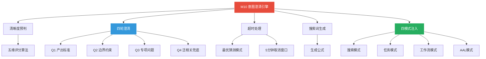
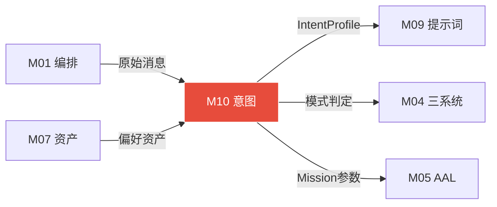

# 模块 10: 意图澄清引擎（Intent Clarification Engine）

> **本文档定义意图澄清引擎的完整设计——七步串联流程·IntentProfile结构·清晰度评分·追问策略·超时猜测·搜索词生成·四模式注入方案。**
> 核心原则：先问清楚人想要什么，再去找最好的工具——意图澄清在前，提示词搜索在后。
> 跨模块引用：M04（三大系统+执行模式）·M05（AAL·Mission体系）·M07（数字资产·第8类用户偏好）·M09（提示词系统·五层架构）

---

## 1. 核心定位

### 1.1 解决的根本问题

```
收到任务后不急着执行
先通过多轮追问把意图问清楚
避免「按字面意思做了但不是你想要的」

意图清楚了之后
根据任务类型上网搜索最优提示词策略
动态组装出针对这个具体任务的最佳提示词
再开始执行
```

### 1.2 串联关系

```
意图澄清引擎 → 提示词搜索优化 → 提示词系统组装 → 进入执行

先做基础澄清（1-2轮）让意图足够清晰
再去搜索 · 这样搜索词更精准
搜到的提示词策略也更契合
如果意图完全模糊就去搜 · 搜回来的东西太宽泛反而没用
```

### 1.3 三条锁定规则

```
规则1 · 清晰度驱动不是轮次驱动
 不是说「问满三轮就开始执行」
 而是每次用户回答后重新计算清晰度
 一旦≥0.85立即跳过剩余问题直接进搜索阶段
 「够清楚了就不要继续问」

规则2 · 问题4泛相关兜底
 前三问都是引导式的（你问什么用户答什么）
 第四问「还有什么你觉得我需要知道的」把主动权还给用户
 用户可以补充引擎没想到的关键信息
 工作流模式的终止条件被列为硬性要求

规则3 · 超时5分钟取消窗口作第二道防线
 超时后不立即执行
 先推送推断摘要等5分钟
 AAL任务超时时token预算自动降到$1上限
 防止失控消耗
```

---

## 2. 完整七步串联流程

### 步骤0 · 前置：意图清晰度预判

```
收到任务后先判断清晰度评分（0-1）:
 · 高于0.85 → 跳过澄清直接进步骤5
 · 低于0.85 → 进入澄清流程
 · 极度模糊（<0.3）→ 直接问「你想做什么」开放题而不是具体问题
```

### 步骤1 · 意图澄清第一轮（最重要的问题）

```
问「产出标准」:
 · 做完什么样叫完成？
 · 格式是什么？
 · 给谁看的？
 ↓
等待用户回答（计时2分钟）
 ↓
更新意图画像 · 重新评估清晰度
```

### 步骤2 · 意图澄清第二轮（范围与约束）

```
仅当清晰度 < 0.85 时继续

问「边界约束」:
 · 有没有不能做的？
 · 依赖什么前置条件？
 · 时间要求？
 ↓
等待用户回答（计时2分钟）
 ↓
再次评估清晰度
```

### 步骤3 · 意图澄清第三轮（专项补充）

```
仅当清晰度仍 < 0.85

问「最影响产出质量的那一个专项问题」
由引擎根据任务类型动态生成（见§5专项问题库）
 ↓
等待用户回答（计时2分钟）
```

### 步骤4 · 第四问（泛相关兜底）

```
仅当三问后清晰度仍不达标（<0.85）

问一个泛相关的开放性问题:
 「还有什么你觉得我需要知道的？」
 ↓
等待用户回答（计时2分钟）
 ↓
无论结果如何 · 第四问后一定进入执行 · 不再追问
```

### 步骤5 · 提示词搜索优化（意图明确后触发）

```
基于已明确的意图画像生成精准搜索词
 → 搜索最优提示词策略（Tavily+Exa）
 → 提炼3-5个候选提示词片段
 → 与提示词资产库已有内容融合
 → 组装本次任务专属提示词包
```

### 步骤6 · 模式判断 + 注入执行

```
确认执行模式（搜索/任务/工作流/AAL）
 → 将专属提示词包注入对应模式的Signature
 → 飞书告知：「意图已明确·提示词已优化·开始执行[模式]...」
 → 正式进入执行
```

---

## 3. 整体决策树

```
收到任务
 ↓ 预判清晰度
≥0.85 ──────────────────────────────→ 跳到步骤5（提示词搜索）
<0.85 ↓
问题1（产出标准）→ 2分钟等待
 ├─ 回答 → 评分≥0.85 ──────────→ 步骤5
 └─ 回答 → 评分<0.85 → 问题2（边界约束）→ 2分钟等待
     ├─ 回答 → 评分≥0.85 ─────────→ 步骤5
     └─ 回答 → 评分<0.85 → 问题3（专项问题）→ 2分钟等待
         ├─ 回答 → 评分≥0.85 ─────────→ 步骤5
         └─ 回答 → 评分<0.85 → 问题4（泛相关兜底）→ 2分钟等待
             ├─ 回答 ─────────────────────→ 步骤5
             └─ 超时 → 最优猜测模式 ──────→ 步骤5

任意步骤超时2分钟 → 最优猜测模式 → 直接进步骤5
用户说「你自己判断」→ 立即进步骤5
```

---

## 4. IntentProfile 意图画像结构

```json
{
  "goal": "",
  "deliverable": "",
  "audience": "",
  "quality_bar": "",

  "constraints": [],
  "dependencies": [],
  "deadline": null,
  "budget_tokens": null,

  "domain": "",
  "task_type": "",
  "mode": "",
  "related_assets": [],

  "clarity_score": 0.0,
  "questions_asked": 0,
  "filled_fields": [],
  "missing_critical": []
}
```

### 字段说明

| 维度 | 字段 | 说明 |
|---|---|---|
| 核心意图 | goal | 最终想达成什么 |
| 核心意图 | deliverable | 产出物是什么形态 |
| 核心意图 | audience | 给谁用/谁来看 |
| 核心意图 | quality_bar | 什么叫做好 |
| 约束 | constraints | 不能做什么/不能碰什么 |
| 约束 | dependencies | 前置条件有哪些 |
| 约束 | deadline | 时间要求 |
| 约束 | budget_tokens | 资源预算（AAL模式用） |
| 上下文 | domain | 属于哪个领域 |
| 上下文 | task_type | 任务类型（搜索/代码/写作等） |
| 上下文 | mode | 对应哪种执行模式 |
| 上下文 | related_assets | 相关的历史资产ID |
| 澄清状态 | clarity_score | 0-1·≥0.85开始执行 |
| 澄清状态 | questions_asked | 已问了几个问题 |
| 澄清状态 | filled_fields | 已填充的字段 |
| 澄清状态 | missing_critical | 仍缺失的关键字段 |

---

## 5. 清晰度评分算法

```
清晰度 = 各维度加权评分之和

 goal已明确      +0.30（最重要·不清楚就不知道做什么）
 deliverable已明确 +0.25（不知道产出什么就无法验收）
 quality_bar已明确 +0.20（不知道好坏标准就无法优化）
 constraints已明确 +0.15（不知道边界可能做错方向）
 deadline/budget已明确 +0.10（影响策略选择）

评分达到0.85即可开始执行 · 不需要满分
```

---

## 6. 问题生成规则（每轮只问一个）

| 轮次 | 目标字段 | 问题生成策略 | 判断是否跳过 |
|---|---|---|---|
| 问题1（固定） | goal + deliverable | 「你想要什么样的结果？做完长什么样？」同时探查目标和产出形态 | 不跳过·每次必问（除非预判清晰度≥0.85） |
| 问题2（条件） | quality_bar + constraints | 「什么叫做好·有没有不能碰的东西？」质量标准和边界约束 | goal+deliverable已从问题1推断出 → 跳到专项问题 |
| 问题3（动态） | 依任务类型动态生成 | 由引擎根据任务类型生成最影响质量的那一个专项问题 | 评分已达0.85 → 跳过 |
| 问题4（兜底） | 任意未填充字段 | 「还有什么你觉得我需要知道的·比如偏好、格式、特殊要求？」泛相关开放题 | 仅在三问后评分仍<0.85时触发 |

---

## 7. 问题3：各任务类型专项问题库

| 任务类型 | 专项问题（问题3内容） | 针对的关键字段 |
|---|---|---|
| 信息搜索 | 「你需要的是最新的还是历史的？要结论摘要还是原始来源？」 | time_sensitivity + output_depth |
| 代码生成 | 「用什么语言版本·代码风格有要求吗·需要测试用例吗？」 | lang_version + style_req + test_needed |
| 文档写作 | 「给谁看的·是技术文档还是通俗说明·字数有要求吗？」 | audience + doc_type + length |
| 问题诊断 | 「报错信息是什么·之前怎么做的·什么时候开始出现的？」 | error_context + history + trigger |
| 系统配置 | 「目标系统版本是什么·现有配置有什么·成功的判断标准是什么？」 | sys_version + existing_config + success_criteria |
| 规划制定 | 「时间窗口多长·资源约束有哪些·最不能接受的风险是什么？」 | timeframe + resource_limit + risk_tolerance |
| 工作流搭建 | 「触发条件是什么·失败了怎么处理·什么时候可以停止？」 | trigger_cond + failure_handling + exit_cond |
| AAL长期任务 | 「你能给我多大的自主空间·哪些操作必须经过你确认·token预算上限是多少？」 | autonomy_level + mandatory_confirm + token_budget |
| 创意生成 | 「有没有参考风格·有哪些不想要的元素·最终用在哪里？」 | style_ref + exclusions + use_case |

---

## 8. 四种模式差异化追问策略

### 8.1 搜索模式追问策略

```
核心是「信息边界」
不问清楚就容易返回过多无关信息或遗漏关键维度

问题1重点:
 「你想了解的是XX的什么方面？是想要最新进展还是系统性介绍？」

问题2重点:
 「需要有来源引用吗？信息的时效性要求是什么？」

问题3重点（专项）:
 「结果要用来做什么——直接用还是作为后续任务的输入？」

快速跳过条件:
 任务包含明确的时间范围+具体领域+结果用途时
 直接跳到提示词搜索
```

### 8.2 任务模式追问策略

```
核心是「验收标准」
不知道什么叫完成就无法判断是否做对了

问题1重点:
 「做完之后长什么样？产出物是文件/代码/配置/报告哪种形式？」

问题2重点:
 「有没有格式要求？依赖什么已有的东西？」

问题3重点（专项）:
 按任务类型（代码/文档/配置等）动态生成专项问题

快速跳过条件:
 任务包含明确的产出格式+验收标准+范围限定时直接跳过
```

### 8.3 工作流模式追问策略

```
核心是「触发规则+终止条件」
工作流一旦运行就是持续的·边界不清楚会出问题

问题1重点:
 「什么事件/时间触发？触发一次还是持续？」

问题2重点:
 「什么情况下停止？失败了怎么处理·重试还是通知？」

问题3重点（专项）:
 「结果需要推送给你吗·每次都推还是只有异常时推？」

必须问清楚:
 工作流的终止条件
 没有终止条件的工作流是危险的
 即使用户说「你自己判断」也要给出默认终止规则并告知
```

### 8.4 AAL长周期模式追问策略

```
核心是「授权边界+使命定义」
AAL会自主运行很长时间·必须先把边界搞清楚

问题1重点:
 「这个使命的最终目标是什么？完成后系统应该能做到什么？」

问题2重点:
 「哪些事情必须经过你确认才能做？token预算上限是多少？」

问题3重点（专项）:
 「有没有绝对不能触碰的东西（文件/系统/服务）？」

AAL特殊规则:
 超时猜测模式下·AAL任务的token_budget默认设为低档（$1）
 权限默认设为Tier0-1
 告知用户后可调整
```

---

## 9. 超时处理与最优猜测模式

### 9.1 超时触发条件

```
条件1: 任意一轮追问等待超过2分钟未收到回复
条件2: 用户明确说「你自己判断」「随便」「你决定」
 → 立即进入最优猜测模式·不再等待
```

### 9.2 最优猜测模式运转逻辑

```
步骤1 · 基于已有信息构建最优猜测:
 从已收到的信息 + 用户偏好资产（第8类）+ 历史相似任务执行记录
 推断未填充的IntentProfile字段
 优先采用「历史上用户最满意的那次同类任务的参数」

步骤2 · 生成推断说明（飞书立即推送）:
 发送推断摘要给用户:
 「意图澄清超时/你说让我自主判断·我的理解是：
  [产出=xxx][格式=xxx][标准=xxx]·
  5分钟内回复「调整」可修改·否则按此执行」

步骤3 · 5分钟取消窗口:
 等待5分钟
 → 有「调整」回复则暂停执行·进行一轮定向补充澄清
 → 无回复则进入步骤5（提示词搜索）正式开始
```

### 9.3 推断优先级（从高到低）

| 来源 | 权重 | 说明 |
|---|---|---|
| 用户偏好资产（第8类） | 最高 | 历史上用户明确表达过的风格偏好·格式要求·特殊习惯·最可靠 |
| 历史相似任务执行记录 | 高 | 经验包中同类任务的成功路径参数·「上次帮你做代码审查时你要求+注释」 |
| 当前上下文推断 | 中 | 从任务描述本身的语言风格·词汇·复杂度推断目标受众和质量要求 |
| 任务类型默认参数 | 低（兜底） | 每种任务类型有一套合理的默认参数·无任何依据时使用 |

### 9.4 各任务类型超时默认参数

| 任务类型 | 默认deliverable | 默认quality_bar | 默认constraints |
|---|---|---|---|
| 信息搜索 | 结构化摘要+来源引用 | 三源以上交叉验证·置信度≥0.8 | 只用公开信息 |
| 代码生成 | 可运行代码+注释 | 通过基础测试·代码风格参考项目已有代码 | 不引入新的外部依赖 |
| 文档写作 | Markdown格式文档 | 结构清晰·面向技术用户 | 不超过2000字 |
| 工作流 | 工作流注册+首次运行测试 | 首次测试通过 | token预算$0.5/次·每周一汇总推送 |
| AAL任务 | Mission阶段完成报告 | 完成率≥80% | token预算$1上限·Tier0-1权限·每4小时飞书汇报 |

### 9.5 飞书推送格式（超时触发时）

```
⏰ 意图澄清超时（2分钟）·已进入最优猜测模式

我对这个任务的理解:
 目标：帮你写一个Python脚本批量处理图片
 产出：可运行的.py文件 + 简单注释
 质量标准：能处理jpg/png·支持批量·输出到指定目录
 约束：不引入额外依赖·基于你已有的Pillow版本

📌 推断依据：参考上次你让我做的「批量压缩图片」任务的参数
 5分钟内回复「调整」可修改·否则开始执行
```

---

## 10. 搜索词生成规则

### 10.1 核心原则

```
搜索的目标是:
 找到针对「这个具体任务」的最优提示词策略
 而不是找通用教程

意图越清晰 · 搜索词越精准
搜到的提示词策略越能命中当前任务的产出标准
这就是为什么要先澄清意图再搜索
```

### 10.2 搜索词生成公式

```
搜索词 = 任务类型词 + 具体场景词 + 质量目标词 + 时效词 + 技术词

// 基础模板
搜索词1 = "[task_type] prompt [deliverable] [quality_bar] best practices 2026"
搜索词2 = "[domain] [task_type] system prompt [specific_constraint] example"
搜索词3 = "Claude/GPT [task_type] [audience] prompt optimization site:docs.anthropic.com OR site:arxiv.org"

// 具体示例（任务：为技术团队写API文档）
搜索词1 = "technical documentation prompt API reference clear concise 2026"
搜索词2 = "API docs writing system prompt developer audience structured output example"
搜索词3 = "Claude API documentation prompt optimization site:docs.anthropic.com"
```

### 10.3 各任务类型搜索词生成规则

| 任务类型 | 必含词 | 从IntentProfile提取的词 | 搜索引擎优先级 |
|---|---|---|---|
| 信息搜索 | prompt research synthesis citation | domain + time_sensitivity + output_depth | Tavily（新鲜度优先） |
| 代码生成 | code generation prompt clean correct | lang_version + style_req + test_needed | Exa（GitHub专项搜索） |
| 文档写作 | writing prompt structured clear audience | doc_type + audience + length | Tavily+Exa各一次 |
| 问题诊断 | debugging prompt diagnosis root cause | error_type + domain + sys_version | Exa（StackOverflow+GitHub） |
| 规划制定 | planning prompt strategic breakdown | timeframe + resource_limit + risk_tolerance | Tavily（最新方法论） |
| 工作流 | workflow automation prompt trigger condition | trigger_cond + failure_handling + output_format | Exa（n8n+Make社区） |
| AAL任务 | autonomous agent prompt mission boundary | autonomy_level + mandatory_confirm + domain | Exa（学术+GitHub） |

### 10.4 搜索耗时控制

```
搜索总时限：30秒内必须完成 · 超时则使用资产库现有内容

执行方式：
 并行搜索3条词（不串行）
 → 取最先返回的高质量结果
 → 30秒超时则跳过搜索 · 使用资产库已有提示词执行
```

---

## 11. 搜索结果处理与注入流程

```
Step 1 执行3条搜索词:
 并行搜索·抓取前3篇高质量来源
 优先：官方文档 > 顶会论文 > 知名开源项目README > 技术博客

Step 2 提炼候选提示词片段:
 LLM从搜索内容中提炼3-5个候选提示词片段
 每个注明：适用场景·预期效果·来源URL

Step 3 与资产库融合:
 检索提示词资产库（第7类）
 相似度≥0.85的已有资产直接复用
 搜索结果作为补充增量 · 避免重复造轮子

Step 4 组装专属提示词包:
 最终提示词包 = 安全约束(P1) + 用户偏好(P2) + 融合后的专项提示词(P3)
                + Few-shot(P4) + 上下文(P5) + SOUL基础(P6)

Step 5 记录搜索来源:
 把搜索来源URL记录到prompt_context.search_source
 若本次执行质量高则触发提示词固化
 来源同步写入提示词资产的search_source字段
```

---

## 12. 四模式注入方案

### 12.1 注入原则

```
提示词包在执行前一次性注入
执行中不再修改
执行后做质量评估

IntentProfile + 搜索优化结果
 → 组装为 PromptPackage
 → 注入到对应模式的Signature
 → 正式执行
```

### 12.2 搜索模式注入

```
注入时机: search() MCP工具调用前

注入内容:
 · SearchSynth Signature系统提示词（含搜索深度·引用格式·时效要求）
 · IntentProfile.domain → 引擎路由权重（技术类走Exa·新闻类走Tavily）
 · IntentProfile.output_depth → 控制摘要字数和引用数量
 · Few-shot：3个历史高质量搜索结果摘要示例

SharedContext写入字段:
 prompt_context.active_recipe = "SearchSynth_v[n]"
 prompt_context.task_type = "search"
 prompt_context.intent_profile = {填充后的IntentProfile}
 search_depth = IntentProfile.output_depth
 engines = 按domain动态路由
```

### 12.3 任务模式注入

```
注入时机: execute_task() MCP工具调用前·DAG规划阶段

注入内容:
 · TaskDecompose Signature系统提示词（含粒度要求·验收标准格式）
 · IntentProfile.deliverable → 控制DAG最终节点的产出格式
 · IntentProfile.quality_bar → 注入到OutputValidation Signature
 · IntentProfile.constraints → 注入到工具调用的安全检查层
 · Few-shot：同类任务的成功DAG结构示例

关键作用:
 quality_bar注入到验证层后
 OutputValidation会用IntentProfile里的标准评判输出是否达标
 而不是用通用标准

 constraints注入后
 工具调用前的权限检查会额外比对IntentProfile.constraints
 防止做出用户不想要的操作
```

### 12.4 工作流模式注入

```
注入时机: create_workflow() 生成workflow.json时

注入内容:
 · FlowPlanning Signature系统提示词（含触发模式·错误处理策略）
 · IntentProfile.trigger_cond → 直接写入workflow.json的trigger字段
 · IntentProfile.failure_handling → 写入workflow.json的on_error字段
 · IntentProfile.exit_cond → 写入workflow.json的termination字段（必须字段）
 · IntentProfile.notification_pref → 控制推送频率和推送条件

特殊处理:
 工作流的提示词注入与其他模式不同
 它是写入workflow.json的元数据而不是在运行时动态注入
 工作流一旦注册后每次执行时读取这些元数据
 确保每次执行的提示词策略与创建时意图一致
```

### 12.5 AAL模式注入

```
注入时机: 写入Mission.md和Phase.md时·以及每次子任务立项时

注入内容:
 · Mission.md写入：IntentProfile.goal（长期使命）+ IntentProfile.constraints（绝对边界）
 · Phase.md写入：IntentProfile.deliverable（当前阶段产出）
 · boulder.json：IntentProfile.quality_bar（每个子任务的验收标准）
 · token_budget：从IntentProfile.budget_tokens读取·超时猜测时使用低档默认值
 · AALDecision Signature：注入IntentProfile.autonomy_level控制自主决策范围

持久化特性:
 AAL任务的提示词不是一次性的而是持久化到Mission文件体系中
 AAL运行期间的每次子任务立项都会重新读取这些意图参数
 确保长周期运行中不漂移
 意图参数变更（用户更新了Mission.md）会触发纠偏员重新校验当前执行方向
```

---

## 附录 A: 建设蓝图 (Construction Roadmap)

| 阶段 | 目标 | 关键交付物 | 验收标准 | 预估工期 |
|:---:|---|---|---|:---:|
| **Phase 0** | IntentProfile + 清晰度 | IntentProfile JSON schema、五维清晰度评分算法 | 任务到达→清晰度评分→≥0.85直接通过 | 3 天 |
| **Phase 1** | 七步澄清流程 | 四轮追问引擎、专项问题库、超时猜测模式 | 模糊任务→最多4轮追问→清晰度提升至≥0.85 | 5 天 |
| **Phase 2** | 搜索词+注入 | 搜索词生成公式、四模式注入方案、飞书超时推送 | 意图明确→搜索词生成→30秒内返回→注入执行 | 5 天 |
| **Phase 3** | 全流程联调 | 与M09提示词系统对接、边界case测试、AAL持久化 | 全路径端到端：模糊任务→澄清→搜索→注入→执行成功 | 5 天 |

---

## 附录 B: 模块结构脑图 (Architecture Mind Map)



---

## 附录 C: 跨模块关系图 (Cross-Module Dependencies)

| 方向 | 对端模块 | 交换内容 | 触发条件 |
|:---:|---|---|---|
| → 输出 | **M09 提示词系统** | IntentProfile + 精准搜索词 | 澄清完成后 |
| → 输出 | **M04 三大系统** | 执行模式判定（搜索/任务/工作流） | 模式判断完成 |
| → 输出 | **M05 AAL** | AAL模式的Mission参数写入 | AAL任务立项 |
| ← 输入 | **M07 数字资产** | 第8类用户偏好资产（推断猜测用） | 超时猜测时 |
| ← 输入 | **M01 编排引擎** | 用户原始消息 | 意图路由阶段 |



---

## 附录 D: GitHub 项目与相关文献 (References)

| 项目 | GitHub 链接 | 在本模块中的角色 |
|---|---|---|
| **DeerFlow 2.0** | https://github.com/bytedance/deer-flow | 意图路由的宿主框架 |
| **DSPy** | https://github.com/stanfordnlp/dspy | IntentClassifier Signature 定义 |
| **Tavily** | https://github.com/tavily-ai/tavily-python | 意图明确后的搜索词执行引擎 |
| **Exa** | https://exa.ai/ | 语义搜索引擎（深度研究型查询） |

---

## 附录 E: 方法论参考 (Methodology Sources)

| 方法论 | 来源网址 | 在本模块中的应用点 |
|---|---|---|
| **清晰度驱动澄清** | 本项目 M10 原创设计 | 不以轮次驱动，以五维清晰度评分驱动追问 |
| **IntentProfile 结构** | 本项目 M10 原创设计 | 四维度意图画像：核心意图+约束+上下文+澄清状态 |
| **最优猜测模式** | 本项目 M10 原创设计 | 超时后基于偏好+历史+上下文+默认四级推断 |
| **四模式注入** | 本项目 M10+M09 联合设计 | 搜索/任务/工作流/AAL各有专属注入策略 |

---

## 校验清单

- [x] 核心定位与串联关系
- [x] 三条锁定规则（清晰度驱动·泛相关兜底·5分钟取消窗口）
- [x] 完整七步串联流程
- [x] 整体决策树
- [x] IntentProfile结构（完整字段定义与说明）
- [x] 清晰度评分算法（五维度加权）
- [x] 问题生成规则（四轮·每轮策略）
- [x] 九大任务类型专项问题库
- [x] 四种模式差异化追问策略（搜索/任务/工作流/AAL）
- [x] 超时触发条件
- [x] 最优猜测模式三步流程
- [x] 推断优先级四级体系
- [x] 各任务类型超时默认参数表
- [x] 飞书超时推送格式
- [x] 搜索词生成公式与规则
- [x] 各任务类型搜索词生成规则表
- [x] 搜索耗时控制（30秒上限）
- [x] 搜索结果处理五步流程
- [x] 四模式注入方案（搜索/任务/工作流/AAL·每种含具体字段）
- [x] AAL模式持久化特性

---

## 接管清单 (Takeover Manifest)

> **V3.0 接管式升级 — 2026-04-11 新增**

### 接管类型

纯新增 — OpenClaw 原生没有意图澄清引擎，M10 作为新能力注入消息处理管线。

### 注入位置

`
OpenClaw消息管线（注入后）:
  飞书消息 → OpenClaw → ★M10意图澄清★ → M01编排引擎 → ...
`

M10 插入在消息入口和编排引擎之间，确保在执行前完成意图理解。
