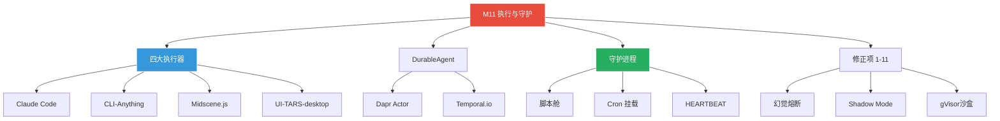
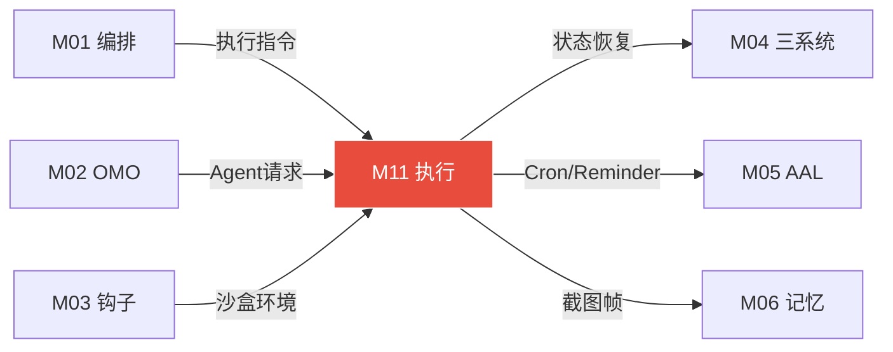

# 模块 11: 执行层与守护进程系统

> **本文档定义执行层完整设计——执行工具栈·持久化保障·视觉自动化·Daemon守护进程·Cron定时·修正项落地方案。**
> 跨模块引用：M01（DeerFlow编排）·M03（Harness钩子）·M04（任务系统）·M05（AAL·Ralph Loop）

---

## 1. 执行工具栈（四大执行器）

### 1.1 Claude Code（主力执行手脚）

```
职责: 代码编写·文件系统操作·bash命令·git集成
选择理由: 最强代码执行能力·Anthropic官方·无替代
特性:
 · Hash锚定编辑（精准修改而非全量覆盖）
 · git快照（每次关键操作前自动保存）
 · 文件系统全量访问
 · bash命令直接执行
```

### 1.2 CLI-Anything（软件CLI化）

```
项目: HKUDS/CLI-Anything (12k stars)
职责: 将任何GUI软件转化为CLI工具·自动生成SKILL.md
工作流:
 Step 1: 截图 → AI理解软件界面
 Step 2: 生成CLI wrapper脚本
 Step 3: 写入CLI-Hub（~/.deerflow/cli-hub/）
 Step 4: 下次直接CLI调用·零视觉成本

CLI-Hub目录:
 ~/.deerflow/cli-hub/
  ├── gimp-resize.sh      # GIMP批量缩放
  ├── blender-render.sh   # Blender渲染
  ├── obs-record.sh       # OBS录屏
  └── meta-skill.md       # CLI-Hub元技能索引
```

### 1.3 Midscene.js（Web视觉自动化）

```
项目: web-infra-dev/midscene
职责: 纯视觉Web浏览器操作·零DOM依赖·token降低40%
安装: npm install @midscene/web
底层模型: UI-TARS-2 / Qwen3-VL（可配）

配置:
 // midscene.config.mjs
 export default {
   aiVendorBaseUrl: 'https://api.siliconflow.cn/v1',
   aiModel: 'Pro/UI-TARS',
   aiApiKey: process.env.SILICONFLOW_API_KEY,
 };

DeerFlow工具节点封装:
 import { AgentOverChromeBridge } from '@midscene/web/bridge-mode';
 export async function midscene_browser(instruction, url) {
   const agent = new AgentOverChromeBridge();
   await agent.aiAction(instruction);
   return await agent.aiQuery({type:'object', description:'需要的数据'});
 }
```

### 1.4 UI-TARS-desktop（桌面GUI兜底）

```
项目: bytedance/UI-TARS-desktop
职责: 桌面应用GUI操作（GIMP/Blender等）
触发条件: 使用次数<3 → TARS触发·≥3次 → CLI-Anything自动生成
```

### 1.5 视觉工具决策树

```
步骤需要视觉/GUI操作?
 ↓ 判断: Web浏览器操作? 还是桌面应用操作?

Web浏览器操作 → Midscene.js
 · 纯视觉·零DOM·token低40%
 · 支持: Chrome/Firefox/Edge

桌面应用操作 → 使用次数判断
 · <3次 → UI-TARS-desktop（视觉操作）
 · ≥3次 → CLI-Anything生成CLI wrapper（零视觉成本）

需要Agent级MCP浏览器工具时:
 → @agent-infra/mcp-server-browser（复杂多步浏览器任务）
```

---

## 2. 持久化可靠执行（Dapr DurableAgent）

### 2.1 安装步骤

```powershell
# 1. 安装Dapr CLI
powershell -Command "iwr -useb https://raw.githubusercontent.com/dapr/cli/master/install/install.ps1 | iex"
dapr --version

# 2. 初始化本地环境（自动启动Redis+Zipkin Docker容器）
dapr init
dapr status

# 3. 安装Python包
pip install dapr-agents --break-system-packages
pip install dapr --break-system-packages
```

### 2.2 DurableAgent使用方式

```python
from dapr_agents import DurableAgent
from dapr_agents.llm import AnthropicChatClient

task_agent = DurableAgent(
    name="deerflow-task-agent",
    role="Task Executor",
    llm=AnthropicChatClient(model="claude-sonnet-4-6"),
    tools=[deerflow_search, claude_code_exec, cli_tool],
    max_iterations=50
)

# 启动（带Dapr sidecar）
# dapr run --app-id task-agent -- python task_agent.py
# 崩溃后重启自动从中断点继续
```

### 2.3 保障机制

```
Exactly-Once执行:
 · 每个工具调用步骤精确执行一次
 · 崩溃重启不会重复调用已完成的步骤
 · Actor Reminder确保持久触发
 · state store记录每步状态

自动重试策略:
 · 工具调用失败 → 指数退避重试
 · LLM调用超时 → 自动重试
 · Circuit Breaker防止雪崩
 · 可配置: maxRetries · timeout · backoff

Scale-To-Zero:
 · Actor模型 · 空闲时自动回收资源
 · 唤醒延迟: <100ms
 · HEARTBEAT触发时快速就绪

与boulder.json的协同:
 · Dapr管执行状态 · boulder.json管任务计划 · 互补不冲突
 · 任务完成后Dapr自动更新boulder.json对应节点状态
```

---

## 3. 守护进程系统（Daemon）

### 3.1 设计目标

```
支持长周期、持续性工作流:
 例: 持续监控某对标短视频账号·一旦发视频则提取内容并自动派发

系统缺少让Agent自己编写"自动化循环监控逻辑"
并将其作为常驻进程(Daemon)养在系统后台的机制
```

### 3.2 三层实现

**脚本级长时监控舱（Daemon Isolation Pod）：**

```
当Sisyphus判断这是一个"周期循环"型作业时
 → 不直接执行
 → 委派底层Agent编写一个全自动监控提取脚本
 → 脚本实体文件封存写入 src/tasks/daemons/

目录结构:
 src/tasks/daemons/
  ├── monitor_competitor.py     # 竞品监控
  ├── check_github_releases.py  # GitHub版本检测
  ├── feishu_daily_digest.py    # 飞书每日摘要
  └── README.md                 # 守护进程索引
```

**Cron扳机的动态挂载引擎（Dynamic Cron Loader）：**

```
无需重启整个OpenClaw
Agent写完脚本后·向DeerFlow调度配置中写入触发器法则:

# ~/.deerflow/crontabs.yaml
daemons:
  - name: monitor_competitor
    script: src/tasks/daemons/monitor_competitor.py
    cron: "*/30 * * * *"     # 每30分钟
    sandbox: true            # gVisor沙盒运行
    notify: feishu           # 异常推飞书

  - name: check_github_releases
    script: src/tasks/daemons/check_github_releases.py
    cron: "0 8 * * *"        # 每天8点
    sandbox: true
    notify: feishu
```

**心跳驱动执行（Tick Engine）：**

```
主干框架新增纯后台的轮询心跳服务
检测到注册表新增了驻留任务
 → 自动在沙盒（gVisor）中拉起该脚本循环作业
 → Agent通过代码"自我雇佣了一个数字打工人·24小时帮自己干脏活"
```

---

## 4. 修正项落地方案（来自系统架构审计）

### 4.1 修正项1: Windows桌面端GUI自动化

```
问题: @agent-infra/mcp-server-browser仅能控制浏览器内网页
      无法操作Windows本地应用软件

方案: 引入基于Python的轻量级守护进程(Daemon)
      底层调用PyAutoGUI·脱离纯Web限制

执行链路:
 Agent接收到跨软件操作需求
 → 截取当前Windows全屏图像
 → 请求UI-TARS云端API(硅基流动)进行视觉解析
 → 提取返回的(x,y)坐标与动作指令
 → 发送给本地Python守护进程
 → 完成物理级鼠标/键盘操控
```

### 4.2 修正项2: 多语言生态大一统与超长任务编排

```
问题: 直接将Python Dapr API强塞给Node.js底座·缺乏跨语言通信

方案: Temporal.io引擎 + MCP协议

原理:
 · Node.js编写核心"智能体心智工作流(Deterministic Workflows)"
 · 所有Python AI库包装为Temporal子活动(Activities)
 · 持久化执行(Durable Execution)机制
 · 即便宿主机蓝屏断电·开机后毫秒级原地满血复活

参考项目:
 · Redhat UnifAI - 红帽Temporal+MCP多Agent编排方案
 · netadx1ai/ai-core - Temporal+MCP完全自主AI平台
 · Temporal AI Agent(Official Demo) - 官方无限上下文最佳实践
```

### 4.3 修正项3: 视觉GUI操作记忆坍塌

```
问题: 多步长序列几百张截图击穿Token额度

方案: 锚定状态记忆(Anchored State Memory) + 分级模态抛弃法

原理:
 操作完成后·立刻用小型本地模型将屏幕提炼为"局部文本状态树"
 上下文里有且仅有当前步骤的唯一一张最新截图
 过去100步全部坍缩为极精简的文本锚点(Text Anchors)
 只有"走错路需退回"时·才通过RAG拉取历史画面

参考:
 · AndroTMem - Anchored State Memory
 · AgentProg - 交互历史重构为带变量的代码程序
 · CortexaDB - AI Agent专用时空图谱/向量混合数据库
```

### 4.4 修正项4: 飞书免穿透远程控制

```
问题: 没有公网固定IP·内网穿透易断流

方案: 飞书开放平台原生WebSocket长连接(Persistent Connection)

原理:
 由局域网内OpenClaw主动发出外联加密请求(wss通道)
 天然免疫入站防火墙
 内置心跳包(Heartbeat)机制确保弱网环境瞬时重发

参考:
 · 飞书开放平台《使用长连接接收事件》
 · openclaw-feishu - WebSocket原生处理插件
 · feishu-claude-code - 飞书接入本地CLI工具最佳实践
```

### 4.5 修正项5: 夜间沙盒安全（gVisor）

```
问题: 原生Docker被AI生成代码逃逸

方案: 全面改建Docker使用gVisor(runsc)用户层内核

原理:
 替换底层runc环境为runsc
 AI每一条系统调用被拦截进入"虚拟假内核"
 即使发动毁灭级攻击·宿主机不受损
 保证"半夜无人值守自动化进化"的绝对安全

参考: google/gvisor
```

### 4.6 修正项6: HITL审批死锁与影子模式

```
问题: 高危脚本需人确认·Agent主线程死锁等待

方案: Temporal异步状态冷藏挂起 + "影子模式(Shadow Mode)"

原理:
 1. 状态冰封秒切: Temporal提取推演栈帧快照挂起·转去做其他杂活
 2. 影子派生前行: 待批阅脚本拷贝进gVisor沙盒"空跑过载测试"
    第二天审批时直接查收崩溃日志和成功率曲线
    点击"同意"→拉取沙盒成功镜像实装部署

参考: cordum-io/cordum · paperclip-aperture
```

### 4.7 修正项7: 长周期记忆灾难

```
问题: 传统RAG在数周数据叠加后遭遇灾难性遗忘

方案: 夜间局部认知引擎提纯(GraphRAG) + 语义记忆网络(Mem0)

原理:
 夜间自净化进程中注入"炼金步骤"
 AI调用轻量级模型审查全天执行录像和代码变更
 提炼出"实体特征"和"多级关联逻辑"
 组建本地核心知识关联图谱
 记录"Python3.12"--"不兼容"--"模块X"
 而不是存一句报错废话长文

参考: microsoft/graphrag · mem0ai/mem0
```

### 4.8 修正项8: 幻觉死循环与监察熔断

```
问题: Agent在排错中陷入无限死循环

方案: 树搜索回溯熔断(LATS) + Temporal时光倒流 + 监察Agent介入

原理:
 1. 滑动语义死网监控: 过去3回合行动向量相似度达90%→脱锚熔断
 2. 时间倒流回滚(MCTS Backtracking): Temporal摧毁脏沙盒·回退5步
 3. 监察特工外部物理踢除: 唤醒监察Agent以上帝视角查阅报错
    写出强迫转弯路径法则·下发给基层AI

参考: LATS · Reflexion
```

### 4.9 修正项9: 零信任凭证保险库

```
问题: Agent内存暴露API Key·Prompt Injection后凭证泄露

方案: MCP协议独立JIT零信任发卡保险库

原理:
 1. Agent大脑0凭据(绝对贫穷)
 2. JIT即时发牌: 执行操作时请求Vault Broker
 3. 安全代持: 动态生成即抛型代币·执行后立即销毁

参考: agentidentityprotocol · ZSP(零基础驻地特权)
```

### 4.10 修正项10: 去中心化蜂群架构

```
问题: 中央集权Pipeline遇到复杂任务时中枢Context爆满幻觉

方案: Swarm思想P2P动态交接(Handoff) + 共享黑板(Blackboard)

原理:
 将组件解构为高度独立的"自治专家"
 采用接力交接(Agent Handoff): 完成后直接把成果砸在黑板上@同事
 可以"逆向反路由"直接扔回修改要求
 动态涌现流·算力打散到单点

参考: openai/swarm · MetaGPT
```

### 4.11 修正项11: Prompt钩子热插拔与Context Hash锚定

```
问题: Sisyphus 1100行提示词注意力衰减

方案A: Harness钩子热插拔减负 + Context Hash锚定快照

原理:
 1. Prompt减负: 常驻提示词精减至200行
    剩余碎片化为YAML封存于assets/skills/
    PreToolUse时JIT挂载·PostToolUse时卸载抹除
 2. Context护城河: 叫停DeerFlow 8K无差别Summarize
    对冗长报错用hashline_edit浓缩为动作意图快照
    只保留最近3步最致命的行号和结果
    庞杂乱码在SQLite沉淀而非冲进LLM文本框
```

---

## 附录 A: 建设蓝图 (Construction Roadmap)

| 阶段 | 目标 | 关键交付物 | 验收标准 | 预估工期 |
|:---:|---|---|---|:---:|
| **Phase 0** | 四大执行器 | Claude Code集成、CLI-Anything安装、Midscene.js配置、UI-TARS部署 | 四种执行器各完成一个端到端任务 | 5 天 |
| **Phase 1** | DurableAgent | Dapr DurableAgent包装、Exactly-Once验证、崩溃恢复测试 | 模拟崩溃→自动恢复→从精确断点继续执行 | 4 天 |
| **Phase 2** | 守护进程 | 脚本舱部署、Cron挂载、HEARTBEAT心跳驱动、crontabs.yaml | 守护进程7×24运行；定时任务准时触发 | 4 天 |
| **Phase 3** | 修正项落地 | 11个修正项逐一实现（幻觉熔断、Shadow Mode等） | 每个修正项有独立测试用例通过 | 5 天 |

---

## 附录 B: 模块结构脑图 (Architecture Mind Map)



---

## 附录 C: 跨模块关系图 (Cross-Module Dependencies)

| 方向 | 对端模块 | 交换内容 | 触发条件 |
|:---:|---|---|---|
| ← 输入 | **M01 编排引擎** | 执行指令分发 | 路径B/C任务 |
| ← 输入 | **M02 OMO矩阵** | Agent执行请求 | Handoff |
| → 输出 | **M04 三大系统** | 持久化状态恢复 | 崩溃恢复 |
| → 输出 | **M05 AAL** | Cron触发信号、Actor Reminder | 定时任务 |
| → 输出 | **M06 记忆** | UI-TARS 截图帧数据 | 视觉任务 |
| ← 输入 | **M03 钩子** | gVisor沙盒执行环境 | 高风险操作 |



---

## 附录 D: GitHub 项目与相关文献 (References)

| 项目 | GitHub 链接 | 在本模块中的角色 |
|---|---|---|
| **Dapr Agents** | https://github.com/dapr/dapr-agents | DurableAgent持久化执行框架 |
| **CLI-Anything** | https://github.com/HKUDS/CLI-Anything | 软件CLI化执行器 |
| **Midscene.js** | https://github.com/web-infra-dev/midscene | Web浏览器自动化 |
| **UI-TARS-desktop** | https://github.com/bytedance/UI-TARS-desktop | 桌面应用GUI自动化 |
| **gVisor** | https://github.com/google/gvisor | 沙盒隔离（runsc） |
| **Temporal.io** | https://github.com/temporalio/temporal | 持久化工作流（进阶恢复） |

---

## 附录 E: 方法论参考 (Methodology Sources)

| 方法论 | 来源网址 | 在本模块中的应用点 |
|---|---|---|
| **DurableAgent** | https://docs.dapr.io/developing-applications/building-blocks/actors/ | Exactly-Once语义+Actor Reminder |
| **视觉决策树** | 本项目 M11 设计 | Web→Midscene；桌面<3次→UI-TARS；≥3次→CLI |
| **Shadow Mode** | 本项目修正项3 | HITL等待期间预执行代码、不死锁 |
| **LATS 幻觉熔断** | https://arxiv.org/abs/2310.04406 | 3回合语义相似度>90%→脱锚→回退5步 |
| **Zero Trust Vault** | https://github.com/agentidentityprotocol | JIT即抛型凭证管理 |

---

## 校验清单

- [x] 四大执行器（Claude Code·CLI-Anything·Midscene.js·UI-TARS-desktop）
- [x] 视觉工具决策树
- [x] Dapr DurableAgent安装与使用
- [x] 持久化保障四大机制（Exactly-Once·自动重试·Scale-To-Zero·boulder协同）
- [x] Daemon守护进程三层实现（脚本舱·Cron挂载·心跳驱动）
- [x] crontabs.yaml配置格式
- [x] 修正项1-11完整落地方案
- [x] 每个修正项的问题·方案·原理·参考项目

---

## 接管清单 (Takeover Manifest)

> **V3.0 接管式升级 — 2026-04-11 新增**

### 接管目标

- **文件**: `gateway.cmd` + `node.cmd` + 进程管理
- **获取方式**: 在原有进程管理基础上增强，加入沙盒隔离

### M11 增强能力

| 新增能力 | 原生没有 |
|---|---|
| gVisor沙盒隔离 | 原生无隔离 |
| 不可逆操作拦截 | 原生无 |
| Daemon守护进程 | 原生只有gateway基础进程 |
| Dapr持久化 | 原生无 |
