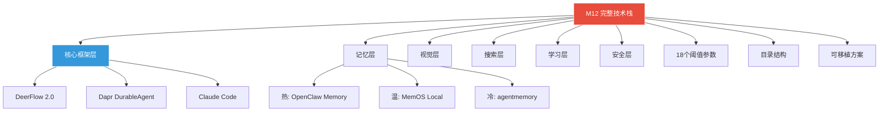
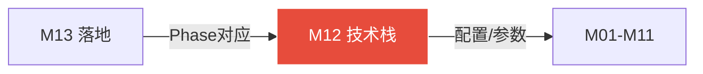

# 模块 12: 完整技术栈与关键配置

> **本文档定义系统完整技术栈——按层级分类·每项含GitHub来源·选择理由·备选方案·18个关键阈值参数·目录结构·可移植方案。**
> 跨模块引用：全部模块（M01-M11）

---

## 1. 核心框架层（不可替代）

| 功能 | 选型决策 | GitHub | 选择理由 | 备选方案 |
|---|---|---|---|---|
| 编排引擎 | **DeerFlow 2.0** | bytedance/deer-flow | #1 GitHub Trending·字节内部验证·LangGraph+飞书原生·SuperAgent架构 | LangGraph手写（成本高） |
| 持久执行 | **Dapr DurableAgent** | dapr/dapr-agents | CNCF级可靠性·Exactly-Once·Scale-To-Zero·Python原生 | 手动boulder.json（不可靠） |
| 执行手脚 | **Claude Code（本地）** | Anthropic官方 | 最强代码执行·文件系统·bash·git集成 | 无替代 |
| 软件接入 | **CLI-Anything** | HKUDS/CLI-Anything | 12k stars·OpenClaw官方支持·200+软件已收录 | UI-TARS全量（成本高） |
| 多Agent工作流 | **Antfarm** | snarktank/antfarm | 零依赖·YAML确定性·OpenClaw原生·一条命令安装 | n8n（重） |
| 持续循环 | **Ralph Loop** | snarktank/ralph | 12k stars·硬上下文重置·AGENTS.md学习·CC原生 | 自写循环（易漂移） |

---

## 2. 记忆层（三层分工明确）

| 层级 | 选型 | GitHub | 职责 | Windows状态 |
|---|---|---|---|---|
| 热记忆 | **OpenClaw内置Memory** | openclaw/openclaw | 当前任务上下文·压缩管理·Dreaming整合·SQLite向量 | ✅ 原生支持 |
| 温记忆 | **MemOS Local Plugin** | MemTensor/MemOS | 跨会话持久化·FTS5+向量混合·Skill进化·Memory Viewer | ⚠️ 需手动安装 |
| 冷记忆 | **agentmemory** | rohitg00/agentmemory | PostToolUse语义压缩·SHA256去重·BM25+向量RRF·质量评分 | ✅ npm支持 |

---

## 3. 视觉层（分场景路由）

| 场景 | 选型 | GitHub | 触发条件 | 底层模型 |
|---|---|---|---|---|
| Web浏览器自动化 | **Midscene.js** | web-infra-dev/midscene | Web页面操作·数据提取 | UI-TARS-2/Qwen3-VL |
| 桌面应用<3次 | **UI-TARS-desktop** | bytedance/UI-TARS-desktop | GUI软件·次数<3 | UI-TARS-2本地 |
| 桌面应用≥3次 | **CLI-Anything生成** | HKUDS/CLI-Anything | 自动触发CLI化流程 | 无（CLI直接调用） |
| Agent级浏览器MCP | **@agent-infra/mcp-server-browser** | 字节/agent-infra | 复杂多步浏览器任务 | UI-TARS-2 |

---

## 4. 搜索层（按类型路由）

| 信息类型 | 主引擎 | 备引擎 | 内容提取 |
|---|---|---|---|
| 通用网页 | SearXNG（自托管） | Brave Search API | Jina Reader |
| AI/技术文档 | Tavily API | Exa Search | Jina Reader |
| 官方文档（实时） | context7 MCP | 官网直抓 | MCP直接返回 |
| 学术/深度 | Exa Search | arXiv API | PDF解析 |
| 代码/仓库 | GitHub Search API | grep_app MCP | 直接API返回 |
| ByteDance内部 | InfoQuest（DeerFlow内置） | — | 内置处理 |

---

## 5. 提示词与学习层

| 功能 | 选型 | GitHub | 职责 |
|---|---|---|---|
| 提示词参数化·编译 | **DSPy** | stanfordnlp/dspy | Signatures+Modules+MIPROv2·模型更新自动重编译 |
| 提示词反射进化 | **GEPA** | gepa-ai/gepa | 捕获执行轨迹→LLM诊断→Pareto前沿采样·ICLR 2026 Oral |
| 经验包记忆 | **agentmemory** | rohitg00/agentmemory | PostToolUse语义压缩·去重·向量索引 |
| 图谱化长期记忆 | **GraphRAG** | microsoft/graphrag | 夜间提纯·实体关联图谱·防灾难性遗忘 |

---

## 6. 安全层

| 功能 | 选型 | 参考 | 职责 |
|---|---|---|---|
| 沙盒隔离 | **gVisor(runsc)** | google/gvisor | 用户层内核·系统调用拦截·防逃逸 |
| 凭证保险库 | **JIT零信任Vault** | agentidentityprotocol | Agent 0凭据·即抛型代币·执行后销毁 |
| 死循环熔断 | **LATS+Reflexion** | LATS论文 | 3回合语义相似度90%→脱锚熔断→回退5步 |
| 飞书安全通信 | **WebSocket长连接** | 飞书开放平台 | 免穿透·wss加密·心跳重连 |

---

## 7. 完整技术栈按层总览

| 层级 | 组件 | 项目来源 | Phase |
|---|---|---|---|
| 感知层 | mss截图·fast-whisper耳·Kokoro TTS嘴 | 各开源库 | Phase4 |
| 入口层 | 飞书→OpenClaw Gateway(A2A插件) | openclaw + A2A plugin | 已有 |
| 记忆层 | OpenClaw Memory(热)+MemOS Local(温)+agentmemory(冷) | openclaw·MemTensor·rohitg00 | 立即安装 |
| 编排层 | DeerFlow 2.0 SuperAgent Harness | bytedance/deer-flow | 立即安装 |
| 搜索层 | 搜索Agent+SearXNG+Tavily+InfoQuest+context7 MCP | DeerFlow内置+外部 | Phase1 |
| 任务层 | 任务Agent+监督Agent+Optimizer节点 | DeerFlow 2.0+自实现 | Phase3 |
| 持久层 | Dapr DurableAgent(精确恢复·exactly-once) | dapr/dapr-agents | 立即安装 |
| 执行层 | Claude Code(主力)+CLI-Anything(软件) | Anthropic+HKUDS | Phase2 |
| 视觉层 | Midscene.js(Web)+UI-TARS-desktop(桌面) | web-infra-dev·bytedance | Phase2 |
| 循环层 | Ralph Loop+Antfarm+HEARTBEAT | snarktank/ralph·antfarm | Phase3 |
| 学习层 | 钩子捕获+经验包+Optimizer+夜间复盘+资产晋升 | OpenHarness+自实现 | Phase3 |
| 可观测 | Diagrid Dashboard(工作流监控) | Dapr生态 | Phase3 |

---

## 8. 18个关键阈值参数

| # | 参数名 | 默认值 | 说明 | 所在模块 |
|---|---|---|---|---|
| 1 | retrieval_threshold | 0.85 | 资产检索相似度阈值 | M07·M09 |
| 2 | promote_min_count | 3 | 晋升最少调用次数 | M07·M08 |
| 3 | promote_min_success | 0.80 | 晋升最低成功率 | M07·M08 |
| 4 | clarity_threshold | 0.85 | 意图清晰度启动阈值 | M10 |
| 5 | max_questions | 4 | 意图澄清最多提问数 | M10 |
| 6 | timeout_per_question | 120s | 每轮追问超时时间 | M10 |
| 7 | cancel_window | 300s | 超时猜测取消窗口 | M10 |
| 8 | llm_judge_threshold | 0.70 | LLM-Judge重试阈值 | M09 |
| 9 | max_retry | 3 | 提示词重试最大次数 | M09 |
| 10 | gepa_improve_threshold | 0.05 | GEPA替换阈值(新版须高于旧版+0.05) | M09 |
| 11 | heartbeat_interval | 5min | HEARTBEAT扫描间隔 | M05 |
| 12 | nightly_review_cron | "0 2 * * *" | 夜间复盘触发时间 | M08 |
| 13 | weekly_review_cron | "0 1 * * 0" | 周度深化触发时间 | M08 |
| 14 | search_timeout | 30s | 提示词搜索总时限 | M10 |
| 15 | aal_default_budget | $1 | AAL超时默认token预算 | M10·M05 |
| 16 | asset_watch_period_usable | 7d | 可用资产淘汰观察期 | M07·M08 |
| 17 | asset_watch_period_quality | 14d | 优质资产淘汰观察期 | M07·M08 |
| 18 | optimizer_shrink_threshold | 0.80 | Optimizer精简阈值(步骤数<原×0.8才固化) | M08 |

---

## 9. 目录结构

```
~/.deerflow/                        # DeerFlow核心目录
 ├── config.yaml                     # 主配置文件
 ├── docker-compose.yaml             # 服务栈
 ├── skills/                         # 技能文件系统
 │   ├── public/                     # 内置技能
 │   ├── learned/                    # 夜间复盘自动生成
 │   └── custom/                     # 手动添加
 ├── assets/                         # 数字资产库
 │   ├── asset-index.json            # 资产索引
 │   ├── skills/                     # 技能SOP资产
 │   ├── tools/                      # 工具资产
 │   ├── workflows/                  # 工作流资产
 │   ├── prompts/                    # 提示词资产
 │   ├── knowledge/                  # 知识库资产
 │   ├── search_paths/               # 搜索路径资产
 │   ├── failure_patterns/           # 失败模式库
 │   ├── user_prefs/                 # 用户偏好资产
 │   ├── env_configs/                # 环境配置资产
 │   ├── retired/                    # 已淘汰资产（保留记录）
 │   └── audit-log/                  # 操作审计日志
 ├── memory/                         # 记忆系统
 │   ├── experience-packs/           # 每日经验包JSONL
 │   ├── capability-map.json         # 能力版图
 │   └── graphrag/                   # 知识图谱
 ├── cli-hub/                        # CLI-Anything生成的wrapper
 ├── crontabs.yaml                   # 守护进程定时配置
 ├── mission/                        # AAL任务体系
 │   ├── Mission.md
 │   ├── Phase.md
 │   └── boulders/
 └── logs/                           # 系统日志

~/.openclaw/                         # OpenClaw配置
 ├── openclaw.json                   # 主配置（含Memory配置）
 └── extensions/                     # 插件目录
     └── memos-local-openclaw-plugin/ # MemOS Local

src/tasks/daemons/                   # 守护进程脚本目录
```

---

## 10. 可移植方案

### 10.1 三种迁移场景

| 场景 | 迁移范围 | 耗时 |
|---|---|---|
| 新电脑 | 全量迁移 | ~30分钟 |
| 重装系统 | 配置+资产迁移 | ~20分钟 |
| 新用户 | 仅核心资产 | ~10分钟 |

### 10.2 一键备份/恢复

```bash
# 备份（~/.deerflow/backup.sh）
tar czf openclaw-backup-$(date +%Y%m%d).tar.gz \
  ~/.deerflow/assets/ \
  ~/.deerflow/memory/ \
  ~/.deerflow/skills/learned/ \
  ~/.deerflow/config.yaml \
  ~/.deerflow/crontabs.yaml \
  ~/.openclaw/openclaw.json

# 恢复（~/.deerflow/restore.sh）
tar xzf openclaw-backup-*.tar.gz -C ~/
# 重新安装依赖:
# make docker-start · dapr init · npm install
```

---

## 11. 环境要求与API Keys

### 11.1 环境要求

```
Node.js 22+
Python 3.12+
Docker Desktop (gVisor enabled)
Claude Code CLI (已安装)
OpenClaw Gateway (已安装)
Git (版本控制)
Dapr CLI
```

### 11.2 API Keys清单

| API | 用途 | 阈值/限制 | 获取地址 |
|---|---|---|---|
| Anthropic API | Claude Code执行 | 按量计费 | console.anthropic.com |
| Tavily API | AI搜索 | 1000次/月免费 | tavily.com |
| Exa Search API | 深度搜索 | 1000次/月免费 | exa.ai |
| SiliconFlow API | UI-TARS-2视觉 | 按量计费 | siliconflow.cn |
| 飞书开放平台 | 消息通道 | 无限制 | open.feishu.cn |
| Jina Reader API | 网页提取 | 免费 | jina.ai |

---

## 附录 A: 建设蓝图 (Construction Roadmap)

| 阶段 | 目标 | 关键交付物 | 验收标准 | 预估工期 |
|:---:|---|---|---|:---:|
| **Phase 0** | 核心框架层安装 | DeerFlow+Dapr+Claude Code+OpenClaw Gateway | 所有核心服务启动正常 | 3 天 |
| **Phase 1** | 记忆+搜索+安全 | 三层记忆部署、搜索引擎路由、gVisor+JIT Vault | 混合检索可用；搜索返回结果；沙盒执行通过 | 5 天 |
| **Phase 2** | 视觉+学习+提示词 | Midscene.js+UI-TARS+DSPy+GEPA | 四大视觉场景路由；DSPy编译通过 | 5 天 |
| **Phase 3** | 18参数调优 | 全部18个阈值参数配置、可移植方案验证 | 全参数表配置完成；备份恢复脚本跑通 | 3 天 |

---

## 附录 B: 模块结构脑图 (Architecture Mind Map)



---

## 附录 C: 跨模块关系图 (Cross-Module Dependencies)

| 方向 | 对端模块 | 交换内容 | 触发条件 |
|:---:|---|---|---|
| → 输出 | **M01-M11 全模块** | 技术栈配置、参数阈值、目录规范 | 系统全生命周期 |
| ← 输入 | **M13 分阶段落地** | Phase 0-4的技术选型对应关系 | 落地计划编制 |



---

## 附录 D: GitHub 项目与相关文献 (References)

| 项目 | GitHub 链接 | 在本模块中的角色 |
|---|---|---|
| **DeerFlow 2.0** | https://github.com/bytedance/deer-flow | 编排核心框架 |
| **Dapr** | https://github.com/dapr/dapr | 持久执行运行时 |
| **CLI-Anything** | https://github.com/HKUDS/CLI-Anything | 软件接入执行器 |
| **Antfarm** | https://github.com/snarktank/antfarm | 多Agent工作流 |
| **Ralph** | https://github.com/snarktank/ralph | 持续循环引擎 |
| **MemOS** | https://github.com/MemTensor/MemOS | 温记忆插件 |
| **agentmemory** | https://github.com/autonomousresearchgroup/agentmemory | 冷记忆管线 |
| **gVisor** | https://github.com/google/gvisor | 沙盒隔离 |
| **DSPy** | https://github.com/stanfordnlp/dspy | 提示词编译 |
| **GraphRAG** | https://github.com/microsoft/graphrag | 图谱记忆 |

---

## 附录 E: 方法论参考 (Methodology Sources)

| 方法论 | 来源网址 | 在本模块中的应用点 |
|---|---|---|
| **12层技术栈分层** | 本项目 M12 设计 | 感知→入口→记忆→编排→搜索→任务→持久→执行→视觉→循环→学习→可观测 |
| **18参数体系** | 本项目 M12 设计 | 全系统关键阈值的统一管理 |
| **Git-based 可移植** | https://git-scm.com/ | 一键备份/恢复方案 |

---

## 校验清单

- [x] 核心框架层（6项·含GitHub·理由·备选）
- [x] 记忆层三层（热/温/冷）
- [x] 视觉层四场景路由
- [x] 搜索层六类信息源路由
- [x] 提示词与学习层
- [x] 安全层四大组件
- [x] 完整技术栈12层总览
- [x] 18个关键阈值参数表
- [x] 完整目录结构
- [x] 可移植方案（三场景·备份恢复脚本）
- [x] 环境要求
- [x] API Keys清单

---

## 接管清单 (Takeover Manifest)

> **V3.0 接管式升级 — 2026-04-11 新增**

### 接管目标

- **文件**: `config/gateway.yaml` + `config/node.yaml`
- **获取方式**: 保留原有配置，统一为单一配置入口

### M12 增强能力

| 新增能力 | 原生没有 |
|---|---|
| 12层技术栈规范 | 原生配置分散 |
| 18个关键阈值参数 | 原生无统一阈值管理 |
| 可移植方案 | 原生无 |
