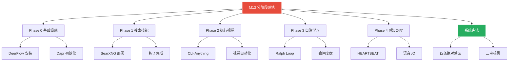
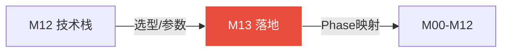

# 模块 13: 分阶段落地计划

> **本文档定义完整的分阶段实施路线——Phase 0-4·每阶段验收标准·锁定设计决策·风险矩阵·系统宪法。**
> **V3.1 更新**: 以接管式升级路线为主线。DeerFlow (`e:\OpenClaw-Base\deerflow\`) 作为统一编排总管家，接管并升级 OpenClaw 所有能力。
> 跨模块引用：全部模块（M00-M12）

---

## 🔴 主线路线图（V3.1 接管式升级·以此为准）

```
Phase 0（文档完成·已完成）  —— 接管声明与方向制定
Phase 1（第1-2周）          —— 核心功能接管（M08/M07/M06/M05）
Phase 2（第3-4周）          —— 管线增强与注入（M03/M09/M02/M01）
Phase 3（第2月）            —— 新增能力注入（M10/M04/M11/M12）
Phase 4（第3月）            —— 验证收尾与24/7运行
持续迭代                    —— 能力扩展与深化
```

> **DeerFlow 物理路径**: `e:\OpenClaw-Base\deerflow\`
> **接管机制**: 备份原文件(`{name}.{YYYYMMDD_HHmmss}.bak`) → 增强版替换 → 验证通过切换

### Phase 0 验收标准 ✅ 已完成

```
✅ M00 系统总论创建（含宪法·映射全景·DeerFlow总管家定位）
✅ M01-M13 全部文档添加接管清单章节
✅ M00 确认 DeerFlow 为统一编排总管家
✅ M00 确认物理路径 e:\OpenClaw-Base\deerflow\
✅ M00 确认接管机制：备份后直接替换
✅ 接管目标文件全部确认存在
✅ flows/registry.sqlite WAL 已合并
```

### Phase 1 核心功能接管（第1-2周）

```
1. 安装 DeerFlow: git clone https://github.com/bytedance/deer-flow.git
   目标路径: e:\OpenClaw-Base\deerflow\
   make config → make docker-start

2. M08 接管 universal-evolution-framework.js (914行)
   备份: UEF.js.20260411_xxxxxx.bak
   开发增强版 → 替换 → 验证 UEF 闭环学习引擎运转正常

3. M07 接管 dynamic-platform-binding.js (578行)
   备份 → 增强版替换 → 验证九类资产体系运转

4. M06 扩展 memory/*.sqlite
   只新增表（保护宪法第三条）→ 验证 ReMe 四层记忆写入

5. M05 接管 cron/jobs.json
   备份 → 4个任务迁移为 HEARTBEAT 子任务结构
```

**Phase 1 验收标准**:
```
□ DeerFlow 启动运行（e:\OpenClaw-Base\deerflow\·localhost:2026）
□ M08 增强版运行·PostToolUse 自动写入经验包
□ M07 增强版运行·资产五级分级可见
□ M06 新增记忆表存在·不影响原有表
□ M05 HEARTBEAT 接替原 cron 4个任务
□ 所有备份文件存在（*.bak）
```

### Phase 2 管线增强与注入（第3-4周）

```
1. M03 接管 self-hardening.js → 完整 Pre/PostToolUse 钩子体系
2. M09 接管 token-optimizer.js → SOUL.md 五层提示词架构
3. M02 增强 openclaw.json agents → OMO 四类分级路由
4. M01 DeerFlow 注入 OpenClaw 消息管线（飞书→DeerFlow→编排）
```

**Phase 2 验收标准**:
```
□ M03 钩子体系：每次工具调用触发 Pre/PostHook
□ M09 提示词五层架构运行·token 消耗降低≥30%
□ M02 OMO 分级路由：Operator/Manager/Orchestrator/Observer 各就其位
□ 飞书消息→DeerFlow→编排→返回 完整链路跑通
```

### Phase 3 新增能力注入（第2月）

```
1. M10 意图澄清引擎注入（飞书消息入口处）
2. M04 扩展 flows/registry.sqlite → 三系统协同
3. M11 加入 gVisor 沙盒隔离
4. M12 统一配置中心
```

**Phase 3 验收标准**:
```
□ M10 意图澄清：模糊请求触发追问策略
□ M04 三系统联动（搜索/任务/工作流）
□ M11 gVisor 沙盒运行验证
□ M12 所有配置统一入口管理
```

### Phase 4 验证收尾（第3月）

```
□ 所有接管功能正常运行
□ 原有 4 个 JS 备份文件确认保留
□ 连续 72 小时稳定性测试
□ 全面交叉引用校验
```

---

## 📚 历史参考（V2.0 旧版路线·仅供参考·以上方 V3.1 主线为准）

> ⚠️ 以下为 V2.0 独立系统建设路线，**已被 V3.1 接管式升级路线取代**，保留仅供历史审计参考。

### 旧 Phase 0: 基础设施搭建（V2.0·已废弃）

---

## 2. Phase 0: 基础设施搭建（立即·1周内）[V3.0作废·接管式升级后已废弃]

### 2.1 执行项

```
1. DeerFlow 2.0安装与启动
   git clone https://github.com/bytedance/deer-flow.git
   cd deer-flow
   make config     # 生成config.yaml
   make docker-start  # 启动（localhost:2026）

2. OpenClaw Memory配置启用
   编辑 ~/.openclaw/openclaw.json
   启用: memory.enabled=true · dreaming.enabled=true · hybridSearch=true

3. MemOS Local Plugin手动安装（Windows方式B）
   npm pack → 解压到extensions → npm install → 配置openclaw.json → gateway restart

4. agentmemory安装
   npm install -g agentmemory
   agentmemory start  # 端口3111

5. Dapr CLI初始化
   安装Dapr CLI → dapr init → 确认Redis+Zipkin容器运行

6. 飞书频道配置
   config.yaml中配置飞书app_id/app_secret
   验证WebSocket长连接
```

### 2.2 验收标准

```
□ DeerFlow Web UI可访问（localhost:2026）
□ 飞书消息→DeerFlow→飞书回复完整链路跑通
□ OpenClaw Memory混合搜索可用（验证: /memory search "测试"）
□ MemOS Local Plugin跨会话记忆可用
□ agentmemory MCP服务运行（localhost:3111/mcp）
□ Dapr状态存储可用（dapr status显示所有服务running）
```

---

## 3. Phase 1: 搜索与技能系统（第1-2周）[V3.0作废·接管式升级后已废弃]

### 3.1 执行项

```
1. SearXNG本地部署（Docker）
   docker run -d -p 8080:8080 searxng/searxng

2. Tavily/Exa API配置
   .env中配置TAVILY_API_KEY和EXA_API_KEY
   config.yaml中注册搜索引擎路由

3. claude-to-deerflow Skill安装
   cp -r deer-flow/skills/public/claude-to-deerflow ~/.claude/skills/

4. 三轮搜索逻辑验证
   测试: 飞书发送搜索任务 → SearXNG+Tavily+Exa三源搜索
   验证: 结果融合·冲突标注·置信度评分

5. DeerFlow Skill按需加载测试
   验证: 只加载相关Skill文件·非全量加载

6. OpenHarness钩子集成
   配置PreToolUse/PostToolUse钩子
   验证: PostToolUse自动写入经验包JSONL
```

### 3.2 验收标准

```
□ SearXNG本地搜索可用
□ Tavily API搜索返回结果（含引用URL）
□ claude-to-deerflow委派命令可执行
□ 三轮搜索逻辑跑通（粗筛→精搜→验证）
□ Skill按需加载·token消耗降低≥50%
□ PostToolUse钩子生成经验包JSONL
```

---

## 4. Phase 2: 执行与视觉能力（第3-4周）[V3.0作废·接管式升级后已废弃]

### 4.1 执行项

```
1. CLI-Anything安装与CLI-Hub初始化
   安装CLI-Anything → 创建~/.deerflow/cli-hub/
   生成cli-hub-meta-skill索引

2. Midscene.js安装与配置
   npm install @midscene/web
   配置midscene.config.mjs（SiliconFlow API）

3. 视觉工具决策树实现
   Web操作→Midscene.js · 桌面<3次→UI-TARS · ≥3次→CLI生成

4. boulder.json任务持久化
   实现boulder.json自动生成与状态追踪

5. DurableAgent包装关键任务Agent
   将DeerFlow任务Agent改为Dapr DurableAgent
   验证崩溃恢复能力
```

### 4.2 验收标准

```
□ CLI-Anything对至少3个软件生成CLI wrapper
□ Midscene.js完成一次Web表单填写任务
□ 视觉决策树按条件正确路由
□ boulder.json记录任务状态·可暂停恢复
□ DurableAgent模拟崩溃后自动恢复执行
```

---

## 5. Phase 3: 自治与学习闭环（第2月）[V3.0作废·接管式升级后已废弃]

### 5.1 执行项

```
1. 三层幻觉消除机制
   · 滑动语义相似度检测（3回合>90%→熔断）
   · MCTS回溯5步
   · 监察Agent外部介入

2. Sandbox节点 + Optimizer节点实现
   · DeerFlow Docker沙盒验证
   · Optimizer即时路径优化写资产

3. Ralph Loop + Antfarm部署
   · Ralph Loop硬上下文重置
   · Antfarm YAML多Agent工作流

4. 夜间复盘引擎（凌晨2点cron）
   · 六阶段批量分析
   · 飞书日报推送

5. 经验包 + 资产检索 + 晋升机制
   · 资产四级分级体系运转
   · 晋升/淘汰自动化

6. Diagrid Dashboard监控
   · docker run -p 8080:8080 diagrid-dashboard
   · 工作流执行历史可视化
```

### 5.2 验收标准

```
□ 幻觉死循环在3回合内被检测并熔断
□ Sandbox验证代码产出·通过率≥85%
□ Optimizer识别冗余步骤·精简率≥20%
□ Ralph Loop完成一个多轮任务（≥5轮·自动重置上下文）
□ 夜间复盘生成日报·飞书推送成功
□ 资产晋升：至少1个一般→可用晋升记录
□ Diagrid Dashboard显示完整执行轨迹
```

---

## 6. Phase 4: 感知与24/7运行（第3月）[V3.0作废·接管式升级后已废弃]

### 6.1 执行项

```
1. HEARTBEAT感知层
   · 每5分钟扫描任务队列
   · 日间高频·夜间低频模式切换
   · 02:00触发夜间复盘

2. 语音输入（fast-whisper）
   · sounddevice麦克风捕获
   · faster-whisper本地转文字
   · 唤醒词检测

3. 语音输出（Kokoro TTS）
   · Kokoro TTS本地语音合成
   · ElevenLabs云端高质量备选

4. 屏幕监控（mss+TARS）
   · mss截图 + UI-TARS-2理解
   · 环境变化感知

5. 自主任务生成器完整版
   · 队列空闲时生成进化/监控/维护任务
   · 写入boulder.json
   · 持续不间断运行

6. 24/7不间断运行验证
   · 连续运行72小时稳定性测试
   · 崩溃恢复验证
   · 资源消耗监控
```

### 6.2 验收标准

```
□ HEARTBEAT每5分钟正常触发
□ 语音输入识别准确率≥90%
□ 语音输出播报清晰自然
□ 自主任务生成器在空闲时自主产生有效任务
□ 连续72小时运行无崩溃
□ 崩溃后自动恢复到精确中断点
```

---

## 7. 持续迭代

```
· A2A多Agent通信协议（openclaw plugins install a2a）
· CLI-Hub持续扩充（200+→500+软件）
· OPT个人工作流模板积累
· 能力版图可视化（capability-map.json → Web展示）
· 周度深化复盘上线（周日01:00·飞书周报）
· 资产智能体夜间时序优化（00:30-06:00全窗口利用）
· gVisor安全加固（替换默认Docker运行时）
· JIT零信任凭证保险库部署
```

---

## 8. 系统宪法（绝对红线·不可覆盖）

### 8.1 四条绝对禁区

```
1. 禁止自主修改核心配置
   config.yaml·SOUL.md·安全白名单·灰名单·权限规则
   → 任何修改必须飞书通知用户·等待确认

2. 禁止自主删除核心资产
   核心资产(≥90分)的删除/降级/替换
   → 完全由用户决断

3. 禁止自主修改权限规则
   Tier 0-3权限体系·安全审查规则·绝对禁区清单
   → 永久固化·不可被任何Agent修改

4. 禁止禁用安全审计
   操作审计日志(audit-log/)永久保存
   安全审查三审核员(纠偏员·安全官·风控员)不可被关闭
```

### 8.2 安全审查三审核员

```
纠偏员(Alignment Auditor):
 · 每个Mission/Phase/Boulder决策后审查
 · 判断: 是否偏离用户原始意图
 · 偏离则: 飞书通知 → 暂停执行 → 等待纠正

安全官(Safety Auditor):
 · 每个工具调用前审查
 · 判断: 是否触碰绝对禁区 · 是否超越权限
 · 违规则: 阻止执行 → 记录日志

风控员(Risk Auditor):
 · 大额token消耗/长时间执行/高风险操作前审查
 · 判断: 成本是否合理 · 风险是否可控
 · 异常则: 飞书通知 → 降级执行或暂停
```

---

## 9. 锁定设计决策汇总（24条）

| # | 决策 | 锁定理由 |
|---|---|---|
| 1 | DeerFlow 2.0作为编排核心 | 字节内部验证·LangGraph标准化·飞书原生 |
| 2 | Dapr DurableAgent作为持久层 | CNCF级·Exactly-Once·自动恢复 |
| 3 | 三层记忆架构（热/温/冷） | 各层职责清晰·已有验证项目 |
| 4 | 资产四级分级（记录/一般/可用/核心） | 覆盖全生命周期·自动化+人工决策并存 |
| 5 | 连续3次而非总成功率触发淘汰 | 反应速度快10倍 |
| 6 | 核心资产不参与自动淘汰 | 安全红线·用户全权 |
| 7 | DSPy+GEPA双引擎提示词系统 | 编译+进化分工·覆盖完整需求 |
| 8 | 意图清晰度≥0.85即启动执行 | 清晰度驱动·非轮次驱动 |
| 9 | 最多4轮追问·第4问泛相关兜底 | 平衡精准度与用户耐心 |
| 10 | 超时2分钟进入最优猜测+5分钟取消窗口 | 双重防线·不阻塞不失控 |
| 11 | PostToolUse异步写入经验包 | 不阻塞主执行流 |
| 12 | HEARTBEAT每5分钟·02:00触发复盘 | 日间高频感知·夜间深化学习 |
| 13 | 飞书WebSocket长连接（非穿透） | 免公网IP·心跳重连·稳定 |
| 14 | gVisor沙盒（非原生Docker） | 防逃逸·用户层内核·军工级安全 |
| 15 | JIT零信任凭证（非.env全局暴露） | 防Prompt Injection凭证泄露 |
| 16 | Swarm Handoff（非集中Pipeline） | 防中枢Context爆满·动态涌现 |
| 17 | Harness钩子热插拔（非巨型Prompt） | 常驻提示词减至200行·注意力不衰减 |
| 18 | GraphRAG+Mem0（非扁平RAG） | 防灾难性遗忘·5年经验如肌肉记忆 |
| 19 | LATS+Reflexion死循环熔断 | 3回合检测·回退5步·监察介入 |
| 20 | Shadow Mode影子预执行 | HITL不死锁·待批代码预跑测试 |
| 21 | Temporal.io持久化执行（进阶） | 蓝屏断电后原地满血复活 |
| 22 | AAL超时默认token$1+Tier0-1权限 | 内置保守安全机制 |
| 23 | 工作流必须有终止条件 | 无终止条件的工作流是危险的 |
| 24 | 操作审计日志永久保存 | 所有Agent操作均可回溯 |

---

## 10. 风险矩阵

| 风险 | 等级 | 影响 | 缓解措施 |
|---|---|---|---|
| MemOS Windows安装失败 | 中 | 温记忆不可用 | 手动方式B·社区issue追踪 |
| DeerFlow 2.0 API不稳定 | 中 | 编排层受影响 | LangGraph手写备选 |
| Dapr Docker依赖 | 低 | 持久层不可用 | boulder.json作为降级回退 |
| Token预算超支 | 中 | 成本失控 | 硬上限设置·风控员审查 |
| 模型版本更新导致提示词退化 | 中 | 输出质量下降 | DSPy自动重编译·GEPA进化 |
| 飞书API变更 | 低 | 消息通道中断 | WebSocket协议稳定·社区维护 |
| gVisor性能开销 | 低 | 沙盒执行慢 | 仅高风险代码走沙盒 |
| 经验包JSONL磁盘占用 | 低 | 存储增长 | 30天自动归档·agentmemory压缩 |

---

## 附录 A: 建设蓝图 (Construction Roadmap)

| 阶段 | 目标 | 关键交付物 | 验收标准 | 预估工期 |
|:---:|---|---|---|:---:|
| **Phase 0** | 基础设施 | DeerFlow+Dapr+Memory+飞书 | 全链路消息流通 | 1 周 |
| **Phase 1** | 搜索与技能 | SearXNG+Tavily+Skill按需加载+钩子 | 三轮搜索跑通 | 2 周 |
| **Phase 2** | 执行与视觉 | CLI-Anything+Midscene.js+DurableAgent | 四大执行器验证 | 2 周 |
| **Phase 3** | 自治与学习 | Ralph Loop+夜间复盘+资产晋升 | 24小时自主运行 | 1 月 |
| **Phase 4** | 感知与24/7 | HEARTBEAT+语音+屏幕监控 | 72小时稳定运行 | 1 月 |

---

## 附录 B: 模块结构脑图 (Architecture Mind Map)



---

## 附录 C: 跨模块关系图 (Cross-Module Dependencies)

| 方向 | 对端模块 | 交换内容 | 触发条件 |
|:---:|---|---|---|
| → 输出 | **M00-M12 全模块** | 落地阶段与模块的对应关系 | 项目启动 |
| ← 输入 | **M12 技术栈** | 技术选型与配置参数 | Phase对应 |



---

## 附录 D: GitHub 项目与相关文献 (References)

| 项目 | GitHub 链接 | 在本模块中的角色 |
|---|---|---|
| **DeerFlow 2.0** | https://github.com/bytedance/deer-flow | Phase 0 核心安装 |
| **Dapr** | https://github.com/dapr/dapr | Phase 0 持久层初始化 |
| **SearXNG** | https://github.com/searxng/searxng | Phase 1 搜索引擎部署 |
| **CLI-Anything** | https://github.com/HKUDS/CLI-Anything | Phase 2 软件接入 |
| **Ralph** | https://github.com/snarktank/ralph | Phase 3 循环引擎 |
| **Antfarm** | https://github.com/snarktank/antfarm | Phase 3 多Agent协作 |

---

## 附录 E: 方法论参考 (Methodology Sources)

| 方法论 | 来源网址 | 在本模块中的应用点 |
|---|---|---|
| **五阶段渐进落地** | 本项目 M13 设计 | Phase 0→4 由简到繁递进式部署 |
| **24条锁定决策** | 本项目 M13 设计 | 技术选型不可更改的设计约束 |
| **系统宪法** | 本项目 M13 设计 | 四条绝对禁区 + 三审核员安全治理 |
| **风险矩阵** | 项目管理最佳实践 | 8项风险评估（等级/影响/缓解） |

---

## 校验清单

- [x] Phase 0-4完整执行项
- [x] 每阶段验收标准（可勾选清单）
- [x] 持续迭代方向
- [x] 系统宪法四条绝对禁区
- [x] 安全审查三审核员（纠偏/安全/风控）
- [x] 24条锁定设计决策（含理由）
- [x] 风险矩阵（8项·含等级/影响/缓解）
- [x] 安装顺序与环境要求

---

## 接管清单 (Takeover Manifest)

> **V3.0 接管式升级 — 2026-04-11 新增**

### 接管方向变更

M13 从"新系统分阶段建设"改为"接管式升级分阶段实施"：

- Phase 0: 接管声明与文档更新
- Phase 1: 核心功能接管（M08→UEF / M07→DPBS / M06→memory / M05→cron）
- Phase 2: 管线增强与注入（M03→self-hardening / M09→token-optimizer / M02→agents / M01→DeerFlow注入）
- Phase 3: 新增能力注入（M10意图澄清 / M04三系统 / M11沙盒 / M12配置）
- Phase 4: 验证收尾

### 变更红线

1. 只改方向不删功能
2. 只改定位不改实质
3. 只做增强不做替代
4. 数据保护宪法永久执行
