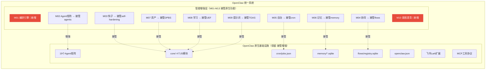

# M00: OpenClaw 系统总论 — 接管式升级统一架构

> **版本**: V3.0 接管式升级版
> **决策日期**: 2026-04-11
> **本文档性质**: 系统级架构总纲，统领 M01-M13 全部模块
> **变更性质**: 只改方向不删功能，所有已设计技术细节 100% 保留

---

## 数据保护宪法

> **第一条**: OpenClaw 整体（含 `.openclaw/` 目录下所有文件、数据库、配置）永久作为数字资产存在。
>
> **第二条**: 任何对 OpenClaw 原数据的修改操作，必须先执行备份。备份格式：`{原文件名}.{YYYYMMDD_HHmmss}.bak`。
>
> **第三条**: SQLite 数据库在接管增强时只允许增加新表，不得修改或删除原有表结构和数据。
>
> **第四条**: `core/` 下 4 个 JS 模块在接管后备份保留，增强版逐步替换，验证通过后方可切换。原文件不得删除。
>
> **第五条**: 本宪法由用户于 2026-04-11 颁布，永久有效，不可废除。

---

## 1. 核心架构转向

### 1.1 旧模型 vs 新模型

```
❌ 旧模型（两套系统并行）:
   OpenClaw 原生功能              你设计的智能系统
   ├── core/UEF.js (914行)        ├── M08 学习系统
   ├── core/self-hardening (666行) ├── M03 钩子体系
   ├── core/token-optimizer (363行)├── M09 提示词系统
   ├── core/DPBS.js (578行)       ├── M07 数字资产
   ├── cron/jobs.json (4任务)      ├── M05 自治层
   ├── memory/*.sqlite             ├── M06 记忆架构
   └── 互不感知                    └── 独立运行

✅ 新模型（接管式升级）:
   OpenClaw（你的智能系统已接管原生功能，原地升级）
   ├── core/UEF.js       → 被 M08 接管，升级为闭环学习引擎
   ├── core/self-hardening→ 被 M03 接管，升级为生命周期钩子
   ├── core/DPBS.js      → 被 M07 接管，升级为九类资产体系
   ├── core/token-optimizer→ 被 M09 接管，升级为动态提示词
   ├── cron/jobs.json     → 被 M05 接管，升级为智能心跳
   ├── memory/*.sqlite    → 被 M06 接管，在原SQLite上扩展
   └── M01编排/M10意图     → 新增注入
```

### 1.2 DeerFlow 定位（V3.1 总管家升级 · 2026-04-11）

> **决策锁定**: DeerFlow 物理路径 `e:\OpenClaw-Base\deerflow\`，接管机制为**备份后直接替换**（宪法第四条）。

| 维度 | 旧定位（V2.0） | 新定位（V3.1·终态） |
|---|---|---|
| **身份** | 独立系统/内嵌编排引擎 | **OpenClaw 统一编排总管家** |
| **物理路径** | — | `e:\OpenClaw-Base\deerflow\` |
| **职责范围** | 编排推理规划 | **接管并统一调度 OpenClaw 所有能力** |
| **技术能力** | LangGraph/DAG/子Agent/沙盒 | **全部保留不变·通过接管增强** |
| **管辖关系** | 并列/包含关系 | **DeerFlow 深度融合 OpenClaw·统一编排调度** |
| **与接管模块关系** | 外部调用 | M08/M03/M07/M09/M05 等增强版均在 DeerFlow 体系内开发·部署到 `.openclaw/core/` |
| **接管机制** | — | 备份原文件(`{name}.{timestamp}.bak`) → 增强版替换 → 验证通过切换 |

### 1.3 系统身份（终态定义）

**OpenClaw + DeerFlow = 统一的数字资产自治操作系统**

```
架构层级:
  DeerFlow（总管家·物理路径: e:\OpenClaw-Base\deerflow\）
  └── 统一编排调度 OpenClaw 的一切能力
      ├── OpenClaw 原生功能（.openclaw/core/ 等）→ 由 M01-M13 接管增强
      ├── 所有 Agent（M02 接管 openclaw.json 19个Agent）
      ├── 所有数据流（M03 钩子全程监控）
      ├── 所有记忆（M06 接管 memory/*.sqlite）
      ├── 所有资产（M07 接管 DPBS.js）
      ├── 所有学习（M08 接管 UEF.js）
      ├── 所有提示词（M09 接管 token-optimizer.js）
      └── 所有自主任务（M05 接管 cron/jobs.json）
```

- 所有数据、技能、记忆、资产均通过 DeerFlow 统一调度，不绕过 DeerFlow 直接访问

---

## 2. 接管映射全景图

### 2.1 OpenClaw 原生功能 → 模块接管对照

| OpenClaw 原生功能 | 文件/路径 | 接管模块 | 增强方向 |
|---|---|:---:|---|
| 自我进化框架 | `core/universal-evolution-framework.js` (914行) | **M08** | 升级为闭环学习引擎+夜间Distiller |
| 自我加固系统 | `core/self-hardening.js` (666行) | **M03** | 升级为Pre/PostToolUse完整生命周期钩子 |
| Token优化器 | `core/token-optimizer.js` (363行) | **M09** | 升级为SOUL.md+动态提示词工程 |
| 平台发现淘汰 | `core/dynamic-platform-binding.js` (578行) | **M07** | 升级为九类资产+五级分级+五维评分 |
| 定时任务 | `cron/jobs.json` (4个Job) | **M05** | 升级为HEARTBEAT智能心跳+Ralph Loop |
| 记忆存储 | `memory/*.sqlite` + `lancedb-pro/` | **M06** | 在原SQLite上新增ReMe四层记忆表 |
| 工作流注册 | `flows/registry.sqlite` | **M04** | 扩展为搜索/任务/工作流三系统协同 |
| Agent矩阵 | `openclaw.json` 19个Agent | **M02** | 加入OMO四类Agent分级路由 |
| 进程管理 | `gateway.cmd` + `node.cmd` | **M11** | 加入gVisor沙盒隔离 |
| 配置管理 | `config/gateway.yaml` + `node.yaml` | **M12** | 统一配置中心 |
| 无（新增能力） | — | **M01** | DeerFlow编排引擎注入 |
| 无（新增能力） | — | **M10** | 意图澄清引擎注入 |

### 2.2 接管统计

```
接管增强型（OpenClaw有基础版）: 10 个模块 = 77%
纯新增型（OpenClaw没有）:       2 个模块 = 15%
规划型:                          1 个模块 =  8%
```

### 2.3 架构图



---

## 3. 模块清单（接管视角）

| 编号 | 文件名 | 标题 | 接管目标 | 核心内容（不变） |
|:---:|---|---|---|---|
| M00 | `M00_System_Overview.md` | 系统总论（本文） | — | 接管架构·宪法·映射全景 |
| M01 | `01_Orchestration_Engine.md` | 编排引擎 | 🔴新增 | DeerFlow编排·LangGraph·SharedContext |
| M02 | `02_OMO_Agent_Matrix.md` | Agent矩阵 | `openclaw.json` agents | OMO四类·竞争上岗·视觉栈 |
| M03 | `03_Harness_Hooks_System.md` | 钩子体系 | `self-hardening.js` | Pre/PostToolUse·18个拦截点·安全分级 |
| M04 | `04_Three_Systems_Coordination.md` | 系统协同 | `flows/registry.sqlite` | 搜索/任务/工作流·SharedContext |
| M05 | `05_Autonomous_Agent_Layer.md` | 自治层 | `cron/jobs.json` | Ralph Loop·HEARTBEAT·自主任务生成 |
| M06 | `06_Memory_Architecture.md` | 记忆体系 | `memory/*.sqlite` | ReMe四层记忆·GraphRAG·双轨存储·PostToolUse管线 |
| M07 | `07_Digital_Asset_System.md` | 数字资产 | `DPBS.js` | 九类资产·五级分级·五维评分·淘汰 |
| M08 | `08_Learning_System.md` | 学习系统 | `UEF.js` | 闭环学习·夜间Distiller·经验包 |
| M09 | `09_Prompt_Engineering_System.md` | 提示词 | `token-optimizer.js` | SOUL.md·DSPy·五层架构 |
| M10 | `10_Intent_Clarification_Engine.md` | 意图澄清 | 🔴新增 | 七步串联·清晰度评分·追问策略 |
| M11 | `11_Execution_And_Daemons.md` | 执行守护 | `gateway.cmd` | gVisor沙盒·Daemon·Cron |
| M12 | `12_Tech_Stack_And_Config.md` | 技术栈 | `config/*.yaml` | 12层栈·18参数·统一配置 |
| M13 | `13_Phased_Implementation.md` | 分阶段落地 | — | 接管式实施路线图 |

---

## 4. 依赖关系图（接管视角更新）

```mermaid
graph TD
    M00["M00 系统总论（本文）"] --> M01
    M00 --> M07

    M01["M01 编排引擎（🔴新增·DeerFlow注入）"] --> M02
    M01 --> M03

    M02["M02 Agent矩阵（接管openclaw.json）"] --> M04
    M03["M03 钩子体系（接管self-hardening.js）"] --> M04
    M04["M04 系统协同（接管flows/）"] --> M05
    M04 --> M06

    M03 --> M07["M07 数字资产（接管DPBS.js·系统核心资产）"]
    M04 --> M07
    M03 --> M08["M08 学习系统（接管UEF.js）"]
    M07 --> M08
    M04 --> M09["M09 提示词（接管token-optimizer.js）"]
    M07 --> M09
    M08 --> M09

    M09 --> M10["M10 意图澄清（🔴新增注入）"]

    M01 --> M11["M11 执行守护（接管gateway）"]
    M05["M05 自治层（接管cron/jobs.json）"] --> M11

    ALL --> M12["M12 技术栈（接管config/）"]
    ALL --> M13["M13 分阶段落地（接管式路线图）"]

    style M01 fill:#E74C3C,stroke:#FFF,color:#FFF
    style M07 fill:#E74C3C,stroke:#FFF,color:#FFF
    style M10 fill:#E74C3C,stroke:#FFF,color:#FFF
```



---

## 5. 接管执行路线图

### Phase 0 — 接管声明与文档更新（第1周）
- [ ] 创建 M00 系统总论（本文）✅
- [ ] M01-M13 每个文档新增"接管清单"章节
- [ ] 修改方向性描述（DeerFlow定位重述）
- [ ] 冻结 `core/` JS 文件的独立演进

### Phase 1 — 核心功能接管（第2-3周）
- [ ] M08 接管 `universal-evolution-framework.js` → 闭环学习引擎
- [ ] M07 接管 `dynamic-platform-binding.js` → 九类资产体系
- [ ] M06 接管 `memory/*.sqlite` → 在原表基础上扩展ReMe四层记忆
- [ ] M05 接管 `cron/jobs.json` → 4个任务迁移为HEARTBEAT子任务

### Phase 2 — 管线增强与注入（第4-5周）
- [ ] M03 接管 `self-hardening.js` → 完整Pre/PostToolUse钩子
- [ ] M09 接管 `token-optimizer.js` → SOUL.md驱动
- [ ] M02 接管 `openclaw.json` agents → OMO四类分级
- [ ] M01 注入 DeerFlow 作为编排引擎

### Phase 3 — 新增能力注入（第6-7周）
- [ ] M10 注入意图澄清引擎
- [ ] M04 扩展 `flows/registry.sqlite` → 三系统协同
- [ ] M11 加入 gVisor 沙盒
- [ ] M12 统一配置中心

### Phase 4 — 验证与收尾（第8周）
- [ ] 验证所有接管功能正常运行
- [ ] 确认原有 4 个 JS 模块可安全停用（备份保留）
- [ ] 全面交叉引用校验
- [ ] 更新 M13 落地计划

---

## 6. 系统七层护城河（接管版）

```
1. 感知→行动→记忆 完整闭环
   眼耳嘴 + Claude Code手脚 + ReMe四层记忆（接管memory/*.sqlite）

2. Agent是操作者 不是被操作对象
   OMO四类分级接管原19个Agent + AgentFlow节点自主编排

3. 工具无限扩展
   CLI-Anything将任何软件Agent化·MCP协议·接管原工具链增强

4. 即时+批量双轨进化
   M08闭环学习（接管UEF.js）+ 夜间Distiller·越用越聪明

5. 24/7不间断
   M05 HEARTBEAT智能心跳（接管cron/jobs.json）+ Ralph Loop·永不停机

6. 编排引擎可替换
   DeerFlow 2.0 作为内嵌编排引擎·通过抽象接口可替换升级

7. 飞书原生
   消息入口 = Agent神经中枢·信息流全程闭环·OpenClaw统一管理
```

---

## 7. 变更红线（永久有效）

1. **只改方向不删功能**: 所有已设计的技术细节（九类资产、五维评分、Ralph Loop、HEARTBEAT、ReMe四层记忆、SOUL.md等）100% 保留
2. **只改定位不改实质**: DeerFlow 从"大脑"改为"内嵌编排引擎"，但其所有技术能力（LangGraph/DAG/子Agent/沙盒）不变
3. **只做增强不做替代**: 每个模块的目标从"新建"改为"接管 OpenClaw 原有功能 + 增强至设计规格"
4. **数据保护宪法**: 任何修改先备份，SQLite只加表不改表，core/ JS备份保留

---

## 8. 与原索引的关系

本文件（`M00_System_Overview.md`）是新增的系统总论。
原索引文件（`00_Module_Index.md`）继续作为模块快速查阅目录存在，两者互补：

- **本文** → 理解系统架构、接管方向、宪法规则
- **原索引** → 快速查找模块文件和依赖关系

---

## 校验确认锚标

- [x] 数据保护宪法五条完整
- [x] 接管映射全景表（10个接管型+2个新增型+1个规划型）
- [x] 旧模型 vs 新模型对比图
- [x] DeerFlow 定位重述（内嵌编排引擎）
- [x] 接管执行路线图（Phase 0-4）
- [x] 系统七层护城河（接管版）
- [x] 变更红线（4条永久有效）
- [x] 依赖关系图（接管视角）
- [x] 模块清单（含接管目标列）
