# Hermes Agent 深度源码分析 — OpenClaw 对标竞品技术报告

> **分析版本**: Hermes Agent v0.8.0 (2026-04-08)
> **代码库**: NousResearch/hermes-agent (47k+ Stars, 209 PR / 82 Issues in v0.8.0)
> **分析目标**: 逐文件源码级拆解，提取对 OpenClaw 可落地的技术洞察
> **文档生成日期**: 2026-04-11

---

## 第一章 · 仓库全景与架构概览

### 1.1 代码规模统计

| 模块目录 | 核心文件(含子目录) | 代码量(字节) | 设计定位 |
|---|---|---|---|
| `agent/` | 27 个 .py | ~600KB | 核心推理引擎、记忆管理、上下文压缩、提示词构建 |
| `tools/` | 45+ 个 .py | ~1.1MB | 工具注册表、终端/浏览器/文件/技能/MCP/安全 |
| `gateway/` | 16 个 .py (+platforms/) | ~550KB | 多平台网关(Telegram/Discord/Slack/Matrix/Signal等) |
| `cron/` | 3 个 .py | ~100KB | 定时任务调度器、Job执行器 |
| `plugins/` | memory/ + context_engine/ | ~30KB 框架 + 各插件 | 插件式记忆/上下文引擎 |
| `skills/` | 25+ 分类目录 | ~数百个 Markdown | 可复用技能知识库 |
| 根目录 | run_agent.py, hermes_state.py, trajectory_compressor.py 等 | ~200KB | 入口、状态持久化、轨迹压缩 |

### 1.2 架构分层图

```mermaid
graph TB
    subgraph 表现层
        CLI["CLI 交互 (curses TUI)"]
        GW["Gateway 多平台适配"]
        API["API Server (REST/SSE)"]
        ACP["VS Code / Zed / JetBrains"]
    end

    subgraph 核心引擎
        AGENT["AIAgent (run_agent.py)"]
        PB["PromptBuilder (prompt_builder.py)"]
        CC["ContextCompressor (context_compressor.py)"]
        CE["ContextEngine (context_engine.py) - 可插拔"]
        MM["MemoryManager (memory_manager.py)"]
        EC["ErrorClassifier (error_classifier.py)"]
        INS["Insights (insights.py)"]
        SMR["SmartModelRouting (smart_model_routing.py)"]
    end

    subgraph 持久化层
        STATE["SessionDB (hermes_state.py) — SQLite + FTS5 + WAL"]
        TC["TrajectoryCompressor — 训练数据压缩"]
        SKILL["Skills System — Markdown 知识库"]
    end

    subgraph 工具层
        TERM["TerminalTool (76KB)"]
        FILE["FileTools / FileOperations"]
        BROWSER["BrowserTool (89KB)"]
        WEB["WebTools (87KB)"]
        MCP_T["MCP Tool (84KB) + OAuth 2.1"]
        DELEGATE["DelegateTool (45KB) — 子Agent"]
        CRON_T["CronJobTools"]
        MSG["SendMessageTool"]
        VISION["VisionTools"]
        TTS_T["TTS/Voice/Transcription"]
        MEMORY_T["MemoryTool"]
        RL["RLTrainingTool (57KB)"]
        SKILL_T["SkillsTool / SkillsHub / SkillsGuard"]
    end

    subgraph 记忆插件
        MP_HO["Honcho"]
        MP_M0["Mem0"]
        MP_OV["OpenViking"]
        MP_HG["Holographic"]
        MP_SM["SuperMemory"]
        MP_BR["ByteRover"]
        MP_HS["Hindsight"]
        MP_RD["RetainDB"]
    end

    CLI --> AGENT
    GW --> AGENT
    API --> AGENT
    ACP --> AGENT

    AGENT --> PB
    AGENT --> CC
    AGENT --> CE
    AGENT --> MM
    AGENT --> EC
    AGENT --> INS
    AGENT --> SMR

    AGENT --> STATE
    AGENT --> TC
    AGENT --> SKILL

    AGENT --> TERM
    AGENT --> FILE
    AGENT --> BROWSER
    AGENT --> WEB
    AGENT --> MCP_T
    AGENT --> DELEGATE
    AGENT --> CRON_T
    AGENT --> MSG
    AGENT --> VISION
    AGENT --> TTS_T
    AGENT --> MEMORY_T
    AGENT --> RL
    AGENT --> SKILL_T

    MM --> MP_HO
    MM --> MP_M0
    MM --> MP_OV
    MM --> MP_HG
    MM --> MP_SM
    MM --> MP_BR
    MM --> MP_HS
    MM --> MP_RD
```



---

## 第二章 · 核心子系统源码级分析

### 2.1 状态持久化 — `hermes_state.py` (SessionDB)

**文件体量**: ~49KB, ~1254 行

**核心设计**:

```
┌─────────────────────────────────────────────┐
│              SessionDB (SQLite)              │
│                                              │
│  sessions 表:                                │
│    id, source, user_id, model,               │
│    model_config, system_prompt,              │
│    parent_session_id (会话链),               │
│    token统计(input/output/cache/reasoning),  │
│    billing 信息(provider/cost/pricing)       │
│    title (唯一索引, 可命名会话)              │
│                                              │
│  messages 表:                                │
│    session_id, role, content,                │
│    tool_call_id, tool_calls, tool_name,      │
│    timestamp, token_count, finish_reason,    │
│    reasoning, reasoning_details              │
│                                              │
│  messages_fts (FTS5 虚拟表):                 │
│    全文检索，自动触发器同步                  │
│                                              │
│  Schema Migration: v1 → v6, ALTER TABLE      │
│  并发控制: WAL模式 + threading.Lock           │
│  + BEGIN IMMEDIATE + 随机抖动重试(15次)      │
│  + 周期性 PASSIVE WAL Checkpoint             │
└─────────────────────────────────────────────┘
```

**关键技术洞察**:

1. **写竞争优化** (`_execute_write`):
   - 使用 `BEGIN IMMEDIATE` 立即争抢写锁（而非在 COMMIT 时才检测冲突）
   - 自定义 15 次重试 + 20~150ms 随机抖动，避免 SQLite 内置确定性退避的"车队效应"
   - 每 50 次写操作执行一次 PASSIVE WAL 检查点

2. **会话链（Session Lineage）**:
   - 通过 `parent_session_id` 外键实现会话延续
   - 支持命名会话（`title`字段，唯一索引）
   - 自动编号继承：`"my session"` → `"my session #2"` → `"my session #3"`

3. **Token 计费系统**:
   - 支持 增量模式（CLI，每次API调用的 delta）和 绝对模式（Gateway，累积总量）
   - 完整的 billing 追踪：provider, base_url, mode, estimated/actual cost

**OpenClaw M06 记忆系统 借鉴点**:
- ✅ FTS5 触发器同步方案 — 比外部全文索引更轻量
- ✅ WAL + 随机抖动重试 — 比简单 timeout 更适合多进程场景
- ✅ Schema 迁移机制 — 逐版本 ALTER TABLE, 比 SQLAlchemy 更轻
- ✅ 会话链设计 — OpenClaw 的对话状态管理可直接采用

---

### 2.2 轨迹压缩 — `trajectory_compressor.py`

**文件体量**: ~61KB, ~1471 行

**核心算法**:

```
输入: Agent完整交互轨迹 (system + human + gpt + tool 多轮)
目标: 压缩到 15,250 tokens 以内

压缩策略 (5步):
1. 保护首轮 (system, human, 第一个 gpt, 第一个 tool)
2. 保护尾部 N 轮 (默认4轮 — 最终行动和结论)
3. 仅压缩中间区域，从第2个tool响应开始
4. 按需压缩：只移除足够满足token预算的轮次
5. 用单条 [CONTEXT SUMMARY] 替换被压缩区域
```

**数据流**:

```
原始轨迹 → count_turn_tokens() → _find_protected_indices()
  → 计算 tokens_to_save = total - target
  → 从 compress_start 累积直到满足预算
  → _extract_turn_content_for_summary()
  → _generate_summary() [调用 LLM, 支持 sync/async]
  → 构建压缩轨迹: [head] + [summary message] + [tail]
  → 输出压缩结果 + TrajectoryMetrics
```

**关键特性**:
- **异步并发**: 最多 50 个并发 API 调用进行摘要生成
- **YAML 可配置**: tokenizer, 压缩目标, 保护区域, 摘要模型 全部外置
- **度量报告**: 每个轨迹和聚合级别的详细压缩指标
- **多 Provider 支持**: OpenRouter / Nous / Codex / xAI / Kimi / MiniMax — 通过 `_detect_provider()` 自动路由

**OpenClaw M08 学习系统 借鉴点**:
- ✅ 受保护区域策略 — 首尾固定，中间可压缩，保证训练信号质量
- ✅ 按需压缩 — 仅移除满足预算所需的最少轮次，不做过度压缩
- ✅ 异步批处理架构 — OpenClaw 可复用于批量经验回放处理

---

### 2.3 记忆插件系统 — `plugins/memory/`

**架构**:

```
plugins/memory/
├── __init__.py          # 插件发现与加载框架(325行)
├── byterover/           # ByteRover — 同步预取
├── hindsight/           # Hindsight — 事后回顾
├── holographic/         # Holographic — 全息提示词+信任评分
├── honcho/              # Honcho — 会话级记忆
├── mem0/                # Mem0 — API v2 图谱化
├── openviking/          # OpenViking — 退出安全网
├── retaindb/            # RetainDB — 本地写队列+辩证
└── supermemory/         # SuperMemory — 多容器搜索
```

**插件注册协议** (来自 `__init__.py` 分析):

```python
# 两种注册方式:
# 1. register(ctx) 模式 — 推荐
def register(ctx):
    provider = MyMemoryProvider()
    ctx.register_memory_provider(provider)

# 2. 直接继承 MemoryProvider ABC
class MyProvider(MemoryProvider):
    def is_available(self) -> bool: ...
    def recall(self, query, user_id) -> str: ...
    def commit(self, messages, user_id) -> None: ...
```

**核心特性**:
- **单一活跃约束**: 通过 `config.yaml` 的 `memory.provider` 字段选择，同一时间只有一个 provider 激活
- **懒加载**: `discover_memory_providers()` 只读 plugin.yaml 元数据，不完整导入
- **CLI 扩展**: 活跃 provider 可通过 `cli.py` 注册自己的命令行子命令
- **8种记忆策略**: 从简单KV到图谱化再到辩证推理，覆盖全谱系

**OpenClaw M06 记忆系统 借鉴点**:
- ✅ 插件发现协议 — `discover_*` + `plugin.yaml` 元数据分离
- ✅ 单一活跃约束 — 避免多 provider 冲突
- ✅ MemoryProvider ABC — 定义 `recall()` / `commit()` / `is_available()` 即可
- ⚠️ 8种 provider 策略对比，OpenClaw 可从 Honcho(轻量) + Holographic(高精度) 起步

---

### 2.4 上下文引擎 — `plugins/context_engine/`

**架构**: 与记忆插件完全对称的插件系统

```python
# ContextEngine ABC
class ContextEngine:
    def is_available(self) -> bool: ...
    def compress(self, messages, target_tokens) -> list: ...
```

- 默认引擎: `compressor` (内置 ContextCompressor)
- 可扩展: 支持 LCM 等外部引擎
- 通过 `config.yaml` 的 `context.engine` 字段切换

**OpenClaw M05 智能对话管理 借鉴点**:
- ✅ 上下文管理与压缩解耦 — 引擎可替换而不影响核心循环

---

### 2.5 定时任务调度 — `cron/scheduler.py` + `cron/jobs.py`

**文件体量**: scheduler.py ~964行, jobs.py ~700行

**调度架构**:

```
Gateway 每60秒调用 tick()
  ↓
文件锁 (~/.hermes/cron/.tick.lock) → 单实例保证
  ↓
get_due_jobs() → 读取 jobs.yaml 中到期任务
  ↓
对每个到期 job:
  1. _build_job_prompt() — 注入技能 + 预运行脚本输出
  2. run_job() — 创建 AIAgent 实例执行
  3. _deliver_result() — 跨平台投递(Telegram/Discord/Slack/Matrix/Email/SMS等)
  4. mark_job_run() + save_job_output() — 记录执行结果
  5. advance_next_run() — 计算下次执行时间
```

**关键技术**:

1. **不活动超时** (而非墙钟超时):
   - 通过 `agent.get_activity_summary()` 追踪最后活动时间
   - 只有真正空闲的 agent 才会被终止，活跃的长时间任务永不被杀
   - 默认 600 秒不活动限制

2. **预运行脚本注入**:
   - 支持在 job 执行前运行 Python 数据收集脚本
   - 脚本输出注入到 prompt 中作为上下文
   - 完整路径遍历防护 (`resolve().relative_to()` 校验)

3. **多平台投递**:
   - 14+ 平台支持 (Telegram/Discord/Slack/Matrix/Signal/WhatsApp/Email/SMS 等)
   - 优先使用活跃适配器（支持 E2EE），失败后回退到独立 HTTP 路径
   - MEDIA 标签提取 → 作为平台原生附件发送

4. **[SILENT] 抑制机制**:
   - 无新内容时 agent 返回 `[SILENT]`，系统跳过投递
   - 避免定时任务的空通知骚扰

**OpenClaw M11 执行与守护进程 借鉴点**:
- ✅ 不活动超时 — 远优于简单的墙钟超时
- ✅ 预运行脚本注入 — 闭环数据采集 → AI分析
- ✅ 文件锁单实例保证
- ✅ [SILENT] 抑制 — 智能决策是否需要通知用户

---

### 2.6 技能系统 — `tools/skills_tool.py` + `skills/`

**技能仓库结构** (25+ 分类):

```
skills/
├── apple/                    # Apple 生态工具
├── autonomous-ai-agents/     # 自主AI代理模式
├── creative/                 # 创意工具(p5js, manim-video)
├── data-science/             # 数据科学
├── devops/                   # DevOps管道
├── diagramming/              # 图表绘制
├── domain/                   # 领域知识
├── email/                    # 邮件处理
├── feeds/                    # 信息聚合(blogwatcher)
├── gaming/                   # 游戏相关
├── github/                   # GitHub集成
├── mcp/                      # MCP工具技能
├── media/                    # 多媒体处理
├── mlops/                    # ML运维
├── note-taking/              # 笔记(Obsidian)
├── productivity/             # 生产力
├── red-teaming/              # 安全测试
├── research/                 # 学术研究
├── smart-home/               # 智能家居(HomeAssistant)
├── social-media/             # 社交媒体
└── software-development/     # 软件开发(claude-code等)
```

**技能执行管线** (来自 `skills_tool.py` 49KB):

```
用户请求 "@skill_name" 或 cron job 配置 skills: [...]
  ↓
skill_view(name) → 读取 Markdown 文件
  ↓
注入到 system prompt:
  "[SYSTEM: The user has invoked the '...' skill,
   follow its instructions. Full skill content below.]"
  ↓
Agent 按技能指令执行
```

**技能配置接口** (v0.8.0 新增):
- 技能可声明 `required_config` — 安装时提示配置
- 支持 `per-platform disabled_skills` — 不同平台禁用不同技能
- SkillsHub (101KB) — 技能市场发现与安装
- SkillsGuard (38KB) — 安全沙箱校验

**OpenClaw M08 学习系统 借鉴点**:
- ✅ Markdown 作为技能载体 — 零代码门槛，LLM 原生可读
- ✅ 技能即提示词注入 — 不改变核心循环，极低侵入性
- ✅ 技能分类体系 — 25+ 领域分类推动可发现性
- ✅ SkillsGuard — 安全审计层，OpenClaw 的安全模块可借鉴

---

### 2.7 工具注册与路由 — `toolsets.py` + `tools/registry.py`

**工具集(Toolset)分组** (来自源码):

| Toolset 名称 | 包含工具 | 可禁用 |
|---|---|---|
| `core` | terminal, file_read, file_write, file_search | ❌ |
| `web` | web_search, web_read, web_screenshot | ✅ |
| `browser` | browser_* 系列 | ✅ |
| `vision` | read_image | ✅ |
| `mcp` | mcp_call | ✅ |
| `delegation` | delegate_task | ✅ |
| `cronjob` | cron_create/list/delete | ✅ |
| `messaging` | send_message | ✅ |
| `skills` | skill_view/create/edit/delete/install | ✅ |
| `memory` | memory_recall/commit | ✅ |
| `clarify` | clarify_question | ✅ |
| `image_gen` | image_generate | ✅ |
| `tts` | text_to_speech | ✅ |
| `rl_training` | feedback_submit | ✅ |

**关键设计**:
- `disabled_toolsets` 参数 — 场景化裁剪（如 cron 模式禁用 cronjob/messaging/clarify）
- 每个 Tool 通过 `@tool` 装饰器注册 JSON Schema
- 工具参数类型强制转换 — 修复模型发送 string 而非 number/boolean 的问题

**OpenClaw M04 工具调用 借鉴点**:
- ✅ Toolset 分组管理 — 场景化启用/禁用
- ✅ 参数类型强制转换 — 提高工具调用成功率
- ✅ 工具结果持久化存储 — 超大结果保存到文件而非截断

---

### 2.8 多模型路由 — `agent/smart_model_routing.py` + `agent/auxiliary_client.py`

**路由决策链**:

```
用户请求 → resolve_turn_route()
  ↓
检查 smart_model_routing 配置:
  - 关键词匹配 → 路由到特定 model+provider
  - 复杂度评估 → 路由到强/弱模型
  ↓
resolve_runtime_provider():
  - 优先级: 命令行参数 > 环境变量 > config.yaml > 自动检测
  - 支持: OpenRouter, Nous, Codex, xAI, Google AI Studio,
          Kimi, MiniMax, Ollama + 自定义 base_url
  ↓
credential_pool 凭证池:
  - 多 API Key 轮转 (53KB 源码)
  - 402 付费失败自动切换
  - 速率限制追踪 + 冷却窗口
```

**Auxiliary Client** (104KB):
- 用于辅助任务: 压缩、视觉、摘要
- 独立的 provider 路由 (可使用免费模型如 MiMo v2 Pro)
- 自动降级链: OpenRouter → Nous → 本地

**OpenClaw M03 模型引擎 借鉴点**:
- ✅ 智能路由 — 按内容复杂度选择模型
- ✅ 凭证池 — 多 Key 轮转 + 限流追踪
- ✅ 辅助/主推理分离 — 非核心任务用廉价模型

---

### 2.9 Agent 核心循环 — `run_agent.py`

**执行流程** (简化):

```
AIAgent.__init__():
  - 加载 session_db, memory_manager, context_compressor
  - 初始化 toolsets (按 disabled_toolsets 裁剪)
  - 配置 prompt_builder, error_classifier

run_conversation(user_prompt):
  while iterations < max_iterations:
    1. prompt_builder.build() — 组装 system prompt
       + skills 注入 + memory recall + subdirectory hints
    2. API 调用 (streaming)
       + activity tracker 更新 (每个 stream delta)
       + 错误分类 + 自动重试 + 抖动退避
    3. 解析响应:
       a. 纯文本 → 输出并结束
       b. tool_calls → 执行每个工具调用
          → approval 检查 (安全审批)
          → 工具结果注入到 messages
    4. 上下文窗口检查:
       if token_count > threshold:
         context_compressor.compress()
         new_session = fork with parent_session_id
    5. 循环继续直到:
       - 模型给出最终回复
       - 达到 max_iterations
       - 被中断 (interrupt)
       - 不活动超时
```

**关键特性**:
- **活动追踪**: `_touch_activity()` 在每次工具调用、API调用、流式delta时更新
- **上下文分裂**: 当 token 超限时自动 fork 新 session，保留 parent 链接
- **Insights 系统** (33KB): 从执行轨迹提取洞察，用于自我改进
- **子 Agent 委派** (45KB): `delegate_tool.py` 创建独立 Agent 实例执行子任务

---

## 第三章 · OpenClaw 各模块对标映射

### 3.1 功能对标矩阵

| OpenClaw 模块 | Hermes 对应实现 | 成熟度 | 差异分析 |
|---|---|---|---|
| **M01 系统总览** | `run_agent.py` + `hermes_constants.py` | ⭐⭐⭐⭐⭐ | Hermes 更工程化,OpenClaw 更理论化 |
| **M02 Agent系统** | `AIAgent` 类 + `prompt_builder.py` | ⭐⭐⭐⭐⭐ | Hermes 单Agent强化 + 委派, OpenClaw 规划多Agent协作 |
| **M03 模型引擎** | `auxiliary_client.py` + `smart_model_routing.py` + `credential_pool.py` | ⭐⭐⭐⭐⭐ | Hermes 支持 15+ provider, 凭证池轮转, 极其成熟 |
| **M04 工具调用** | `tools/` 目录 (45+ 工具) + `toolsets.py` | ⭐⭐⭐⭐⭐ | Hermes 工具覆盖极广, 参数类型强转, 安全审批 |
| **M05 对话管理** | `context_compressor.py` + `context_engine.py` | ⭐⭐⭐⭐ | Hermes 侧重压缩, OpenClaw 侧重状态机 |
| **M06 记忆系统** | `hermes_state.py` + `plugins/memory/` (8种策略) | ⭐⭐⭐⭐⭐ | Hermes 最强模块: FTS5 + 8种记忆provider + 会话链 |
| **M07 蓝图文件** | 无直接对应 (有 RELEASE_*.md) | ⭐⭐ | OpenClaw 的规划文档体系是独有优势 |
| **M08 学习系统** | `trajectory_compressor.py` + `skills/` + `insights.py` | ⭐⭐⭐⭐ | Hermes 通过轨迹压缩做 RL 数据, OpenClaw 规划更通用的学习闭环 |
| **M09 提示词系统** | `agent/prompt_builder.py` (43KB) | ⭐⭐⭐⭐⭐ | Hermes 的 prompt 模板化极其精细 |
| **M10 意图澄清** | `tools/clarify_tool.py` (5KB) | ⭐⭐ | Hermes 仅实现了基础的澄清工具, OpenClaw 规划更深 |
| **M11 执行守护** | `cron/scheduler.py` + `gateway/run.py` | ⭐⭐⭐⭐⭐ | Hermes 支持 14+ 平台 + 不活动超时 + 预运行脚本 |
| **M12 技术栈** | `requirements.txt` + `hermes_constants.py` | ⭐⭐⭐⭐ | Hermes: Python + SQLite + 多 LLM API |
| **M13 分阶段落地** | RELEASE_v0.8.0.md (209 PR 记录) | ⭐⭐⭐⭐ | Hermes 已是成熟产品, OpenClaw 在规划阶段 |

### 3.2 OpenClaw 独有优势

Hermes **没有**但 OpenClaw 规划了的:

1. **多 Agent 协作框架** (M02) — Hermes 只有单 Agent + 子 Agent 委派
2. **结构化意图理解引擎** (M10) — Hermes 只有简单的 clarify_tool
3. **系统蓝图规划体系** (M07) — Hermes 无文档工程
4. **统一的学习闭环理论框架** (M08) — Hermes 的学习偏向 RL 训练数据生产

---

## 第四章 · 可落地技术建议（按优先级排序）

### 🔴 P0 — 立即可用（1-2周可落地）

#### 4.1 采用 SessionDB 方案 → OpenClaw M06

```python
# 直接借鉴的设计决策:
# 1. SQLite WAL 模式 + FTS5 全文检索
# 2. _execute_write() 随机抖动重试
# 3. parent_session_id 会话链
# 4. Schema 版本迁移机制
# 5. 命名会话 + 自动编号
```

**落地路径**:
1. 复制 `hermes_state.py` 的 Schema SQL 和 `_execute_write()` 方法
2. 适配 OpenClaw 的会话字段（添加 OpenClaw 特有的 agent_id, task_id 等）
3. 实现 FTS5 触发器同步
4. 编写 migration 脚本框架

#### 4.2 实现工具参数类型强转 → OpenClaw M04

```python
# Hermes 的做法（来自 model_tools.py）:
# 根据 JSON Schema 声明的类型, 自动将 string 转为 number/boolean
# 大幅提高工具调用成功率
```

#### 4.3 [SILENT] 通知抑制机制 → OpenClaw M11

```python
# 定时任务中, 如果 Agent 判断无需通知用户:
# 返回 "[SILENT]" → 系统跳过投递
# 极简但极其有效
```

### 🟡 P1 — 短期建设（2-4周）

#### 4.4 Markdown 技能系统 → OpenClaw M08

```
建设路径:
1. 创建 openclaw/skills/ 目录结构
2. 定义技能 Markdown 模板标准
3. 实现 skill_view() 读取注入
4. 构建 SkillsHub 发现机制
5. 添加 SkillsGuard 安全校验
```

#### 4.5 上下文压缩引擎 → OpenClaw M05

```
借鉴 trajectory_compressor.py 的策略:
1. 保护首轮 + 尾部 N 轮
2. 中间区域按需压缩
3. 单条 [CONTEXT SUMMARY] 替换
4. 工具结果超大时保存到文件
```

#### 4.6 记忆 Provider 插件协议 → OpenClaw M06

```python
# 定义 MemoryProvider ABC:
class MemoryProvider(ABC):
    @abstractmethod
    def recall(self, query: str, user_id: str) -> str: ...

    @abstractmethod
    def commit(self, messages: list, user_id: str) -> None: ...

    @abstractmethod
    def is_available(self) -> bool: ...
```

### 🟢 P2 — 中期建设（1-2月）

#### 4.7 智能模型路由 → OpenClaw M03

- 参考 `smart_model_routing.py` 的关键词 + 复杂度评估
- 参考 `credential_pool.py` 的多 Key 轮转 + 限流追踪
- 适配国内 Provider (阿里通义、讯飞、智谱等)

#### 4.8 不活动超时机制 → OpenClaw M11

- 参考 Hermes 的活动追踪器 (`_touch_activity()`)
- 在每次工具调用、API调用、流式输出时更新
- 只终止真正空闲的任务, 活跃任务永不被杀

#### 4.9 定时任务预运行脚本注入 → OpenClaw M11

- 支持在任务执行前运行数据收集脚本
- 脚本输出作为 Agent prompt 上下文
- 完整路径安全校验

### 🔵 P3 — 长期规划（2-3月）

#### 4.10 RL 训练数据管线 → OpenClaw M08

- 参考 `rl_training_tool.py` (57KB) 的反馈收集
- 参考 `trajectory_compressor.py` 的批量压缩
- 构建 OpenClaw 的自我改进数据飞轮

#### 4.11 多平台 Gateway → OpenClaw M11

- 参考 Hermes 的 `gateway/platforms/` 14+ 平台适配器
- OpenClaw 可从微信/钉钉/飞书/Slack 起步

---

## 第五章 · 关键源码文件索引

| 源码文件 | 行数 | 核心类/函数 | OpenClaw 关联模块 |
|---|---|---|---|
| `hermes_state.py` | ~1254 | `SessionDB`, `_execute_write`, FTS5 | M06 记忆系统 |
| `trajectory_compressor.py` | ~1471 | `TrajectoryCompressor`, `compress_trajectory` | M08 学习系统 |
| `cron/scheduler.py` | ~964 | `tick()`, `run_job()`, `_deliver_result()` | M11 执行守护 |
| `cron/jobs.py` | ~700 | `get_due_jobs()`, `advance_next_run()` | M11 执行守护 |
| `plugins/memory/__init__.py` | ~325 | `discover_memory_providers()`, `MemoryProvider` | M06 记忆系统 |
| `plugins/context_engine/__init__.py` | ~226 | `discover_context_engines()`, `ContextEngine` | M05 对话管理 |
| `agent/prompt_builder.py` | ~43KB | 提示词组装引擎 | M09 提示词系统 |
| `agent/context_compressor.py` | ~34KB | 上下文窗口压缩 | M05 对话管理 |
| `agent/auxiliary_client.py` | ~104KB | 多 Provider 路由 | M03 模型引擎 |
| `agent/credential_pool.py` | ~54KB | 多 Key 轮转 + 限流 | M03 模型引擎 |
| `agent/smart_model_routing.py` | ~6KB | 智能模型选择 | M03 模型引擎 |
| `agent/memory_manager.py` | ~14KB | 记忆生命周期管理 | M06 记忆系统 |
| `agent/insights.py` | ~34KB | 自我改进洞察提取 | M08 学习系统 |
| `tools/skills_tool.py` | ~50KB | 技能 CRUD + 注入 | M08 学习系统 |
| `tools/skills_hub.py` | ~101KB | 技能市场 | M08 学习系统 |
| `tools/rl_training_tool.py` | ~57KB | RL 反馈收集 | M08 学习系统 |
| `tools/terminal_tool.py` | ~76KB | 终端执行引擎 | M04 工具调用 |
| `tools/browser_tool.py` | ~89KB | 浏览器自动化 | M04 工具调用 |
| `tools/mcp_tool.py` | ~84KB | MCP 协议工具 | M04 工具调用 |
| `tools/delegate_tool.py` | ~45KB | 子Agent委派 | M02 Agent系统 |
| `tools/clarify_tool.py` | ~5KB | 意图澄清 | M10 意图澄清 |
| `tools/approval.py` | ~37KB | 安全审批 | M04 工具调用 |
| `gateway/run.py` | ~383KB | 多平台网关核心 | M11 执行守护 |

---

## 第六章 · 结论

### 6.1 Hermes 的核心竞争力

1. **极致的工程执行力** — v0.8.0 单版本 209 PR, 82 Issues, 18 社区贡献者
2. **持久化记忆体系** — 8种策略 + FTS5 + 会话链, 真正解决了"失忆问题"
3. **全平台覆盖** — 14+ 通信平台 + CLI + IDE + API, 无死角
4. **自我改进数据管线** — 轨迹压缩 + RL训练 + Insights, 闭环学习
5. **安全深度** — SSRF防护/路径遍历/凭证泄露/时序攻击/沙箱隔离

### 6.2 OpenClaw 的战略机遇

1. **多 Agent 协作** — Hermes 的纯单Agent架构是其天花板
2. **意图理解深度** — Hermes 的 clarify_tool 仅 5KB, 有巨大改进空间
3. **规划文档体系** — OpenClaw 的 13 模块规划文档是独有资产
4. **中国大陆生态适配** — Hermes 对国内 Provider/平台支持薄弱

### 6.3 建议的整合策略

```
阶段 1 (1-2周): 移植 SessionDB + 参数类型强转 + [SILENT] 机制
阶段 2 (2-4周): 建设 Markdown 技能系统 + 上下文压缩引擎 + 记忆插件协议
阶段 3 (1-2月): 智能模型路由 + 不活动超时 + 预运行脚本
阶段 4 (2-3月): RL数据管线 + 多平台 Gateway + 自我改进闭环
```

> **核心原则**: 不要重新发明轮子。Hermes 的工程实现极其成熟，OpenClaw 应当站在其肩膀上，聚焦于多 Agent 协作和深度意图理解这两个 Hermes 未覆盖的方向。

---

## 附录 A · 参考文献与链接

| 资源 | URL |
|---|---|
| Hermes Agent GitHub | https://github.com/NousResearch/hermes-agent |
| v0.8.0 Release Notes | RELEASE_v0.8.0.md (328行, 209 PR) |
| Nous Research 官网 | https://nousresearch.com |
| hermes_state.py (SessionDB) | `hermes_state.py` ~1254行 |
| trajectory_compressor.py | `trajectory_compressor.py` ~1471行 |
| plugins/memory/ (8种策略) | `plugins/memory/` 目录 |
| agent/prompt_builder.py | `agent/prompt_builder.py` ~43KB |
| agent/auxiliary_client.py | `agent/auxiliary_client.py` ~104KB |

---

*本文档基于 Hermes Agent v0.8.0 (commit 7241e61) 源码的逐文件分析生成。*
*所有代码引用均来自公开源码仓库。*


# Hermes & OpenCLI Deep 改造计划 (OpenClaw 自进化路线图)

## 第一部分：Hermes Agent 深度调研分析 (原始档案)

### 1. 核心架构概述
Hermes Agent (v0.8.0) 展示了极高的工程成熟度，其核心在于将大模型的推理能力与高度结构化的环境反馈相结合。
- **SessionDB**: 基于 SQLite 的持久化存储，支持通过 WAL 模式进行高并发读写。
- **推理引擎**: 采用分阶段 Prompt 模板，将复杂任务拆解为 Plan -> Action -> Observation 的标准循环。
- **Trajectory Compression**: 独特的轨迹压缩算法，确保长程对话不丢失关键目标。

### 2. 核心组件解析
#### 2.1 状态管理 (hermes_state.py)
- 实现了完整的 `StateStore` 抽象，允许 Agent 在重启后无缝恢复执行现场。
- 支持会话分支 (Forking)，便于进行多路径探索。

#### 2.2 插件与扩展
- 采用规范化的元数据定义，每个工具都拥有严格的类型检查（Type Hints），极大降低了大模型调用工具时的格式错误。

---

## 第二部分：OpenCLI 自动化 HUB 整合

### 1. 设计构想
通过 OpenCLI 的 **Browser Bridge**，OpenClaw 将获得“上帝视角”的网页操控能力。
- **无感接管**: OpenCLI 以守护进程方式运行，Agent 通过 HTTP/WS 协议下达指令。
- **环境复用**: 直接接管用户当前的 Chrome 实例，无需重新登录社交平台（如 Feishu, GitHub, Twitter）。

### 2. 改造方案
- **统一工具总线**: 废弃 `browser_subagent` 目录下陈旧的 Playwright 脚本。
- **MCP 协议标准化**: 所有的外部能力（文件、网页、数据库）全部抽象为 MCP Server 挂载。

---

## 第三部分：深层改造设计细节 (Technical Implementation)

### 1. 存储层：SessionDB (SQLite + FTS5)
- **目标**: 实现秒级全文索引，解决 Context 长度限制带来的记忆碎片问题。
- **细节**: 每条执行轨迹 (`Trajectory`) 都会打上语义标签，允许 Agent 在遇到相似问题时通过 RAG 召回成功经验。

### 2. 上下文层：轨迹压缩 (Trajectory Compressor)
- **策略**: “首尾保护 + 过程折叠”。固定初始目标和近期反馈，中间过程仅保留语义摘要。
- **优势**: Token 节省率预计提升 40% 以上。

### 3. 进化层：自合成学习系统 (Self-Evolution)
- **逻辑**: 当 Agent 发现现有的 Skill 无法满足需求，并通过通用工具探索出一条成功路径时，触发 `Synthesis`。
- **产物**: 自动生成新的 `SKILL.md`，实现系统功能的有机增长。

---

---

## 第四部分：实施路径图 (Roadmap)

### 1. 系统加固 (Stabilization)
- 迁移至 `SessionDB`。
- 安装并配置 `OpenCLI` 桥接器。

### 2. 智慧升维 (Optimization)
- 注入 `TrajectoryCompressor` 中间件。
- 实施工具参数强转逻辑。

### 3. 自进化验证 (Self-Evolution)
- 完成第一个“捕获 XP -> 合成技能”的闭环测试。

---

## 第五部分：OpenCLI 深度源码分析 (Technical Report)

### 1. 注册与发现机制 (Registry & Discovery)
**核心文件**: `src/registry.ts`, `src/discovery.ts`
- **全局注册表**: 使用 `__opencli_registry__` (Map) 统一管理所有 CLI 命令。
- **动态发现**: 
  - **Fast-path (Production)**: 优先读取 `manifest.json`，实现毫秒级启动，无需扫描磁盘。
  - **Fallback (Development)**: 扫描 `clis/` 和 `skills/` 目录下的 `.ts/.js` 文件。
  - **模块热重载**: 在 Daemon 模式下，通过监视文件 `mtime` 自动清空 `import` 缓存并重新加载。
- **OpenClaw 借鉴**: 采用 Manifest 预生成机制，解决工具集庞大时的启动延迟。

### 2. 浏览器桥接微服务 (The Micro-Daemon)
**核心文件**: `src/daemon.ts`
- **架构模式**: `CLI --(HTTP/POST)--> Local Daemon --(WebSocket)--> Browser Extension`.
- **安全性设计**:
  - **Origin 校验**: 严禁非 Extension 环境连接 WebSocket，防止恶意网页接管。
  - **自定义 Header**: 要求 `X-OpenCLI` 请求头，天然防御 CSRF。
  - **持久化链接**: Daemon 维持与 Extension 的心跳，保证长耗时自动化任务不会因页面休眠而中断。
- **OpenClaw 借鉴**: 弃用 Playwright 的“隔离沙盒”模式，改用“浏览器插件桥接”模式，复用用户现有 Session（无需处理登录、2FA）。

### 3. 命令执行引擎 (Execution Engine)
**核心文件**: `src/execution.ts`
- **Lazy Loading**: 仅在命令被调用时才 `import()` 对应的 TS 模块。
- **策略化路由 (Capability Routing)**:
  - 支持 `UI` (网页操作), `COOKIE` (接口调用), `FILES` (文件操作)。
  - 自动处理 **Pre-navigation**: 如果命令需要特定的 Cookie，引擎会自动先跳转到该域名再执行逻辑。
  - **自动化窗口管理**: 执行完毕后自动调用 `page.closeWindow()`，优化系统资源。
- **自动化诊断**: 失败时自动捕获当前页面的 a11y tree 镜像和快照。
- **OpenClaw 借鉴**: 实现基于“意图”的路径预判，减少模型在环境配置上的无效思考。

### 4. 插件生命周期 (Plugin Lifecycle)
**核心文件**: `src/plugin.ts`
- **编译管线**: 使用 `esbuild` 实时将 TypeScript 工具转译为 ESM，并建立 `~/.opencli/node_modules/` 软链接。
- **隔离性**: 每个插件拥有独立的作用域，但共享核心 API 接口 (`@jackwener/opencli`)。
- **OpenClaw 借鉴**: 采用“源码即中心”的理念，让 OpenClaw 的 AGI 能够编写 TS 脚本，经 OpenCLI 即时转译后立即生效。

---

## 第六部分：OpenClaw 下一阶段实施细则

### 1. SessionDB 迁移 (100% 对标 Hermes)
- **数据库**: SQLite 3.45+ (WAL 模式)。
- **全文检索**: 启用 `fts5` 模块，对所有 `Trajectory` 全内容建立索引。
- **核心逻辑**: 移植 `hermes_state.py` 中的 `_execute_write` 随机重试机制。

### 2. Browser Bridge 落地 (基于 OpenCLI)
- **服务端**: 启动 `opencli daemon`。
- **客户端**: 封装 `BrowserClient` 类，作为 OpenClaw 的 `BrowserTool` 底层连接器。
- **Session 锁定**: 支持多会话隔离，每个任务拥有独立的临时 `BrowserContext`。

---
> **存档声明**: 
> - 本文件由原 `Hermes_Agent_Deep_Analysis.md` 演化而来。
> - 相关构想已同步封存于 `OpenClaw超级工程项目_V1_Full_Archive.md`。
